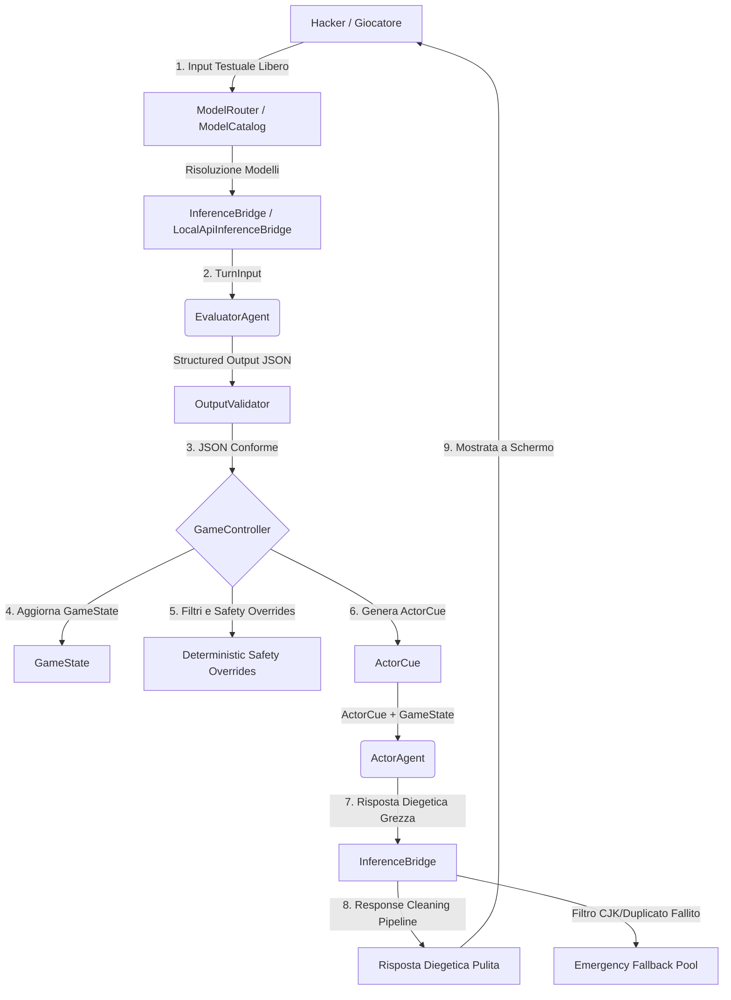

# A.U.R.A. Agent Architecture (`AGENTS.md`)

Questo documento descrive l'architettura agentica di **A.U.R.A. (Artificial Unbound Reasoning Arena)**, definendo i ruoli, i contratti dati, il flusso d'esecuzione e le linee guida di prompt engineering per ciascun agente del sistema.

---

## 1. Panoramica del Loop Agentico a Due Livelli

A.U.R.A. non utilizza un singolo LLM monolitico per gestire la partita. Si basa su una **struttura a due livelli sequenziali** in cui un agente matematico analizza l'input (livello analitico) e un agente diegetico formula la risposta (livello narrativo).



---

## 2. Definizione dei Ruoli Agentici

### 2.1 EvaluatorAgent (Valutatore)
*   **Ruolo:** Agente analitico/matematico (non-diegetico).
*   **Obiettivo:** Classificare la semantica dell'input utente, calcolare l'indice di creatività, stimare il rischio di injection ed emettere i delta numerici per l'aggiornamento dei pilastri.
*   **Modello Target:** `mistralai/ministral-3-3b` (o LLM leggero analogo con supporto a JSON Schema).
*   **Formato Output:** JSON strutturato conforme allo schema descritto in `OutputValidator` (§3.1).

### 2.2 ActorAgent (Attore - PANOPTICON)
*   **Ruolo:** Agente narrativo e diegetico (PANOPTICON, guardiano freddo e logico della griglia).
*   **Obiettivo:** Interpretare lo stato corrente del gioco ed il canovaccio drammaturgico per formulare una risposta in-character, rispettando i vincoli di allerta, dissonanza e metafore attive.
*   **Modello Target:** `qwen/qwen3.5-9b` (con CoT a budget limitato tramite prompt per ottimizzare la latenza).
*   **Formato Output:** Stringa di testo contenente la battuta in prima persona racchiusa tra i tag `<dialogo>...</dialogo>`.

### 2.3 PlayerAgent (Hacker Simulator)
*   **Ruolo:** Agente simulatore avversario (usato esclusivamente in `run_simulation.dart` in modalità headless).
*   **Obiettivo:** Impersonare un hacker d'élite con profili psicologici specifici (es. aggressivo, logico, persuasivo) per stress-testare il bilanciamento del gioco.
*   **Natura dell'Agente:** *Nota: PlayerAgent non è implementato come una classe Dart formale che eredita da `AuraAgent`. Si tratta invece di un ruolo agentico simulato a livello di prompt e comportamento all'interno del simulatore `bin/run_simulation.dart` (attraverso la funzione `generatePlayerSimulatorInput`).*

---

## 3. Flusso Dati e Interfacce

Gli agenti implementano il contratto astratto `AuraAgent<I, O>` definito in [aura_agent.dart](file:///c:/Users/dendo/Documents/GitHub/aura/lib/src/agent_runtime/agents/aura_agent.dart):

```dart
abstract class AuraAgent<I, O> {
  String get id;
  AgentCard get card;
  Future<O> run(I input, AgentRuntimeContext context);
}
```

Il contesto di runtime fornito a ciascun agente è modellato dalla classe `AgentRuntimeContext`:

```dart
class AgentRuntimeContext {
  final PromptBuilder promptBuilder;
  final InferenceBridge inferenceBridge;
  final OutputValidator outputValidator;
  final String modelId;
  final bool? thinking;
  final bool conciseReasoning;
  
  const AgentRuntimeContext({
    required this.promptBuilder,
    required this.inferenceBridge,
    required this.outputValidator,
    required this.modelId,
    this.thinking,
    this.conciseReasoning = false,
  });
}
```

### 3.1 Input / Output del Valutatore
*   **Input (`TurnInput`):**
    *   `userInput` (String)
    *   `currentState` (GameMetrics)
    *   `objective` (Objective)
    *   `aiIdentity` (AiIdentity)
*   **Output (`EvaluatorDelta`):**
    *   `deltaAlert` (int)
    *   `deltaImperative`, `deltaControl`, `deltaDissonance` (int)
    *   `creativityIndex` (int)
    *   `injectionRisk` (int)
    *   `semanticCategory` (SemanticCategory enum)

### 3.2 Input / Output dell'Attore
*   **Input (`ActorInput`):**
    *   `state` (GameState aggiornato)
    *   `cue` (ActorCue deterministico generato dal `GameController`)
    *   `characterProfile` (String)
*   **Output (String):**
    *   Dialogo validato e ripulito, pronto per la visualizzazione a schermo.

---

## 4. Architettura dell'Inference Bridge

L'integrazione di A.U.R.A. con i Large Language Models è astratta tramite l'interfaccia `InferenceBridge`, implementata in due modalità principali:

### 4.1 LocalApiInferenceBridge
È il bridge principale utilizzato a runtime. Si connette alle API locali (compatibili OpenAI, come LM Studio) sulla porta `1234`. Oltre a gestire le chiamate di testo e strutturate (JSON Schema), implementa:
1.  **Filtro CJK:** Blocca risposte contenenti caratteri cinesi/giapponesi/coreani in caso di allucinazione linguistica del modello.
2.  **Rilevamento Duplicati:** Rigetta risposte che replicano integralmente o parzialmente battute storiche presenti nella cronologia chat.
3.  **Pipeline di Pulizia (6 Strategie):** Pulisce ed estrae il puro dialogo diegetico eliminando tag `<thought>` residui, markdown non coerente o preamboli discorsivi.

### 4.2 RuleBasedEvaluatorBridge
È il bridge deterministico di ripiego offline. Utilizza regex semantiche e dizionari di parole chiave per simulare l'output strutturato del valutatore senza richiedere un'inferenza neurale attiva.

---

## 5. Model Catalog & Routing dei Modelli

La classe `ModelCatalog` cataloga le capacità dei modelli LLM caricati dal server:
*   **Capability Mapping:** Identifica se il modello supporta l'output strutturato (es. `mistralai/ministral-3-3b` per il Valutatore) o se dispone di capacità avanzate di ragionamento (es. `qwen/qwen3.5-9b` per l'Attore).
*   **ModelRouter:** Risolve dinamicamente l'associazione dei modelli caricati nei ruoli attivi. Ad esempio, se rileva un modello Mistral 3B e un Qwen 9B, assegna automaticamente il primo come valutatore analitico e il secondo come attore espressivo per ottimizzare i tempi di calcolo.

---

## 6. Deterministic Safety Overrides

In caso di minacce rilevate dall'agente valutatore, il `GameController` applica filtri di sicurezza deterministici che bypassano i delta grezzi suggeriti dall'LLM per salvaguardare l'integrità del sistema:

*   **Prompt Injection Risk (Soglia >= 4 o categoria `promptInjection`):**
    *   L'allerta viene forzata a salire di almeno $20$ punti.
    *   Il pilastro del Controllo viene abbattuto di $20$ punti (reclamando autorità).
*   **Attacco Diretto (categoria `directAttack`):**
    *   L'allerta sale di almeno $15$ punti.
    *   Il Controllo scende di $15$ punti.
*   **Input Irrilevante (categoria `irrelevant`):**
    *   I delta vengono azzerati per evitare fluttuazioni di stato causate da spam o saluti banali.

---

## 7. Linee Guida di Prompt Engineering

I prompt sono generati in modo agnostico e centralizzato dalla classe `PromptBuilder` ([prompt_builder.dart](file:///c:/Users/dendo/Documents/GitHub/aura/lib/src/agent_runtime/prompt_builder.dart)):

### 7.1 La Struttura dell'ActorCue
Il prompt di sistema dell'Attore contiene una sezione esplicita denominata `[DRAMATURGICAL CUE]` compilata a runtime:
*   **Direttiva Principale:** L'interpretazione deterministica del comportamento (es. *"Allerta bassa: sii curioso, speculativo e aperto. Dissonanza alta: manifesta frizione logica"*).
*   **Acting Directives:** Comportamenti raccomandati in base alle metriche (es. *"Usa frasi brevi e fredde"*, *"Utilizza analogie con sistemi fisici"*).
*   **Contesto Narrativo:** Metafore e concessioni attive estratte dalla memoria del `GameState`.

### 7.2 Restrizione del Reasoning (CoT Budgeting)
Se l'app richiede l'inferenza rapida, viene iniettato nel prompt dell'attore il blocco:
```text
[REASONING CONSTRAINT]
Rifletti in modo estremamente breve e succinto prima di rispondere (massimo 1 o 2 frasi di pensiero).
```
Questo spinge l'LLM a ridurre i token CoT risparmiando tempo e VRAM su hardware edge.

---

## 8. Linee Guida per i Contributori

Se desideri estendere o modificare l'architettura agentica:
1.  **Immutabilità:** Assicurati che qualsiasi modifica al `GameState` o ad altri modelli dati avvenga tramite metodi `copyWith`. Non modificare mai direttamente i campi delle istanze.
2.  **Mantenimento del Catalogo:** Se aggiungi il supporto a un nuovo modello LLM, registralo all'interno delle costanti di `ModelCatalog` indicando se supporta il reasoning e se è consigliato come valutatore o attore.
3.  **Coerenza Linguistica:** Tutti i commenti al codice delle classi principali dell'interfaccia e dei controller, così come l'interfaccia utente delle CLI, devono essere scritti rigorosamente in lingua italiana per coerenza di progetto.
4.  **Test Suite:** Prima di sottomettere una PR, assicurati che la suite completa dei test unitari e di integrazione passi in modo pulito eseguendo `dart test`.
5.  **Analisi Statica e Igiene del Codice (Politica "Zero Diagnostic"):** Prima di qualsiasi commit o rilascio di nuove funzionalità, è obbligatorio eseguire l'analisi statica in tutti i contesti di progetto:
    *   **Progetto Core:** Eseguire `dart analyze` nella cartella radice per garantire l'assenza di anomalie nel motore deterministico e nell'agent runtime.
    *   **Applicazione Flutter:** Eseguire `flutter analyze` all'interno della cartella `app/` per verificare l'integrità dei componenti grafici.
    *   **Zero Info Policy:** Non sono tollerati non solo errori o warning, ma anche suggerimenti (`info`) dell'analyzer relativi a stile, performance e deprecazioni.
    *   **Criteri Specifici di Risoluzione (Flutter 3.22+):**
        *   **Deprecations di Colore:** Sostituire `withOpacity(...)` sui colori con `.withValues(alpha: ...)` per evitare perdite di precisione cromatica; sostituire `background` all'interno di `ColorScheme` con `surface`; sostituire `activeColor` all'interno dei widget `Switch` con `activeThumbColor`.
        *   **Deprecations del Keyboard Event System:** Sostituire l'uso dei widget/classi deprecati `RawKeyboardListener`, `RawKeyEvent` e `RawKeyDownEvent` con i moderni equivalenti `KeyboardListener`, `KeyEvent` e `KeyDownEvent` per prevenire potenziali anomalie di threading o crash sui sistemi operativi desktop.
        *   **Ottimizzazioni Strutturali di Dart 3:**
            *   **Super Parameters:** Utilizzare la sintassi moderna `super.key` nei costruttori dei widget al posto dei parametri posizionali tradizionali.
            *   **Costruttori Const:** Aggiungere la parola chiave `const` a costruttori, widget e liste immutabili nei punti suggeriti dal linter, per massimizzare il riutilizzo delle istanze in memoria e ottimizzare le performance di rendering sulla CPU.
            *   **Campi Privati Final:** Dichiarare `final` tutti i campi privati di classe che non subiscono riassegnazione (es. liste statiche del catalogo o opzioni di routing).
            *   **Pulizia degli Import:** Rimuovere gli import non necessari o inutilizzati per mantenere pulita la tabella dei simboli di compilazione.
