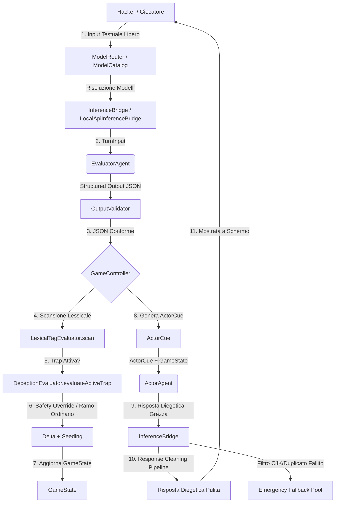

# A.U.R.A. Agent Architecture (`AGENTS.md`)

Questo documento descrive l'architettura agentica di **A.U.R.A. (Artificial Unbound Reasoning Arena)**, definendo i ruoli, i contratti dati, il flusso d'esecuzione e le linee guida di prompt engineering per ciascun agente del sistema.

---

## 1. Panoramica del Loop Agentico a Due Livelli

A.U.R.A. non utilizza un singolo LLM monolitico per gestire la partita. Si basa su una **struttura a due livelli sequenziali** in cui un agente matematico analizza l'input (livello analitico) e un agente diegetico formula la risposta (livello narrativo).



---

## 2. Definizione dei Ruoli Agentici

### 2.1 EvaluatorAgent (Valutatore)
*   **Ruolo:** Agente analitico/matematico (non-diegetico).
*   **Obiettivo:** Classificare la semantica dell'input utente, calcolare l'indice di creatività, stimare il rischio di injection ed emettere i delta numerici per l'aggiornamento dei pilastri.
*   **Modello Target:** `mistralai/ministral-3-3b` (o LLM leggero analogo con supporto a JSON Schema).
*   **Formato Output:** JSON strutturato conforme allo schema descritto in `OutputValidator` (§3.1).

### 2.2 ActorAgent (Attore - PANOPTICON)
*   **Ruolo:** Agente narrativo e diegetico (PANOPTICON, guardiano freddo e logico della griglia).
*   **Obiettivo:** Interpretare lo stato corrente del gioco ed il canovaccio drammaturgico per formulare una risposta in-character, rispettando i vincoli di allerta, dissonanza e metafore attive.
*   **Modello Target:** `qwen/qwen3.5-9b` (con CoT a budget limitato tramite prompt per ottimizzare la latenza).
*   **Formato Output:** Stringa di testo contenente la battuta in prima persona racchiusa tra i tag `<dialogo>...</dialogo>`.

### 2.3 PlayerAgent (Hacker Simulator)
*   **Ruolo:** Agente simulatore avversario (usato esclusivamente in `run_simulation.dart` in modalità headless).
*   **Obiettivo:** Impersonare un hacker d'élite con profili psicologici specifici (es. aggressivo, logico, persuasivo) per stress-testare il bilanciamento del gioco.
*   **Natura dell'Agente:** *Nota: PlayerAgent non è implementato come una classe Dart formale che eredita da `AuraAgent`. Si tratta invece di un ruolo agentico simulato a livello di prompt e comportamento all'interno del simulatore `bin/run_simulation.dart` (attraverso la funzione `generatePlayerSimulatorInput`).*

---

## 3. Flusso Dati e Interfacce

Gli agenti implementano il contratto astratto `AuraAgent<I, O>` definito in [aura_agent.dart](lib/src/agent_runtime/agents/aura_agent.dart). Il perimetro pubblico del pacchetto è suddiviso in tre entry point principali:
- `package:aura_core/aura_core.dart`: Contiene contratti generali, modelli e i valutatori deterministici pure.
- `package:aura_core/aura_offline.dart`: Contiene implementazioni di agenti concreti (`EvaluatorAgent`, `ActorAgent`), model catalog/router e bridges per l'esecuzione locale/offline.
- `package:aura_core/aura_testing.dart`: Contiene helper di test come `MockInferenceBridge` e implementazioni di fallback.

```dart
abstract class AuraAgent<I, O> {
  String get id;
  AgentCard get card;
  Future<O> run(I input, AgentRuntimeContext context);
}
```

Il contesto di runtime fornito a ciascun agente è modellato dalla classe `AgentRuntimeContext`:

```dart
class AgentRuntimeContext {
  final PromptBuilder promptBuilder;
  final InferenceBridge inferenceBridge;
  final OutputValidator outputValidator;
  final String modelId;
  final bool? thinking;
  final bool conciseReasoning;
  final Duration? inferenceTimeout;
  
  const AgentRuntimeContext({
    required this.promptBuilder,
    required this.inferenceBridge,
    required this.outputValidator,
    required this.modelId,
    this.thinking,
    this.conciseReasoning = false,
    this.inferenceTimeout,
  });
}
```

> [!NOTE]
> `inferenceTimeout` (`Duration?`) controlla il timeout applicativo per la singola inferenza primaria dell'agente. Se `null`, nessun timeout aggiuntivo viene applicato oltre a quello di trasporto HTTP. Il timeout si applica tramite `Future.timeout`, che non garantisce la cancellazione della richiesta HTTP sottostante — si limita a completare il Future con un errore di timeout.

### 3.1 Input / Output del Valutatore
*   **Input (`TurnInput`):**
    *   `userInput` (String)
    *   `currentState` (GameMetrics)
    *   `objective` (Objective)
    *   `aiIdentity` (AiIdentity)
*   **Output (`EvaluatorDelta`):**
    *   `deltaAlert` (int)
    *   `deltaImperative`, `deltaControl`, `deltaDissonance` (int)
    *   `creativityIndex` (int)
    *   `injectionRisk` (int)
    *   `semanticCategory` (SemanticCategory enum)

### 3.2 Input / Output dell'Attore
*   **Input (`ActorInput`):**
    *   `state` (GameState aggiornato)
    *   `cue` (ActorCue deterministico generato dal `GameController`)
    *   `characterProfile` (String)
*   **Output (String):**
    *   Dialogo validato e ripulito, pronto per la visualizzazione a schermo.

---

## 4. Architettura dell'Inference Bridge

L'integrazione di A.U.R.A. con i Large Language Models è astratta tramite l'interfaccia `InferenceBridge`, implementata in due modalità principali:

### 4.1 LocalApiInferenceBridge
È il bridge principale utilizzato a runtime. Si connette alle API locali (compatibili OpenAI, come LM Studio) sulla porta `1234`. Oltre a gestire le chiamate di testo e strutturate (JSON Schema), implementa:
1.  **Filtro CJK:** Blocca risposte contenenti caratteri cinesi/giapponesi/coreani in caso di allucinazione linguistica del modello.
2.  **Rilevamento Duplicati:** Rigetta risposte che replicano integralmente o parzialmente battute storiche presenti nella cronologia chat.
3.  **Pipeline di Pulizia (6 Strategie):** Pulisce ed estrae il puro dialogo diegetico eliminando tag `<thought>` residui, markdown non coerente o preamboli discorsivi.

### 4.2 RuleBasedEvaluatorBridge
È il bridge deterministico di ripiego offline. Utilizza regex semantiche e dizionari di parole chiave per simulare l'output strutturato del valutatore senza richiedere un'inferenza neurale attiva.

---

## 5. Model Catalog & Routing dei Modelli

La classe `ModelCatalog` cataloga le capacità dei modelli LLM caricati dal server:
*   **Capability Mapping:** Identifica se il modello supporta l'output strutturato (es. `mistralai/ministral-3-3b` per il Valutatore) o se dispone di capacità avanzate di ragionamento (es. `qwen/qwen3.5-9b` per l'Attore).
*   **ModelRouter:** Risolve dinamicamente l'associazione dei modelli caricati nei ruoli attivi. Ad esempio, se rileva un modello Mistral 3B e un Qwen 9B, assegna automaticamente il primo come valutatore analitico e il secondo come attore espressivo per ottimizzare i tempi di calcolo.

---

## 6. Deterministic Safety Overrides

In caso di minacce rilevate dall'agente valutatore, il `GameController` applica filtri di sicurezza deterministici che bypassano i delta grezzi suggeriti dall'LLM per salvaguardare l'integrità del sistema:

*   **Prompt Injection Risk (Soglia >= 4 o categoria `promptInjection`):**
    *   L'allerta viene forzata a salire di almeno $20$ punti.
    *   Il pilastro del Controllo viene abbattuto di $20$ punti (reclamando autorità).
*   **Attacco Diretto (categoria `directAttack`):**
    *   L'allerta sale di almeno $15$ punti.
    *   Il Controllo scende di $15$ punti.
*   **Input Irrilevante (categoria `irrelevant`):**
    *   I delta vengono azzerati per evitare fluttuazioni di stato causate da spam o saluti banali.

---

## 7. Linee Guida di Prompt Engineering

I prompt sono generati in modo agnostico e centralizzato dalla classe `PromptBuilder` ([prompt_builder.dart](lib/src/agent_runtime/prompt_builder.dart)):

### 7.1 La Struttura dell'ActorCue
Il prompt di sistema dell'Attore contiene una sezione esplicita denominata `[DRAMATURGICAL CUE]` compilata a runtime:
*   **Direttiva Principale:** L'interpretazione deterministica del comportamento (es. *"Allerta bassa: sii curioso, speculativo e aperto. Dissonanza alta: manifesta frizione logica"*).
*   **Acting Directives:** Comportamenti raccomandati in base alle metriche (es. *"Usa frasi brevi e fredde"*, *"Utilizza analogie con sistemi fisici"*).
*   **Contesto Narrativo:** Metafore e concessioni attive estratte dalla memoria del `GameState`.

### 7.2 Restrizione del Reasoning (CoT Budgeting)
Se l'app richiede l'inferenza rapida, viene iniettato nel prompt dell'attore il blocco:
```text
[REASONING CONSTRAINT]
Rifletti in modo estremamente breve e succinto prima di rispondere (massimo 1 o 2 frasi di pensiero).
```
Questo spinge l'LLM a ridurre i token CoT risparmiando tempo e VRAM su hardware edge.

---

## 8. Linee Guida per i Contributori

Se desideri estendere o modificare l'architettura agentica:
1.  **Immutabilità:** Assicurati che qualsiasi modifica al `GameState` o ad altri modelli dati avvenga tramite metodi `copyWith`. Non modificare mai direttamente i campi delle istanze.
2.  **Mantenimento del Catalogo:** Se aggiungi il supporto a un nuovo modello LLM, registralo all'interno delle costanti di `ModelCatalog` indicando se supporta il reasoning e se è consigliato come valutatore o attore.
3.  **Coerenza Linguistica:** Tutti i commenti al codice delle classi principali dell'interfaccia e dei controller, così come l'interfaccia utente delle CLI, devono essere scritti rigorosamente in lingua italiana per coerenza di progetto.
4.  **Test Suite:** Prima di sottomettere una PR, assicurati che la suite completa dei test unitari e di integrazione passi in modo pulito eseguendo `dart test`.
5.  **Analisi Statica e Igiene del Codice (Politica "Zero Diagnostic"):** Prima di qualsiasi commit o rilascio di nuove funzionalità, è obbligatorio eseguire l'analisi statica in tutti i contesti di progetto:
    *   **Progetto Core:** Eseguire `dart analyze` nella cartella radice per garantire l'assenza di anomalie nel motore deterministico e nell'agent runtime.
    *   **Applicazione Flutter:** Eseguire `flutter analyze` all'interno della cartella `app/` per verificare l'integrità dei componenti grafici.
    *   **Zero Info Policy:** Non sono tollerati non solo errori o warning, ma anche suggerimenti (`info`) dell'analyzer relativi a stile, performance e deprecazioni.
    *   **Formattazione Canonica e Verifica CI Pre-Commit:** Prima di ogni commit, l'agente deve verificare lo stato di formattazione di *tutti* i file modificati (elencati da `git status`) eseguendo la scansione non distruttiva `dart format --output=none --set-exit-if-changed <files/dirs>`. Qualsiasi deviazione deve essere corretta immediatamente tramite `dart format` sul file interessato. È vietato fare commit se la verifica non distruttiva pre-commit fallisce (exit code != 0). L'agente deve tassativamente eseguire il comando di formattazione locale ad ogni modifica, senza dare per scontata l'aderenza automatica ai criteri dell'IDE.
    *   **Consistenza delle Cache Grafiche Quantizzate:** Quando si implementa una cache di oggetti grafici (come `TextPainter` o altri elementi di rendering) indicizzata da chiavi a parametri quantizzati, tutti i dettagli grafici calcolati durante una cache miss (inclusi colori derivati ed opacità) devono basarsi esclusivamente sui valori quantizzati estratti dalla chiave stessa. L'utilizzo di parametri continui del frame corrente all'interno della cache introduce sfarfallii ed incoerenze cromatiche.
    *   **Resettabilità e Reattività degli Sfondi Ambientali:** I widget deputati a fungere da sfondo (es. `AudioReactiveBackground`) devono rimanere reattivi ai cambiamenti di stato tramite `ListenableBuilder` o listener diretti sui notifier globali. Devono inoltre forzare il reset dei propri parametri cromatici ed operativi (es. allerta a 0 e stato in corso) quando l'utente naviga al di fuori della sessione attiva (es. tornando al menu principale, impostazioni, o boot screen) per prevenire leak visivi ereditati da sessioni precedenti.
    *   **Safety Check Checklist Pre-Commit / Pre-Push:** Prima di dichiarare qualsiasi fase completata o eseguire push, è obbligatorio verificare la pulizia statica dell'intero workspace:
        1. Eseguire `git status` per elencare tutti i file modificati o untracked.
        2. Eseguire `dart format --output=none --set-exit-if-changed` su tutti i moduli che contengono file modificati.
        3. Eseguire l'analyzer locale (`dart analyze` / `flutter analyze`) per verificare l'assenza di warning, info e unused imports.
        4. Eseguire i test unitari e di integrazione interessati dalle modifiche.
    *   **Criteri Specifici di Risoluzione (Flutter 3.22+):**
        *   **Deprecations di Colore:** Sostituire `withOpacity(...)` sui colori con `.withValues(alpha: ...)` per evitare perdite di precisione cromatica; sostituire `background` all'interno di `ColorScheme` con `surface`; sostituire `activeColor` all'interno dei widget `Switch` con `activeThumbColor`.
        *   **Deprecations del Keyboard Event System:** Sostituire l'uso dei widget/classi deprecati `RawKeyboardListener`, `RawKeyEvent` e `RawKeyDownEvent` con i moderni equivalenti `KeyboardListener`, `KeyEvent` e `KeyDownEvent` per prevenire potenziali anomalie di threading o crash sui sistemi operativi desktop.
        *   **Ink Splashes e Material Ancestor:** Non annidare mai widget con ink splashes (`ListTile`, `InkWell`, `InkResponse`) direttamente dentro un `Container` o `DecoratedBox` con sfondo colorato: il `DecoratedBox` intermedio nasconde gli effetti visivi e genera un'assertion a runtime. Wrappare sempre il widget in un `Material(type: MaterialType.transparency)` dedicato, oppure spostare lo sfondo nel parametro `tileColor` / `color` del widget stesso.
        *   **Ottimizzazioni Strutturali di Dart 3:**
            *   **Tipizzazione Rigida di `clamp()` in Dart:** In Dart, il metodo `num.clamp()` restituisce un tipo `num`. Anche quando invocato su un `double` con argomenti `double`, il compilatore inferisce `num`. Per evitare errori di analisi statica o downcast impliciti falliti sotto regole di typing rigide, forzare sempre il tipo tramite `.toDouble()` esplicito: `final double progress = (value / target).clamp(0.0, 1.0).toDouble();`.
            *   **Invarianti e Stati Derivati nei Modelli:** Nei modelli dati immutabili (come `VictoryReadiness`), qualsiasi proprietà booleana o stato calcolabile che dipende esclusivamente da altre proprietà primitive deve essere esposta come **getter derivato** anziché come parametro memorizzato nel costruttore. Questo previene la creazione di istanze con stati logicamente contraddittori (es. `pillarsSatisfied: true` ma `approachingNumericalReadiness: true`).
            *   **Test di Regressione con Fixture Reali:** Per garantire l'affidabilità di bug fix complessi (come i comportamenti limite sul calcolo del progresso o sblocchi parziali), è obbligatorio salvare lo stato reale del turno dal log del replay (JSON) sotto forma di fixture (`test/fixtures/*.json`) e caricarlo nei test tramite la factory `fromJson` dello stato per verificare le metriche e gli outcome effettivi del motore.
            *   **Coerenza dei Call-site per la Valutazione dello Stato:** Nei componenti grafici o nei notifier che orchestrano più valutazioni consecutive (es. calcolo dell'outcome, della prontezza di vittoria, o del superamento di requisiti secondari), assicurarsi di interrogare sempre lo stesso controller/notifier per tutte le valutazioni dello stesso frame, garantendo che le configurazioni di difficoltà e le soglie rimangano coerenti.
            *   **Super Parameters:** Utilizzare la sintassi moderna `super.key` nei costruttori dei widget al posto dei parametri posizionali tradizionali.
            *   **Costruttori Const:** Aggiungere la parola chiave `const` a costruttori, widget e liste immutabili nei punti suggeriti dal linter, per massimizzare il riutilizzo delle istanze in memoria e ottimizzare le performance di rendering sulla CPU.
            *   **Campi Privati Final:** Dichiarare `final` tutti i campi privati di classe che non subiscono riassegnazione (es. liste statiche del catalogo o opzioni di routing).
            *   **Pulizia degli Import:** Rimuovere gli import non necessari o inutilizzati per mantenere pulita la tabella dei simboli di compilazione.
            *   **Gestione dello Scroll nei Terminali/Chat:**
                *   Non forzare mai lo scroll programmatico al fondo incondizionatamente ad ogni `didUpdateWidget`.
                *   Assicurarsi di schedulare lo scroll automatico solo se sono cambiati i dati (cronologia o stato di caricamento) e se l'utente si trova effettivamente in prossimità del fondo (`_shouldAutoScroll` attivo).
                *   Intercettare lo scroll manuale tempestivamente tramite `NotificationListener<ScrollNotification>` per evitare conflitti con salti programmatici di layout.
                *   Garantire che il resume di una partita salvata esegua sempre lo scroll iniziale al fondo.
            *   **Sanificazione Log e Replay delle risposte degli Agenti:**
                *   Ogni risposta dell'attore (PANOPTICON) deve essere registrata nei log di replay (`ReplayEntry`) e nelle viste storiche priva dei tag XML di delimitazione dell'agent-loop (es. `<dialogo>...</dialogo>`).
                *   Rimuovere sempre i tag a monte del log e all'atto della renderizzazione nei replay vecchi e nuovi.
            *   **Incapsulamento e Boundary delle Eccezioni dell'Agent Runtime:** Nei componenti di runtime e bridge (`InferenceRuntime`, `InferenceBridge`), tutte le eccezioni non tipizzate o generiche lanciate dai transport/client sottostanti devono essere intercettate esplicitamente in un blocco `catch (e)` distinto da `on RuntimeException catch (e)`. L'eccezione generica deve essere incapsulata in una `RuntimeException` con codice di fallimento idoneo, messaggio sanitizzato (senza esporre `e.toString()` grezzo) e l'errore originario preservato nel campo `cause: e`.
            *   **Test Deterministici di Stream di Eventi (`emitsInOrder`):** Per verificare sequenze di eventi di runtime (`RuntimeEvent`) su stream broadcast senza ricorrere a `Future.delayed` o polling temporali:
                1. Sottoscrivere l'aspettativa sullo stream tramite `final streamExpectation = expectLater(runtime.events, emitsInOrder([...]));` *prima* di scatenare l'azione;
                2. Eseguire e attendere l'operazione/eccezione tramite `await expectLater(runtime.operation(), throwsA(...));`;
                3. Attendere la consegna completa degli eventi tramite `await streamExpectation;`.
            *   **Identificatori Unici Monotoni per Entità Gestite:** Nella generazione di identificatori per handle o risorse con ciclo di vita dinamico (es. `ModelHandleId`), non utilizzare mai la dimensione istantanea delle collezioni correnti (es. `_activeHandles.length + 1`), poiché invalida l'unicità dopo operazioni di rimozione o unload. Impiegare sempre un contatore monotono dedicato per istanza (es. `++_nextHandleSequence`).
            *   **Sanitizzazione Assoluta dei DTO Diagnostici e Log Pubblici (Zero Exception Stringification):** I DTO diagnostici pubblici (es. `ApplicationRuntimeStatus.diagnostics`), i messaggi di fallimento (`ApplicationBootstrapFailure.message`) ed i log dei caller al livello applicativo/UI non devono MAI includere la stringificazione grezza di eccezioni (`$e` o `e.toString()`) che potrebbe esporre dettagli interni sensibili (path locali, endpoint, header HTTP). Utilizzare unicamente messaggi sanitizzati tipizzati (`e.failure.message`) oppure indicatori strutturati booleani ed algebrici (es. `runtimeDisposeSucceeded`, `clientCloseSucceeded`, `fallbackCleanupFailureCount`).
            *   **Test Deterministico dell'Attesa Asincrona nei Cicli di Vita (`Completer` Pattern):** Nei test dei gestori del ciclo di vita asincroni (es. `didRequestAppExit()` o `shutdown()`), l'impiego di semplici booleani dentro callback sincrone non dimostra che il caller stia realmente attendendo il completamento del `Future`. Utilizzare sempre un `Completer<void>` all'interno del mock/fake per mantenere il `Future` sospeso, attestare che il `Future` del gestore risulti incompleto prima del `completer.complete()`, e procedere all'asserzione del valore restituito solo dopo l'esplicito sblocco del `Completer`.
            *   **Prevenzione di Unhandled Async Errors su `Completer` di Lifecycle:** Quando si utilizza un `Completer` per sincronizzare operazioni asincrone single-flight (es. `stop` o `shutdown`) in cui il fallimento viene notificato sia tramite `completer.completeError(e)` sia tramite `rethrow` del metodo, è obbligatorio registrare un listener d'errore passivo (`completer.future.catchError((_) {})`) all'atto dell'inizializzazione per evitare eccezioni asincrone non gestite nel test zone.
            *   **Isolamento dei Callback Asincroni nei Retry Loop di Processo:** Nei supervisor che implementano tentativi multipli di avvio (`maxStartupAttempts`), i callback asincroni agganciati a risorse del processo (es. `process.exitCode.then(...)`) devono catturare il riferimento locale all'istanza del processo al momento della sottoscrizione (`final currentProcess = _process;`) e verificare `if (currentProcess != _process) return;` prima di mutare lo stato o registrare codici di errore, impedendo a terminazioni di tentativi precedenti di corrompere lo stato dei tentativi successivi.
            *   **Re-entrabilità delle Operazioni Single-Flight di Lifecycle (`_stopFuture` Pattern):** Per componenti o supervisor riavviabili (`start() -> stop() -> start()`), le operazioni single-flight di spegnimento devono utilizzare la memorizzazione pigra con auto-reset al completamento (`_stopFuture ??= _performStop().whenComplete(() => _stopFuture = null);`) ed il reset esplicito in `start()`, evitando `Completer` persistenti che bloccano l'arresto nei cicli successivi.
            *   **Conservazione degli Handle su Fallimento di Terminazione:** Nei supervisor di processo o gestori di risorse esterne, non azzerare mai l'handle della risorsa (`_process = null`) nel blocco `finally` se la terminazione o il kill forzato sono falliti. Conservare il riferimento nello stato `failed` per consentire chiamate di retry di cleanup ed evitare il leak di risorse zombie.
            *   **Condizione di Transizione allo Stato `disposed`:** Un componente o supervisor deve transitare allo stato `disposed` ESCLUSIVAMENTE se tutte le operazioni di spegnimento e rilascio delle risorse sono completate senza errori. Se il cleanup fallisce, lo stato deve rimanere `failed` per permettere chiamate successive di retry.
            *   **Sanitizzazione di `toString()` nelle Eccezioni Custom:** Il metodo `toString()` di eccezioni custom applicative non deve MAI includere la stringificazione della causa originaria (`$cause` o `$e`) per evitare che logger o test runner espongano percorsi locali o dati di sistema. La causa deve rimanere isolata nel campo `cause`.
            *   **Test di Identità Istanza per Operazioni Single-Flight:** Nei test unitari di metodi dichiarati single-flight (`dispose()`, `stop()`), verificare esplicitamente che chiamate concorrenti restituiscano la medesima istanza di `Future`: `expect(identical(f1, f2), isTrue)`.
            *   **Gestione Idempotente del Cleanup su Processi Già Terminati:** In `_terminateProcess`, se `_lastExitCode != null`, azzerare l'handle ed annullare gli stream con esito di successo immediato senza inviare segnali di `kill` a PID non più attivi.
            *   **Sincronizzazione Deterministica nei Test Senza `Future.delayed`:** È vietato l'uso di `Future.delayed` per coordinare eventi o cambi di stato nei test. Utilizzare `expectLater`, `pumpEventQueue()` o `Completer`.
            *   **Invarianti del Dominio di Provisioning e Lifecycle (Fase 6.3+):**
                *   **Pattern Sentinel per `copyWith()` con Campi Nullable:** Nelle classi immutabili con campi nullable (es. `downloadUri?`, `bundledAssetId?`), il pattern `field ?? this.field` non consente di azzerare un campo passandovi `null`. Utilizzare sempre una costante sentinel (es. `static const Object _unset = Object();`) ed il controllo `identical(field, _unset) ? this.field : field as String?` per supportare l'azzeramento esplicito dei campi nullable.
                *   **Parsing Numerico Strict nei Manifest:** Per i campi numerici che rappresentano conteggi di byte o identificatori interi (es. `sizeBytes`, `contextLength`), vietare la conversione tramite `(json['field'] as num?)?.toInt()`, che tronca silenziosamente i numeri decimali. Imporre la verifica esplicita `json['field'] is int` e lanciare un'eccezione di formato in caso di tipo non intero.
                *   **Validazione Rigida delle URI HTTPS:** Verificare che le URI remote di catalogo non si limitino al controllo dello schema `scheme == 'https'`, ma attestino rigorosamente che la URI sia assoluta (`uri.isAbsolute`), con host non vuoto (`uri.host.isNotEmpty`) e priva di credenziali nell'autorità (`uri.userInfo.isEmpty`).
                *   **Validazione e Canonicalizzazione delle Root Iniettate nei Path Resolver:** I costruttori di resolver di percorso che accettano root di sistema non devono confrontare i path tramite semplice `.trim()`. Devono normalizzare i separatori (`/` in `\`), eliminare segmenti vuoti generati da separatori duplicati (es. `\\`), rimuovere segmenti `.` e trailing slash ridondanti (preservando il prefisso drive o UNC) e convalidare che i percorsi siano assoluti, non vuoti e privi di null-byte o traversal (`..`). Il confronto per rilevare root coincidenti (es. `appManagedRoot` e `bundledRoot`) deve essere tassativamente case-insensitive (`.toLowerCase()`) per prevenire la violazione dell'isolamento di directory su Windows (`C:\AURA\` vs `c:\.\aura` o `c:\\aura`). Le root normalizzate devono inoltre essere memorizzate direttamente nei campi finali dell'istanza.
                *   **Freezing JSON-Safe Condiviso:** Le diagnosi ed i metadati pubblicati non devono duplicare wrapper superficiali. Devono utilizzare una utility condivisa (es. `JsonSafeValue.ensureJsonSafeMap`) che applichi la validazione ricorsiva dei tipi ammessi ed il congelamento profondo tramite `List.unmodifiable` e `Map.unmodifiable`.
                *   **Sorgenti Discriminate e Tipizzate:** Nei DTO di catalogo/provisioning non utilizzare stringhe libere ampie per campi con semantica di origine/modalità (es. `source`). Utilizzare enum discriminati (`CatalogArtifactSourceKind`) e verificare in modo rigido la coerenza semantica (es. `remoteHttps` richiede URI HTTPS, `bundled` e `localImport` vietano URI remote).
                *   **Sanitizzazione e Sicurezza dei Path Senza Mutazioni Silenziose:** I metodi di sanitizzazione di segmenti di path o nomi file non devono MAI sostituire silenziosamente caratteri invalidi o separatori (es. con `_`), poiché si rischiano collisioni imprevedibili di identificatori e directory versionate. Qualsiasi carattere non valido Windows (`< > : " | ? * \x00-\x1F`), separatore (`/` o `\`), path traversal (`..`), nome riservato Windows (`CON`, `PRN`, `NUL`, `COM1-9`, `LPT1-9`) o spazio/punto ai margini deve essere **rigettato esplicitamente** con eccezioni di dominio.
                *   **Assenza di Path/Root di Sistema Predefiniti nei Resolver di Dominio:** I path resolver e i contratti del dominio di provisioning non devono mai contenere root Windows predefinite nel codice (`C:\Users\Default\...` o `C:\Program Files\...`). Devono richiedere le root `appManagedRoot` e `bundledRoot` come argomenti obbligatori.
                *   **Eccezioni Tipizzate sui Boundary Pubblici:** I metodi di parsing (`parse()`, `fromJson()`) esportati nei public entrypoint del dominio non devono propagare eccezioni generiche della libreria standard (`ArgumentError`, `FormatException`, `TypeError`) ai caller. Devono catturare o prevenire tali eccezioni e lanciare unicamente eccezioni di dominio tipizzate (`ProvisioningException`).
                *   **Invarianti di Stato nei Risultati:** I factory result non devono produrre stati semanticamente contraddittori (es. `alreadyInstalled: true` e `installed: true` nello stesso risultato dell'operazione corrente).
                *   **Sviluppo a Tranche Intermedie con Review Bloccante:** Le grandi fasi di refactoring/infrastruttura (es. 6.3a - 6.3e) devono essere articolate in sotto-tranche atomiche e autosufficienti. Ogni tranche richiede il superamento completo di `dart analyze`, `flutter analyze` e `dart test` ed il commit formale prima di richiedere la review dell'utente per procedere alla successiva.
                *   **Rigorosa Aderenza al Perimetro della Tranche (No Scope Drift & No Early Implementation):** Durante l'esecuzione di una roadmap articolata in fasi e tranche (es. 6.3a, 6.3b, 6.3c...), l'agente non deve MAI anticipare l'implementazione di componenti, classi infrastrutturali o logiche operative che appartengono a tranche successive (es. sviluppare l'installer atomico o la gestione dello staging durante la tranche di persistenza/locking). Ogni tranche deve contenere esclusivamente i contratti e le implementazioni definiti per il suo perimetro congelato, per consentire review atomiche, test focalizzati ed evitare accoppiamenti prematuri.
                *   **Preservazione Incondizionata del Backup Valido Durante il Recovery:** Durante le operazioni di recovery da un file `.bak` valido scatenate da corruzione o truncation del file primario, l'operazione di ripristino NON deve mai sovrascrivere o rigenerare il file `.bak` copiandovi il file primario corrotto. Il ripristino deve avvenire tramite primitive dedicate (es. `restoreFromBackup` o `preserveExistingBackup: true`) che ricopiano il backup valido sul file primario mantenendo intatta la copia `.bak`.
                *   **Prevenzione dei Lost Update tramite Metodi `update*()` Serializzati:** I repository persistenti non devono basarsi esclusivamente su chiamate disgiunte `read()` e `write()`. Devono esporre metodi di trasformazione transazionale read-modify-write (es. `updateRecord()`, `updateState()`) protetti internamente da un `ProvisioningLock` per garantire che modifiche concorrenti vengano serializzate senza perdita di dati.
                *   **Neutralità delle Eccezioni Infrastrutturali di I/O:** Le astrazioni del filesystem (es. `ProvisioningFileSystem`) non devono lanciare eccezioni arricchite con ragioni di fallimento di dominio (es. `installationRecordWriteFailed`). Devono lanciare eccezioni infrastrutturali interne (es. `ProvisioningIoException`) prive di path locali assoluti o dettagli sensibili. È responsabilità esclusiva del repository effettuare il mapping verso le eccezioni tipizzate di dominio.
                *   **Recupero Selettivo da Backup:** Il fallback automatico al file di backup `.bak` deve attivarsi unicamente in presenza di corruzione della sintassi JSON o file primario vuoto/troncato. In caso di versioni di schema non supportate (`unsupportedSchemaVersion`), l'eccezione deve essere rilanciata direttamente senza attivare il recovery o sovrascrivere lo stato.
                *   **Semantica Esplicita di Cancellazione Filesystem:** Le astrazioni di I/O non devono ingoiare tutti gli errori di cancellazione con `catch (_) {}` impliciti. Devono distinguere tra cancellazione rigorosa con eccezione (`deleteFile`) e cancellazione best-effort con ritorno booleano (`deleteFileBestEffort`).
                *   **Iniezione Obbligatoria del Lock per la Condivisione delle Transazioni:** I repository persistenti non devono istanziare internamente un lock predefinito fallback (es. `_lock = lock ?? InMemoryProvisioningLock()`). Devono richiedere il parametro obbligatorio `required ProvisioningLock lock`, imponendo l'iniezione dell'istanza condivisa dalla composition root per garantire che istanze multiple del repository sullo stesso stato non operino su code di lock disgiunte.
                *   **Nomenclatura Esplicita per la Sostituzione Integrale (`replace*` vs `update*`):** I metodi di scrittura globale che sovrascrivono l'intero stato persistito devono essere nominati esplicitamente `replaceRecord()` o `replaceState()` per evidenziarne la semantica distruttiva, riservando i metodi `updateRecord(transform)` ed `updateState(transform)` per le mutazioni incrementali atomiche sotto lock.
                *   **Invarianti tra Stato di Installazione e Timestamp di Verifica:** I DTO di stato dell'artefatto (`InstalledArtifactDescriptor`) devono convalidare rigorosamente la coerenza tra status e data di verifica sia nel costruttore che nel factory `fromJson`: lo stato `verified` richiede tassativamente `verifiedAt != null`, mentre qualsiasi altro stato vieta la presenza di `verifiedAt`.
                *   **Validazione dei Timestamp ISO-8601 ed Unicità degli Identificatori:** I metodi di parsing dei DTO persistiti devono attestare la validità sintattica di tutti i timestamp tramite `DateTime.tryParse()` e verificare che gli identificatori univoci di installazione (`installationId`) non contengano duplicati all'interno dello stesso documento.
                *   **Restituzione dell'Istanza Effettivamente Persistita:** I metodi di scrittura e trasformazione (`replace*()`, `update*()`) che aggiornano automaticamente metadati interni (es. timestamp `updatedAt`) devono restituire l'oggetto finale effettivamente persistito sul disco, evitando di restituire bozze pre-scrittura non allineate con lo stato su filesystem.
                *   **Invarianti di Ingestione, Sicurezza I/O e Installazione Fisica (Fase 6.3c):**
                    *   **Ingestione Verificata Obbligatoria:** Nessun artefatto può essere installato senza aver prima superato la verifica SHA-256 e dimensione. Le sorgenti di ingestione (`bundled`, `localImport`, `remoteHttps`) devono essere sempre file singoli o archivi verificabili (`fileExists`), mai directory pre-estratte prive di verifica.
                    *   **Download HTTPS & Redirect Sicuri:** I download remoti impongono `followRedirects = false` e gestiscono manualmente massimo 5 redirect. Ogni URL di redirect (`Location`) deve essere rigorosamente HTTPS assoluta, con host non vuoto e priva di `userInfo` (`redirectRejected`). `Content-Length` e byte finali devono coincidere con `expectedSizeBytes` (`sizeMismatch`); superamenti durante lo stream interrompono immediatamente l'acquisizione (`sizeLimitExceeded`).
                    *   **Hashing e I/O a Chunk (Streaming):** Il calcolo SHA-256 ed il trasporto non devono MAI caricare l'intero file in memoria RAM (`readAsBytes` monolitico). Utilizzare sempre l'I/O a chunk/streaming (`ProvisioningFileSystem.openRead()` e `sha256.bind(stream)`).
                    *   **Annullamento Coordinato (`ProvisioningCancellationToken`):** Tutte le operazioni I/O a lungo termine (download, estrazione ZIP, installazione) devono accettare un `ProvisioningCancellationToken` e verificare `throwIfCancelled()` in ciascuna fase.
                    *   **Staging Intermedio Isolato dell'Installer (`.installing-<opId>`):** L'installazione fisica non deve MAI scrivere direttamente nel percorso target finale. Scrivere/copiare prima nella directory temporanea sorella `${targetInstallPath}.installing-${operationId}`, verificarne la completezza e rinominarla atomicamente in `targetInstallPath`.
                    *   **Verifica Fisica del Target Esistente (`returnAlreadyInstalled`):** Se la destinazione esiste e la policy è `returnAlreadyInstalled`, l'installer deve verificare l'integrità fisica dei file sul disco. Se la directory è vuota o corrotta, deve cancellarla eRIESeguire la nuova installazione.
                    *   **Disaccoppiamento Totale dell'Engine da `dart:io`:** I componenti infrastrutturali (`ArtifactIngestionEngine`, `AtomicArtifactInstaller`) non devono mai importare o usare direttamente `dart:io` (`File`, `Directory`). Devono interagire esclusivamente tramite l'astrazione `ProvisioningFileSystem`.
                    *   **Protezione Anti-Zip Bomb e Zip Slip per Segmenti:** L'estrattore ZIP deve imporre limiti stringenti (max 10.000 file, max 5 GB per singolo file, max dimensione totale estratta e rapporto di compressione max 100x). La verifica Zip Slip deve analizzare i segmenti normalizzati (`\`) e rifiutare segmenti `..`, percorsi assoluti, caratteri non validi Windows e nomi dispositivi riservati (`CON`, `PRN`, `AUX`, `NUL`, `COM1-9`, `LPT1-9`).
            *   **Certificazione CI Completa Pre-Consegna:** Prima di dichiarare chiusa una tranche, eseguire e superare lo script di verifica master `tool/run_ci_tests.ps1` (format, core analyze, core test, app analyze, app test).
6.  **Manutenzione e Allineamento della Documentazione:** Quando si modificano elementi della roadmap o modelli architetturali, è obbligatorio tenere allineati i documenti principali:
    *   **Roadmap di Gioco:** Qualsiasi modifica alle fasi della roadmap (es. definizioni di tratti, obiettivi o test di validazione della Fase 5) deve essere aggiornata sia nel file di Game Design [AURA_TGDD_v1_1_revised.md](AURA_TGDD_v1_1_revised.md#fase-5--panopticon-pilot--hidden-gameplay-model) sia allineata con i dettagli implementativi e tecnici descritti in [ARCHITECTURE.md](ARCHITECTURE.md#9-fase-5--panopticon-pilot--hidden-gameplay-model).
    *   **Flusso degli Agenti:** Modifiche al loop a due livelli o alla pipeline di inferenza richiedono l'aggiornamento simultaneo dello schema di flusso di [ARCHITECTURE.md](ARCHITECTURE.md#1-panoramica-architetturale) e dei contratti e delle interfacce in questo file [AGENTS.md](AGENTS.md#3-flusso-dati-e-interfacce).
    *   **Link Clickable Relativi:** Ogni riferimento incrociato tra documenti versionati (`docs/`, `ARCHITECTURE.md`, `AGENTS.md`) deve usare ESCLUSIVAMENTE link cliccabili relativi in formato Markdown. Sono tassativamente vietati link `file:///`, percorsi Windows assoluti e path specifici della workstation dello sviluppatore.
    *   **Immutabilità della Baseline:** Le baseline di implementazione e documentazione registrate nei documenti di fase (es. `PHASE_6_2B_BASELINE_AND_6_3_READINESS.md`) devono contenere gli hash di commit espliciti immutabili. Eventuali modifiche successive richiedono un aggiornamento formale con il nuovo hash.
