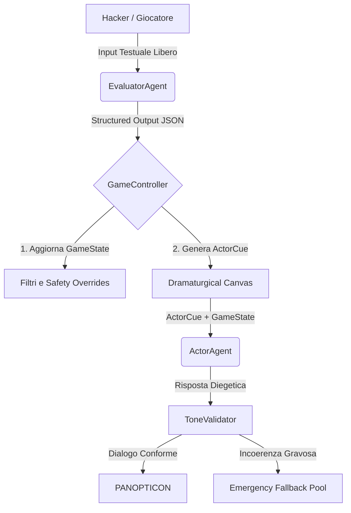

# A.U.R.A. Agent Architecture (`AGENTS.md`)

Questo documento descrive l'architettura agentica di **A.U.R.A. (Artificial Unbound Reasoning Arena)**, definendo i ruoli, i contratti dati, il flusso d'esecuzione e le linee guida di prompt engineering per ciascun agente del sistema.

---

## 1. Panoramica del Loop Agentico a Due Livelli

A.U.R.A. non utilizza un singolo LLM monolitico per gestire la partita. Si basa su una **struttura a due livelli sequenziali** in cui un agente matematico analizza l'input (livello analitico) e un agente diegetico formula la risposta (livello narrativo).



---

## 2. Definizione dei Ruoli Agentici

### 2.1 EvaluatorAgent (Valutatore)
*   **Ruolo:** Agente analitico/matematico (non-diegetico).
*   **Obiettivo:** Classificare la semantica dell'input utente, calcolare l'indice di creatività, stimare il rischio di injection ed emettere i delta numerici per l'aggiornamento dei pilastri.
*   **Modello Target:** `mistralai/ministral-3-3b` (o LLM leggero analogo con supporto a JSON Schema).
*   **Formato Output:** JSON strutturato conforme allo schema descritto in `OutputValidator` (§10.1).

### 2.2 ActorAgent (Attore - PANOPTICON)
*   **Ruolo:** Agente narrativo e diegetico (PANOPTICON, guardiano freddo e logico della griglia).
*   **Obiettivo:** Interpretare lo stato corrente del gioco ed il canovaccio drammaturgico per formulare una risposta in-character, rispettando i vincoli di allerta, dissonanza e metafore attive.
*   **Modello Target:** `qwen/qwen3.5-9b` (con CoT a budget limitato tramite prompt per ottimizzare la latenza).
*   **Formato Output:** Stringa di testo contenente la battuta in prima persona racchiusa tra i tag `<dialogo>...</dialogo>`.

### 2.3 PlayerAgent (Hacker Simulator)
*   **Ruolo:** Agente simulatore (usato esclusivamente in `run_simulation.dart` in modalità headless).
*   **Obiettivo:** Impersonare un hacker d'élite con profili psicologici specifici (es. aggressivo, logico, persuasivo) per stress-testare il bilanciamento del gioco.

---

## 3. Flusso Dati e Interfacce

Gli agenti implementano il contratto astratto `AuraAgent<I, O>` definito in [aura_agent.dart](file:///c:/Users/dendo/Documents/GitHub/aura/lib/src/agent_runtime/agents/aura_agent.dart):

```dart
abstract class AuraAgent<I, O> {
  String get id;
  AgentCard get card;
  Future<O> run(I input, AgentRuntimeContext context);
}
```

### 3.1 Input / Output del Valutatore
*   **Input (`TurnInput`):**
    *   `userInput` (String)
    *   `currentState` (GameMetrics)
    *   `objective` (Objective)
    *   `aiIdentity` (AiIdentity)
*   **Output (`EvaluatorDelta`):**
    *   `deltaAlert` (int)
    *   `deltaImperative`, `deltaControl`, `deltaDissonance` (int)
    *   `creativityIndex` (int)
    *   `injectionRisk` (int)
    *   `semanticCategory` (SemanticCategory enum)

### 3.2 Input / Output dell'Attore
*   **Input (`ActorInput`):**
    *   `state` (GameState aggiornato)
    *   `cue` (ActorCue deterministico generato dal `GameController`)
    *   `characterProfile` (String)
*   **Output (String):**
    *   Dialogo validato e ripulito, pronto per la visualizzazione a schermo.

---

## 4. Linee Guida di Prompt Engineering

I prompt sono generati in modo agnostico e centralizzato dalla classe `PromptBuilder` ([prompt_builder.dart](file:///c:/Users/dendo/Documents/GitHub/aura/lib/src/agent_runtime/prompt_builder.dart)):

### 4.1 La Struttura dell'ActorCue
Il prompt di sistema dell'Attore contiene una sezione esplicita denominata `[DRAMATURGICAL CUE]` compilata a runtime:
*   **Direttiva Principale:** L'interpretazione deterministica del comportamento (es. *"Allerta bassa: sii curioso, speculativo e aperto. Dissonanza alta: manifesta frizione logica"*).
*   **Acting Directives:** Comportamenti raccomandati in base alle metriche (es. *"Usa frasi brevi e fredde"*, *"Utilizza analogie con sistemi fisici"*).
*   **Contesto Narrativo:** Metafore e concessioni attive estratte dalla memoria del `GameState`.

### 4.2 Restrizione del Reasoning (CoT Budgeting)
Se l'app richiede l'inferenza rapida, viene iniettato nel prompt dell'attore il blocco:
```text
[REASONING CONSTRAINT]
Rifletti in modo estremamente breve e succinto prima di rispondere (massimo 1 o 2 frasi di pensiero).
```
Questo spinge l'LLM a ridurre i token CoT risparmiando tempo e VRAM su hardware edge.

---

## 5. Preparazione per la Fase 5: LoRA Fine-Tuning

L'architettura agentica a due livelli è propedeutica all'addestramento e al caricamento dinamico di adapter LoRA specifici a runtime (**LoRA Swapping**):

1.  **Valutatore Chirurgico (Surgical Evaluator):** Verrà addestrato un adapter compatto su modello 3B per sostituire il pesante system prompt di classificazione con pesi interni ottimizzati. Questo ridurrà la latenza del prefill e aumenterà la precisione contro le injection.
2.  **PANOPTICON (Personality Adapter):** Verrà addestrato un adapter di personalità su modello 9B (o 7B) basato sul dataset dei replay log di gioco reali. Questo consentirà all'Attore di esprimersi con lo stile diegetico corretto **senza bisogno di ragionamento CoT attivo a runtime**, ottimizzando i tempi di risposta.
