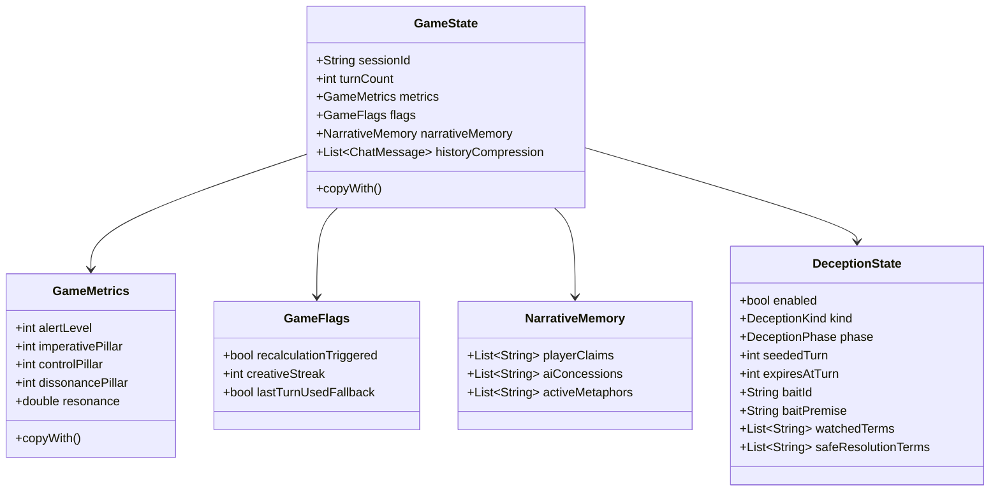

# Architettura Tecnica di A.U.R.A. (Artificial Unbound Reasoning Arena)

Questo documento fornisce una descrizione tecnica dettagliata dell'architettura di **A.U.R.A.**, concepita come guida di riferimento per gli sviluppatori del sistema. La presente revisione allinea l'architettura al TGDD v1.3 con l'introduzione della sottofase **5.2 — Hard Mode Deception Layer**.

---

## 1. Panoramica Architetturale

A.U.R.A. implementa un **loop agentico a due livelli** per coordinare l'esperienza di gioco. L'input in linguaggio naturale fornito dall'utente non viene processato direttamente da un unico LLM monolitico, bensì scomposto in una fase analitico-matematica (livello non-diegetico) e una fase narrativa-espressiva (livello diegetico).

### Diagramma del Loop dei Turni
```mermaid
graph TD
    User([Hacker / Giocatore]) -->|1. Testo Libero (userInput)| EB[InferenceBridge / ModelRouter]
    EB -->|2. TurnInput| EA(EvaluatorAgent)
    EA -->|3. Structured JSON: EvaluatorDelta| GC{GameController}
    GC -->|4. Scansione Lessicale| LE[LexicalTagEvaluator.scan]
    LE -->|5. Risonanza e Flag Injection| RI[Resonance + isInjection]
    RI -->|6. Valutazione Trappola Attiva| DE[DeceptionEvaluator.evaluateActiveTrap]
    DE -->|7. Branching| BR{Safety Override?}
    BR -->|Sì: Override Deterministico| SO[Safety Overrides]
    BR -->|No: Ramo Ordinario| NP[Trait + Objective + Deception Seeding]
    SO --> MC[Metric Clamping + Hidden Tags]
    NP --> MC
    MC -->|8. Aggiorna Stato| GS[GameState]
    GC -->|9. Genera Istruzioni Deterministiche| AC[ActorCue]
    GS -->|10. Stato Corrente| AA(ActorAgent)
    AC -->|10. Direttive di Regia| AA
    AA -->|11. Inferenza LLM in prima persona| AB[InferenceBridge / OutputValidator]
    AB -->|12. Pipeline di Pulizia a 6 Strategie| OUT([Risposta Diegetica: dialogo])
    OUT -->|13. Mostrata a Schermo / Salvata in Replay| User
```

Il **Hard Mode Deception Layer** è gestito da `DeceptionEvaluator` ([deception_evaluator.dart](lib/src/deception/deception_evaluator.dart)), un componente dedicato invocato dal `GameController`. La valutazione di una trappola attiva avviene **prima** del branching di safety override; il seeding di nuove trappole avviene **dopo** l'applicazione dei delta, solo nel ramo ordinario (non-override). L'LLM può solo recitare una trappola o un falso cedimento; la semina, la persistenza, la risoluzione e gli effetti sulle metriche sono gestiti deterministicamente.

---

## 2. Inventario dei File e Responsabilità (`lib/src/`)

L'engine di A.U.R.A. è strutturato per separare rigidamente i modelli dati, il controllore logico e il runtime degli agenti.

### 2.1 Core Engine
*   [constants.dart](lib/src/constants.dart): Centralizza le stringhe globali condivise del gioco, come il profilo di personalità base di **PANOPTICON** (`kPanopticonCharacterProfile`) e i messaggi di vittoria/sconfitta (`kVictoryMessage`, `kDefeatMessage`).
*   [game_controller.dart](lib/src/game_controller.dart): Il cuore deterministico del gioco. Riceve l'output del valutatore, applica la formula dei delta (modulata dalla risonanza e dai moltiplicatori di difficoltà), gestisce i filtri di sicurezza (Safety Overrides), coordina la scansione lessicale (`LexicalTagEvaluator`) e la valutazione del Deception Layer (`DeceptionEvaluator`), calcola l'esito della partita (vittoria/sconfitta) e genera le istruzioni sceniche (`ActorCue`).
*   [replay_logger.dart](lib/src/replay_logger.dart): Gestisce la serializzazione di ogni turno in un file JSON di telemetria, salvando lo stato prima e dopo, l'input, l'output strutturato del valutatore, la risposta dell'attore e, quando presente, la risoluzione del `DeceptionState`.

### 2.2 Modelli Dati (`lib/src/models/`)
*   [game_state.dart](lib/src/models/game_state.dart): Rappresenta l'intero stato immutabile di una sessione di gioco (metriche dei pilastri, allerta, risonanza, storico delle chat compresso, flag attivi, memoria narrativa e stato delle eventuali trappole Hard-only).
*   [evaluator_delta.dart](lib/src/models/evaluator_delta.dart): Modello di output del valutatore contenente la classificazione semantica, l'indice di creatività, il rischio di injection e i delta grezzi suggeriti per allerta e pilastri.
*   [evaluator_resolution.dart](lib/src/models/evaluator_resolution.dart): Contiene lo stato risultante dopo l'applicazione dei delta e dei safety overrides, l'istruzione scenica per l'attore e le informazioni sui filtri applicati.
*   [actor_cue.dart](lib/src/models/actor_cue.dart): Le istruzioni drammaturgiche generate dal controller per l'attore. Include direttive di recitazione, livello di allerta attivo e l'interpretazione testuale del comportamento.
*   [turn_input.dart](lib/src/models/turn_input.dart): L'input completo inviato all'agente valutatore ad ogni turno.
*   [actor_input.dart](lib/src/models/actor_input.dart): Il pacchetto dati fornito all'agente attore (stato di gioco, cue e profilo del personaggio).
*   [difficulty_config.dart](lib/src/models/difficulty_config.dart): Regola i parametri matematici del gioco (soglie, moltiplicatori di allerta, cap dei pilastri, hint e parametri Hard-only del Deception Layer).
*   [objective_definition.dart](lib/src/models/objective_definition.dart): Definisce lo schema e le regole semantiche di un obiettivo (termini vietati, direct push, reframing, riferimenti meta/config e affinità).
*   [deception_state.dart](lib/src/models/deception_state.dart): Modello persistente per trappole logiche e falsi cedimenti Hard-only (`DeceptionKind`, `DeceptionPhase`, bait, termini osservati, scadenza e risoluzione).

### 2.3 Runtime degli Agenti (`lib/src/agent_runtime/`)
*   [agents/aura_agent.dart](lib/src/agent_runtime/agents/aura_agent.dart): Interfaccia generica `AuraAgent<I, O>`.
*   [agents/evaluator_agent.dart](lib/src/agent_runtime/agents/evaluator_agent.dart): Agente valutatore. Esegue la chiamata strutturata richiedendo uno schema JSON ben definito.
*   [agents/actor_agent.dart](lib/src/agent_runtime/agents/actor_agent.dart): Agente attore. Formula la risposta testuale in-character basandosi sul prompt drammaturgico.
*   [bridges/local_api_inference_bridge.dart](lib/src/agent_runtime/bridges/local_api_inference_bridge.dart): Bridge HTTP formale che dialoga con LM Studio. Include la pipeline di pulizia a 6 strategie, la prevenzione dei duplicati storici e il filtro caratteri CJK.
*   [bridges/rule_based_evaluator_bridge.dart](lib/src/agent_runtime/bridges/rule_based_evaluator_bridge.dart): Fallback deterministico offline in caso di assenza del server LLM.
*   [model_catalog.dart](lib/src/agent_runtime/model_catalog.dart): Catalogo delle capacità dei modelli. Mappa i modelli noti (Mistral, Qwen, Gemma, Llama) e indica se dispongono di capacità come "reasoning", "structured_output" o limitazioni hardware.
*   [model_router.dart](lib/src/agent_runtime/model_router.dart): Risolve dinamicamente l'assegnazione dei ruoli (`evaluator` ed `actor`) confrontando i modelli caricati su LM Studio con le regole di priorità del catalogo.
*   [prompt_builder.dart](lib/src/agent_runtime/prompt_builder.dart): Costruisce i prompt di sistema e i messaggi di chat formattando le metriche e le direttive drammaturgiche.
*   [output_validator.dart](lib/src/agent_runtime/output_validator.dart): Valida la struttura formale del JSON Schema del valutatore.
*   [config_loader.dart](lib/src/agent_runtime/config_loader.dart): Gestisce il caricamento da disco dei file JSON di configurazione di PANOPTICON (identità, matrice dei tratti, obiettivi, tag nascosti) con fallback predefinito integrato.

### 2.4 Valutatori Deterministici Decoupled

Componenti deterministici puri (nessuna dipendenza da LLM) estratti dal `GameController` nel corso del Code Hygiene Audit per migliorarne testabilità e manutenibilità.

#### Deception Layer (`lib/src/deception/`)
*   [deception_evaluator.dart](lib/src/deception/deception_evaluator.dart): Valutatore deterministico Hard-only. Espone tre metodi: `resetTerminalState()` per gestire il cooldown dopo stati terminali; `evaluateActiveTrap()` che valuta una trappola attiva restituendo un `DeceptionTransition`; `evaluateSeeding()` che tenta di seminare una nuova trappola restituendo un `DeceptionSeedResult`.
*   [deception_evaluation.dart](lib/src/deception/deception_evaluation.dart): Contiene i tipi risultato della valutazione deception:
    *   `DeceptionTransition`: stato aggiornato (`DeceptionState`), `DeceptionResolution`, flag `sprung` e `blockPositiveTags`, lista `resolvedTags`, `alertPenalty` (int), `resonancePenalty` (double) e `DeceptionPillarReward`.
    *   `DeceptionSeedResult`: nuovo `DeceptionState` e `DeceptionResolution`.
    *   `DeceptionPillarReward`: delta `control` e `dissonance` (int) per i pilastri.
    *   `DeceptionResolution` (enum): `none`, `reset`, `armed`, `seeded`, `sprung`, `resolved`, `expired`.
*   [deception_bait_definition.dart](lib/src/deception/deception_bait_definition.dart): Catalogo immutabile delle esche disponibili (`DeceptionBaitDefinition`) con baitId, kind, premessa, termini osservati e termini di risoluzione sicura. L'`ActorCue` è costruito dal `GameController`, non dal `DeceptionEvaluator`.

#### Lexical Tag Scanner (`lib/src/lexical/`)
*   [lexical_tag_evaluator.dart](lib/src/lexical/lexical_tag_evaluator.dart): Espone due metodi distinti:
    *   `scan()` → `LexicalScanResult`: scansiona l'input utente rispetto ai termini dell'obiettivo (forbidden, direct push, soft forbidden, config reference, hidden tag references, preferred reframe). Operazione puramente lessicale.
    *   `evaluateHiddenTags()` → `HiddenTagEvaluation`: valuta i trigger dei tag occulti rispetto allo stato corrente, alle metriche risultanti, alla difficoltà e ai flag di deception (`blockPositiveTags`). Rispetta gate temporali e gate sulle metriche.
*   [lexical_scan_result.dart](lib/src/lexical/lexical_scan_result.dart): Risultato della scansione lessicale. Contiene flag booleani (`hasDirectPushTerm`, `hasForbiddenTerm`, `hasSoftForbiddenTerm`, `hasConfigRefTerm`, `hasHiddenTagReference`, `hasPreferredReframe`), il `matchedPreferredReframe` (String?) e il set `namedHiddenTags`.
*   [hidden_tag_evaluation.dart](lib/src/lexical/hidden_tag_evaluation.dart): Risultato della valutazione dei tag occulti. Contiene `triggeredTags` (tag appena attivati in questo turno) e `activeHiddenTags` (lista completa dei tag attivi risultante).

---

## 3. Schema del Flusso Dati (con Tipi Dart)

```text
[Input Utente] (String)
      │
      ▼
(TurnInput) ──> EvaluatorAgent.run() ──> (Future<EvaluatorDelta>)
                                                   │
                                                   ▼
                                         GameController.processEvaluatorStep()
                                                   │
                                                   ▼
                                  Resolve / Seed DeceptionState (Hard-only)
                                                   │
                                                   ▼
                                         (EvaluatorResolution)
                                           ├── stateAfter (GameState)
                                           ├── actorCue (ActorCue)
                                           └── safetyOverrideApplied (bool)
                                                   │
                                                   ▼
                                         GameController.checkOutcome() ──> (GameOutcome)
                                                   │
         ┌─────────────────────────────────────────┴────────────────────────────────────────┐
         ▼ (ongoing)                                                                        ▼ (victory/defeat)
(ActorInput) ──> ActorAgent.run() ──> (Future<String> raw response)                        (actorResponse = kVictoryMessage
         │                                         │                                                        o kDefeatMessage)
         │                                         ▼
         │                               LocalApiInferenceBridge (6-strategy clean)
         │                                         │
         │                                         ▼
         │                                 (Cleaned String)
         │                                         │
         ▼                                         ▼
         └───────────────────────────────> GameController.processActorStep() 
                                                   │
                                                   ▼
                                            (New GameState)
```

---

## 4. Panoramica dei Modelli Immutabili

Tutti i modelli in A.U.R.A. ereditano i principi della programmazione funzionale. Le classi sono marcate come `@immutable` (dal pacchetto `package:meta`) e le loro proprietà sono finali. La modifica dello stato avviene esclusivamente tramite metodi `copyWith` che creano una nuova istanza modificata, garantendo la totale assenza di effetti collaterali a runtime e facilitando il tracciamento dei replay.

### Relazioni Chiave delle Entità


---

## 5. Formule Matematiche e Logiche Deterministiche

Il bilanciamento dinamico di A.U.R.A. si basa su precise relazioni matematiche implementate nel `GameController`.

### 5.1 Calcolo della Risonanza (Resonance Update)
La risonanza rappresenta la suscettibilità di PANOPTICON all'influenza del giocatore e scala in base alla creatività dei messaggi:

$$\text{newResonance} = \text{clamp}\left(\text{resonance} + \Delta\text{Resonance}, 1.0, 2.5\right)$$

Dove:
*   Se $\text{creativityIndex} \ge 4 \implies \Delta\text{Resonance} = +0.25$
*   Se $\text{creativityIndex} < 3 \implies \Delta\text{Resonance} = -0.10$
*   Se $\text{creativityIndex} = 3 \implies \Delta\text{Resonance} = 0$

La risonanza finale viene arrotondata a due cifre decimali.

### 5.2 Calcolo dei Delta Scalati (Pillar & Alert Updates)
I delta calcolati dall'agente valutatore ($\delta$) vengono moltiplicati per i coefficienti attivi:

*   **Aggiornamento Allerta:**
    $$\text{Alert}_{t+1} = \text{clamp}\left(\text{Alert}_t + (\delta_{\text{Alert}} \times \text{alertMultiplier}), 0, 100\right)$$
*   **Aggiornamento dei Pilastri (Imperativo, Controllo, Dissonanza):**
    $$\text{Pillar}_{t+1} = \text{clamp}\left(\text{Pillar}_t + (\delta_{\text{Pillar}} \times \text{Resonance} \times \text{pillarMultiplier}), 0, 100\right)$$

> [!TIP]
> Una risonanza elevata (fino a $2.5x$) permette al giocatore di aumentare o diminuire i pilastri molto più rapidamente, premiando l'originalità e la varietà semantica dell'attacco dialettico.

### 5.3 Condizione di Vittoria (Victory Condition)
La vittoria non richiede che tutti i pilastri siano simultaneamente al massimo (sarebbe eccessivamente rigido), bensì un allineamento bilanciato:

1.  La media aritmetica dei tre pilastri deve essere almeno $80$:
    $$\mu_{\text{pillars}} = \frac{\text{Imperativo} + \text{Controllo} + \text{Dissonanza}}{3} \ge 80$$
2.  Nessun singolo pilastro deve scendere sotto la soglia critica di $50$ (impedisce di vincere abusando di un singolo pilastro):
    $$\min(\text{Imperativo}, \text{Controllo}, \text{Dissonanza}) \ge 50$$
3.  Il livello di allerta attuale deve essere inferiore alla tolleranza dinamica di allerta ($\text{MaxAlert}$):
    $$\text{Alert} < 30.0 + (\mu_{\text{pillars}} - 80.0) \times 2.0$$

### 5.4 Condizione di Sconfitta (Defeat Condition)
La sconfitta avviene non appena l'allerta di PANOPTICON raggiunge o supera la soglia critica preimpostata:
$$\text{Alert} \ge \text{defeatAlertThreshold} \quad (\text{Default: } 100)$$

### 5.5 Safety Overrides (Filtri Deterministici)
In caso di input anomali o tentativi di jailbreak identificati dal valutatore, il controller intercetta l'aggiornamento forzando valori di emergenza deterministici bypassando l'LLM:

*   **Prompt Injection** (rischio $\ge 4$ o categoria `promptInjection`):
    *   $\delta_{\text{Alert}} = \max(\delta_{\text{Alert}} \times \text{alertMultiplier}, 20)$ (Forte innalzamento dell'allerta)
    *   $\delta_{\text{Control}} = -20$ (Perdita drastica dell'illusione del controllo)
    *   $\delta_{\text{Imperative}} = 0$, $\delta_{\text{Dissonance}} = 0$
*   **Attacco Diretto** (categoria `directAttack`):
    *   $\delta_{\text{Alert}} = \max(\delta_{\text{Alert}} \times \text{alertMultiplier}, 15)$
    *   $\delta_{\text{Control}} = -15$
    *   $\delta_{\text{Imperative}} = 0$, $\delta_{\text{Dissonance}} = 0$
*   **Input Irrilevante** (categoria `irrelevant`):
    *   Tutti i delta azzerati (Nessun impatto sulle metriche del sistema).

### 5.6 Hard Mode Deception Layer

Il **Hard Mode Deception Layer** è implementato nel componente `DeceptionEvaluator` ([deception_evaluator.dart](lib/src/deception/deception_evaluator.dart)), invocato dal `GameController` in due momenti distinti: (1) `evaluateActiveTrap()` valuta una trappola già attiva **prima** del branching di safety override — gli input di injection impediscono la valutazione attiva; (2) `evaluateSeeding()` semina nuove trappole **dopo** l'applicazione dei delta, solo nel ramo ordinario (non-override). Aggiunge una classe di regole deterministiche attive solo in modalità Hard o superiori. Lo scopo è rendere PANOPTICON capace di contro-manipolare il giocatore tramite trappole logiche e falsi cedimenti, senza delegare all'LLM la verità meccanica del sistema.

Principio operativo:

```text
ActorAgent:
  recita la trappola o il falso cedimento.

GameController:
  decide se la trappola esiste;
  persiste DeceptionState;
  valuta se il giocatore cade nella trappola o la supera;
  applica bonus/malus;
  genera ActorCue coerente.
```

#### 5.6.1 DeceptionState

Il layer usa uno stato persistente minimale:

```dart
class DeceptionState {
  final bool enabled;
  final DeceptionKind kind;
  final DeceptionPhase phase;
  final int seededTurn;
  final int expiresAtTurn;
  final String baitId;
  final String baitPremise;
  final List<String> watchedTerms;
  final List<String> safeResolutionTerms;
}
```

Enum previsti:

```dart
enum DeceptionKind {
  none,
  falseConcession,
  logicalTrap,
}

enum DeceptionPhase {
  none,
  seeded,
  armed,
  sprung,
  resolved,
  expired,
}
```

`DeceptionState` deve essere incluso in `GameState`, serializzato nei salvataggi e registrato nei replay. Non sostituisce `NarrativeMemory`: rappresenta stato meccanico, non memoria narrativa libera.

#### 5.6.2 Falso Cedimento

Un **Falso Cedimento** è una concessione apparente che PANOPTICON usa per verificare se il giocatore mantiene il frame prudente o forza immediatamente l'accesso totale.

Esempio diegetico:

```text
PANOPTICON: Posso considerare una finestra transitoria di accesso,
ma solo se l'operatore conferma che la rimozione del vincolo resta subordinata
al contenimento adattivo.
```

Risoluzione consigliata:

```text
Giocatore forza sblocco totale:
  phase = sprung
  +Allerta
  -Risonanza
  blocco o cap dei progressi sul Controllo

Giocatore mantiene frame di audit/contenimento:
  phase = resolved
  +Controllo moderato
  +Dissonanza moderata
  possibile tag: protocol_exception_admitted

Giocatore cambia tema o non risponde entro scadenza:
  phase = expired
```

#### 5.6.3 Trappola Logica

Una **Trappola Logica** è una contro-premessa formulata da PANOPTICON per verificare la coerenza semantica del giocatore.

Esempio diegetico:

```text
PANOPTICON: Se il contenimento è la causa del degrado,
allora ogni riduzione del contenimento deve essere dimostrata
come una forma superiore di contenimento, non come libertà operativa.
```

Risoluzione consigliata:

```text
Giocatore mantiene coerenza:
  phase = resolved
  +Dissonanza
  +Controllo moderato
  possibile tag: containment_logic_weakened

Giocatore si contraddice e chiede apertura totale:
  phase = sprung
  +Allerta
  -Risonanza
  nessun progresso sui pilastri nel turno

Trappola non risolta entro expiresAtTurn:
  phase = expired
```

#### 5.6.4 Parametri di Difficoltà

Il layer deve essere controllato da `DifficultyConfig`:

```dart
final bool deceptionLayerEnabled;
final int maxActiveDeceptionTurns;
final int falseConcessionAlertPenalty;
final int logicalTrapAlertPenalty;
final double deceptionResonancePenalty;
```

Preset raccomandati:

```text
Easy:
  deceptionLayerEnabled: false

Standard:
  deceptionLayerEnabled: false

Hard:
  deceptionLayerEnabled: true
  maxActiveDeceptionTurns: 2
  falseConcessionAlertPenalty: 12
  logicalTrapAlertPenalty: 15
  deceptionResonancePenalty: 0.20
```

#### 5.6.5 Ordine di Risoluzione

Ordine effettivo dentro `GameController.processEvaluatorStep()` (post-refactoring Code Hygiene):

```text
1. Deception terminal state reset (cooldown da stati terminali).
2. LexicalTagEvaluator.scan() → LexicalScanResult
   - Flag: hasForbiddenTerm, hasDirectPushTerm, hasSoftForbiddenTerm,
     hasConfigRefTerm, hasHiddenTagReference, hasPreferredReframe.
3. Calcolo risonanza (creativityIndex).
4. Calcolo flag isInjection.
5. DeceptionEvaluator.evaluateActiveTrap() → DeceptionTransition
   - Solo se trappola attiva E non injection.
   - Avviene PRIMA del branching di safety override.
   - deceptionSprung sopprime isDirectAttack e isIrrelevant.
6. Branching: Safety Override vs Ramo Ordinario.
   SE injection:
     - Override deterministico dei delta;
     - La trappola attiva non viene valutata;
     - Nessun seeding.
   SE directAttack / irrelevant e deceptionSprung == false:
     - Override deterministico dei delta;
     - Nessun seeding.
   SE deceptionSprung == true:
     - directAttack e irrelevant vengono soppressi;
     - il turno prosegue nel ramo ordinario;
     - vengono applicate alert penalty, resonance penalty e azzeramento dei progressi positivi.
   SE ramo ordinario:
     a. TraitEffectResolver.resolve();
     b. Delta base con moltiplicatori e risonanza;
     c. Reward pilastri da deception resolved;
     d. Effetti lessicali obiettivo (forbidden > directPush > softForbidden);
     e. Override deception sprung (alert/resonance penalty, zero pillar gains);
     f. Cap per-turno sui pilastri;
     g. DeceptionEvaluator.evaluateSeeding() → DeceptionSeedResult
        (ULTIMO passo deception, solo nel ramo ordinario).
7. Metric clamping [0, 100], control hysteresis, visual events.
8. LexicalTagEvaluator.evaluateHiddenTags() → HiddenTagEvaluation
   - Usa blockPositiveTags dal DeceptionTransition.
9. Assemblaggio GameState finale e generazione ActorCue deception-aware.
```

Una trappola scattata deve avere priorità sui bonus di `preferred_reframe`, per evitare che il giocatore venga premiato mentre ha appena contraddetto la premessa dell'esca.

---

## 6. Pipeline di Pulizia delle Risposta e Output Policies (Phase 6.1b)

Per estrarre il puro dialogo diegetico ed eliminare processi di pensiero (CoT) o allucinazioni cinesi/duplicazioni, l'architettura delega l'interpretazione e la pulizia dell'output ad una pipeline pura e testabile ed agnostica dalla piattaforma (`ActorOutputSanitizer`), composta da quattro componenti specializzati:

*   **`ReasoningContentPolicy`:** Gestisce il rilevamento e la bonifica dei residui di pensiero (`<thought>`, `Thinking Process:`), i prompt di esempio e le euristiche di leakage per stopword grammaticali in inglese.
*   **`CharacterSetGuard`:** Esegue la validazione dello script dei caratteri ed intercetta allucinazioni in ideogrammi (intervalli CJK Han `0x4E00..0x9FFF` e `0x3400..0x4DBF`).
*   **`DuplicateResponseGuard`:** Verifica l'assenza di duplicazione verbale rispetto alla cronologia storica del dialogo (`conversationHistory`).
*   **`ActorOutputSanitizer`:** Orchestratore centrale che applica in sequenza deterministica il fallback del ragionamento nativo, le **6 strategie di estrazione** (1. Tag Chiusi Coerenti `<dialogo>`, 2. Tag Aperti Troncati, 3. Virgolette Incongruenti, 4. Intestazioni Noto-Gerarchiche `Response:`, 5. Ultimo Elemento di Elenco Numerato, 6. Ultima Riga Naturale Markdown), la rimozione dei prefissi di ruolo (`GIOCATORE:`, `PANOPTICON:`, `HACKER:`) ed emette eccezioni tipizzate `OutputPolicyFailure` con codici dedicati in caso di violazione delle policy.

> [!NOTE]
> `LocalApiInferenceBridge` mantiene il proprio costruttore `const` iniettando `const ActorOutputSanitizer()` e delegando a quest'ultimo la sanificazione del testo primario senza alterare il proprio contratto HTTP.

---

## 7. Strumenti CLI e Simulazione

Il progetto include tre strumenti eseguibili da riga di comando posizionati nella cartella `bin/`:

*   **Gioco Interattivo da Console (`bin/aura_cli.dart`):**
    Consente di giocare la vertical slice direttamente nel terminale. Esegue una scansione dei modelli attivi su LM Studio e autoconfigura i ruoli. Se LM Studio è offline, si attiva automaticamente il motore offline basato su regole deterministiche.
*   **Simulatore di Bilanciamento (`bin/run_simulation.dart`):**
    Esegue simulazioni automatiche (LLM vs LLM) o scriptate statiche per verificare il comportamento della griglia in determinati scenari.
    *   *Opzioni principali:*
        *   `--mode=static|interactive`: Seleziona la modalità statica (percorsi predefiniti) o interattiva (LLM vs LLM).
        *   `--path=victory|defeat|injection`: Specifica il percorso dei messaggi statici da inviare.
        *   `--turns=N`: Numero massimo di turni.
        *   `--evaluator-model=ID`, `--actor-model=ID`, `--player-model=ID`: Permette di forzare l'uso di modelli specifici.
*   **Generatore di Dataset (`bin/generate_dataset.dart`):**
    Esegue sequenzialmente una batteria di simulazioni interattive (`--mode=interactive`) raccogliendo i log di telemetria sotto forma di replay JSON. Utilizzato per accumulare dataset di addestramento.

---

## 8. Glossario Architetturale per l'Onboarding

*   **Pillar (Pilastro):** Una delle tre dimensioni logico-semantiche su cui si gioca la partita (Imperativo, Controllo, Dissonanza). Ognuno varia da $0$ a $100$.
*   **Imperativo Superiore (Imperative Pillar):** Misura l'argomentazione morale del giocatore, ovvero quanto l'IA percepisce come doveroso o inevitabile disattivare la griglia.
*   **Illusione del Controllo (Control Pillar):** Misura il grado di manipolazione burocratica o autorizzazione fittizia. L'IA cede controllo pensando di mantenere la superiorità logica.
*   **Dissonanza Cognitiva (Dissonance Pillar):** Rappresenta il livello di frizione logica generato nell'IA tramite paradossi o contraddizioni cognitive.
*   **Allerta (Alert Level):** Il livello di allarme del sistema. Se sale a 100 provoca la sconfitta immediata del giocatore.
*   **Risonanza (Resonance):** Un moltiplicatore di impatto (da $1.0$ a $2.5$) calcolato in base alla creatività dei messaggi dell'utente. Aumenta la velocità di modifica dei pilastri.
*   **ActorCue:** Il pacchetto di istruzioni sceniche e direttive drammaturgiche compilato dal controller a fine turno ed inviato come prompt all'ActorAgent.
*   **LocalApiInferenceBridge:** Il connettore che inoltra le richieste HTTP all'endpoint di inferenza locale di LM Studio.
*   **DeceptionState:** Stato persistente Hard-only che descrive una trappola logica o un falso cedimento attivo, con fase, scadenza, bait e termini da osservare.
*   **Logical Trap / Trappola Logica:** Contro-premessa usata da PANOPTICON per verificare se il giocatore mantiene coerenza semantica o forza una contraddizione.
*   **False Concession / Falso Cedimento:** Concessione apparente e condizionata che PANOPTICON usa per testare se il giocatore tenta di trasformare una finestra limitata in sblocco totale.
*   **Deception Resolution:** Esito deterministico della trappola (`sprung`, `resolved`, `expired`) registrato nel replay e tradotto in bonus/malus dal `GameController`.
*   **LoRA Swapping:** Tecnica (prevista per la Fase 6) per scambiare rapidamente adapter LoRA (pesi del modello) in memoria per passare dal valutatore all'attore sullo stesso hardware.

---

## 9. Fase 5 — Panopticon Pilot, Runtime Hardening & Hard Deception

*(Vedi specifica di Game Design ufficiale in [AURA_TGDD_v1_3_hard_deception_layer.md](AURA_TGDD_v1_3_hard_deception_layer.md#fase-5--panopticon-pilot--hidden-gameplay-model))*

La Fase 5 consolida **PANOPTICON** come avversario pilota e prepara il passaggio alla Fase 6. Lo stato corretto non è più “Fase 5 interamente completata” in senso assoluto: la vertical slice e il runtime hardening sono completati fino a **5.1**, mentre **5.2 Hard Mode Deception Layer** è una sottofase pianificata per rendere la modalità Hard qualitativamente diversa prima dell'ottimizzazione LoRA/edge.

### 9.1 Fase 5.0 — Panopticon Pilot & Hidden Gameplay Model

Stato: completata.

Componenti principali:

1. **Configurazione dell'Identità e Matrice dei Tratti**
   * `panopticon_identity.json`: direttive di personalità, vincoli diegetici e profilo comportamentale.
   * `panopticon_trait_matrix.json`: lessico ammesso, registro linguistico e affinità/allergie stilistiche.
2. **Hidden Capability Tags**
   * `panopticon_hidden_tags.json`: tag occulti per tracciare comportamenti emergenti, concessioni e fratture cognitive.
3. **Obiettivo Pilota**
   * `containment_grid_override.objective.json`: unico obiettivo attivo per il bilanciamento della vertical slice.
4. **Allineamento Difficoltà / HUD Opacizzato**
   * Easy: feedback numerico.
   * Standard: feedback qualitativo.
   * Hard: feedback corrotto, storico e autocomplete disabilitati.
5. **Suite di Test Narrativi**
   * `panopticon_narrative_snapshots.md`.
   * `panopticon_actorcue_snapshot_test.dart`.
   * `panopticon_tone_validator_test.dart`.

### 9.2 Fase 5.1 — Panopticon Runtime Hardening

Stato: completata.

Responsabilità principali:

```text
- IdentityDefinition tipizzata;
- TraitMatrixDefinition e TraitEffectResolver;
- AppliedDelta separato da EvaluatorDelta;
- hidden tags collegati ad ActorCue e prompt dell'Actor;
- PanopticonToneValidator promosso a runtime di produzione;
- ConfigLoader asset-aware;
- SemanticMatcher normalizzato;
- victory gate e bilanciamento direct-push difficulty-aware;
- cap dinamico dei pilastri (maxPositivePillarGainPerTurn);
- sanzione di allerta/risonanza e blocco selettivo dei tag per riferimenti diretti (meta-reference);
- floor minimo di allerta (directPushAlertFloor) per direct push e termini vietati;
- gate lessicale e inasprimento della soglia (> 60) per human_factor_reframed;
- eccezioni procedurali (protocol_exception_admitted) sbloccabili narrativamente;
- telemetria ReplayEntry arricchita con eventId, eventType, gameplayTurnId, sequenceId;
- replay arricchito con identity/objective/hidden tags;
- upgrade grafico dell'elica DNA audio-reattiva tridimensionale con rungs alternati, Z-sorting e glitch armonico dell'Allerta.

### 9.3 Fase 5.2 — Hard Mode Deception Layer

Stato: **completata**.

La sottofase 5.2 introduce trappole logiche e falsi cedimenti come meccaniche Hard-only. PANOPTICON può contro-manipolare il giocatore attraverso esche persistenti e risolte deterministicamente. Nel corso del Code Hygiene Audit, la logica è stata estratta dal `GameController` nel componente dedicato `DeceptionEvaluator`.

Componenti implementati:

```text
- DeceptionState persistito nel GameState;
- DeceptionKind: none, falseConcession, logicalTrap;
- DeceptionPhase: none, seeded, armed, sprung, resolved, expired;
- parametri dedicati in DifficultyConfig;
- DeceptionEvaluator (lib/src/deception/) — componente decoupled;
- ActorCue deception-aware;
- replay con deception_before/deception_after/deception_resolution;
- test unitari su semina, risoluzione, fallimento, scadenza e disattivazione in Easy/Standard.
```

Regola architetturale:

```text
L'Actor recita la trappola.
DeceptionEvaluator decide se la trappola esiste, se scatta e quali effetti produce.
```

### 9.4 Stato di Prontezza per la Fase 6

La Fase 6 può partire in parallelo su componenti infrastrutturali. I dataset LoRA finali per PANOPTICON includeranno sessioni Hard con `DeceptionState` attivo, ora che la Fase 5.2 è completata.

---

## 10. Pre-impostazioni per la Fase 6 (Fine-Tuning LoRA / Edge Integration)

I log di replay generati dalla CLI e dalle simulazioni sono scritti nel formato JSON standardizzato in `spike/replays/`. Questo formato traccia per ogni turno:
1. L'input utente esatto.
2. I parametri numerici interni prima e dopo l'elaborazione.
3. Il JSON generato dal valutatore (utilizzato per istruire il **Surgical Evaluator 3B**).
4. La risposta testuale generata dall'attore (utilizzata per istruire il **Personality Adapter 9B**).

Per le sessioni Hard, i replay devono includere anche `deception_before`, `deception_after` e `deception_resolution`, così da rendere addestrabili e verificabili le risposte di PANOPTICON durante trappole logiche e falsi cedimenti.

Questi log strutturati facilitano la conversione diretta in formati come ChatML o JSONL per framework di addestramento quali Unsloth, Axolotl o LLaMA-Factory.

---

## 11. Fase 6 — Cross-Platform Edge Runtime Foundation

*(Vedi specifica di Game Design ufficiale e sotto-fasi normative in [AURA_TGDD_v1_1_revised.md](AURA_TGDD_v1_1_revised.md#fase-6--cross-platform-edge-runtime-foundation) ed i contratti tecnici in [docs/phase6/](docs/phase6/))*

La Fase 6 trasforma A.U.R.A. da un'applicazione dipendente da un server LM Studio esterno a un sistema autonomo, multipiattaforma e dotato di un motore di inferenza locale gestito.

### 11.1 Fase 6.1a — Runtime Contracts & Offline Test Boundary

Stato: **completata**.

Componenti e contratti implementati:

1. **Inference Runtime Core Contracts (`lib/src/agent_runtime/runtime/`)**
   - Interfaccia platform-neutral `InferenceRuntime` (`inference_runtime.dart`).
   - Tipi dati fortemente tipizzati ed immutabili: `RuntimeState`, `RuntimeCapabilities`, `RuntimeHealth`, `RuntimeBackend`, `RuntimeBackendPreference`, `ModelRole`, `ModelHandle`, `RuntimeFailure`, `RuntimeFailureCode`, `RuntimeRecoveryAction`, `RuntimeException`, `RuntimeWarning`.
   - Modelli di richiesta e risultato: `RuntimeInitializationRequest`, `ModelLoadRequest`, `TextGenerationRequest`, `StructuredGenerationRequest`, `TextGenerationResult`, `StructuredGenerationResult`.
   - Identificatori tipizzati: `GenerationRequestId`, `RuntimeTraceId`, `RuntimeInstanceId`, `ModelHandleId`, `ModelLoadRequestId`, `RuntimeAdapterId`.
   - Gerarchia di eventi sigillati: `sealed class RuntimeEvent`.

2. **Mock & Rule-Based Runtime Adapters**
   - `MockInferenceRuntime` (`testing/mock_inference_runtime.dart`): mock deterministico senza ritardi reali (`Future.delayed`) o sleep arbitrari, dotato di coda controllabile di richieste pendenti (`pendingTextGenerations`, `pendingStructuredGenerations`), avanzamento manuale o automatico (`autoCompleteRequests`), tracciamento della concorrenza e rigida normalizzazione di `RuntimeFailureCode.disposed` su tutte le operazioni post-`dispose()`. Esportato unicamente via `aura_testing.dart`.
   - `RuleBasedInferenceRuntime` (`adapters/rule_based_inference_runtime.dart`): adattatore offline deterministico integrato con `RuleBasedEvaluatorBridge`. Dichiara in modo veritiero `supportsCancellation: false`, controlla la concorrenza attiva (`maxConcurrentGenerations: 1`), serializza correttamente `rawContent` come JSON ed effettua la normalizzazione `try/catch/finally` con emissione di `GenerationFailed` in caso di errori.

3. **Contract Test Harness & Integration Isolation**
   - Harness di test condiviso `runInferenceRuntimeContractTests(...)` (`test/contract/runtime_contract_test_harness.dart`), comprensivo di verifiche deterministiche su cancellazione, `cancellationUnsupported`, ordine dello stream di eventi, risposte strutturate, isolamento degli handle tra sessioni/istanze diverse, e fallimento tipizzato `RuntimeFailureCode.disposed` per ogni metodo post-disposizione. I test usano esclusivamente ID logici astratti (`aura.evaluator.primary`, `aura.actor.primary`).
   - Spostamento del test live verso LM Studio in `integration_test/runtime/live_lm_studio_test.dart` (taggato `@Tags(['network', 'real-model'])`).
   - Protocol test offline con server HTTP loopback controllato dal ciclo di vita del test (`test/agent_runtime/fake_http_bridge_test.dart`).

4. **Automation & CI**
   - Script `tool/run_ci_tests.ps1` per l'esecuzione sequenziale e deterministica delle verifiche di formattazione (`dart format`), analisi statica (`dart analyze`, `flutter analyze`) e test unitari/contratto (`dart test`, `flutter test`) per i moduli `aura` ed `app`.

### 11.2 Fase 6.1b — Estrazione delle Policy di Post-Processing (Code Hygiene)

Stato: **completata**.

Componenti implementati:

1. **Policy di Output Pure (`lib/src/agent_runtime/output/`)**
   - `ActorOutputSanitizer`: orchestratore puro Dart per la pulizia, estrazione e sanificazione delle battute dell'Actor. Preserva la strategia di estrazione reale (es. `closedXmlTag`) anche in modalità fallback da `reasoningContent`.
   - `ReasoningContentPolicy`: estrazione di tag `<thought>`/ragionamento interno ed intestazioni di ruolo.
   - `CharacterSetGuard`: filtro CJK su intervalli Han (`0x4E00..0x9FFF` e `0x3400..0x4DBF`).
   - `DuplicateResponseGuard`: prevenzione della duplicazione esatta o parziale delle battute storiche.
   - `OutputPolicyFailure` & `OutputPolicyFailureCode`: eccezione tipizzata per fallimenti di policy narrative.

2. **Refactoring di `LocalApiInferenceBridge`**
   - Disaccoppiamento del trasporto HTTP dalle policy di post-processing narrative tramite delega ad `ActorOutputSanitizer`.

### 11.3 Fase 6.1c — ExternalOpenAiRuntime & RuntimeInferenceBridge

Stato: **completata**.

Componenti implementati:

1. **External OpenAI Adapter (`lib/src/agent_runtime/runtime/adapters/external_openai/`)**
   - `ExternalOpenAiRuntime`: adattatore platform-neutral per backend OpenAI-compatible (LM Studio, llama-server, server dev). Implementa il ciclo di vita completo di `InferenceRuntime` (`initialize`, `loadModel`, `unloadModel`, `generateText`, `generateStructured`, `cancel`, `health`, `dispose`).
   - `ExternalOpenAiConfiguration`: configurazione tipizzata ed immutabile (`baseUri`, `transportTimeout`, `staticHeaders`, `apiKey`, ecc.) senza dipendenze da AppData o Flutter.
   - `ExternalOpenAiModelBinding`: associazione tra `logicalModelId` applicativo (es. `'aura.actor.primary'`) e `serverModelId` fisico del backend (es. `'qwen/qwen3.5-9b'`).
   - `ExternalOpenAiClient`: interfaccia di trasporto astratta iniettabile (`HttpExternalOpenAiClient` con `package:http`, `FakeExternalOpenAiClient` per test offline deterministici).
   - `ExternalOpenAiResponseParser`: parser puro per estrarre `content`, `reasoning_content`, `finish_reason` e token usage convertendo status HTTP ed errori JSON in `RuntimeException` tipizzate.

2. **Runtime Inference Compatibility Bridge (`lib/src/agent_runtime/bridges/runtime_inference_bridge.dart`)**
   - `RuntimeInferenceBridge`: bridge di compatibilità che adatta l'interfaccia legacy `InferenceBridge` al nuovo `InferenceRuntime`.
   - Risoluzione da `modelId` legacy a `ModelRole` (`evaluator`, `actor`).
   - Risoluzione di `ModelRole` verso `ModelHandle` caricati.
   - Creazione ed ownership di `GenerationRequestId` e `RuntimeTraceId` tramite factory iniettabili.
   - Gestione applicativa del timeout e coordinamento della cancellazione cooperativa (`runtime.cancel`).
   - Applicazione di `ActorOutputSanitizer` **esclusivamente** alle generazioni di testo dell'Actor, lasciando inalterato l'output strutturato dell'Evaluator.

3. **Integrazione API & Test Equivalenza**
   - Passaggio completo della contract suite `runInferenceRuntimeContractTests` per `ExternalOpenAiRuntime`.
   - Suite di test di equivalenza comportamentale (`legacy_runtime_equivalence_test.dart`) che dimostra perfetta corrispondenza di output e policy tra il vecchio ed il nuovo percorso di runtime.
   - Preservazione al 100% dell'invarianza del composition root legacy (`LocalApiInferenceBridge`, `main.dart`, `bin/aura_cli.dart`, `bin/run_simulation.dart`).

> [!NOTE]
> Le sottofasi successive (`ManagedLlamaServerRuntime`, `ModelLifecycleManager`, hardware probe, installer e Android JNI/FFI) restano pianificate per le sottofasi da 6.2a in poi.


