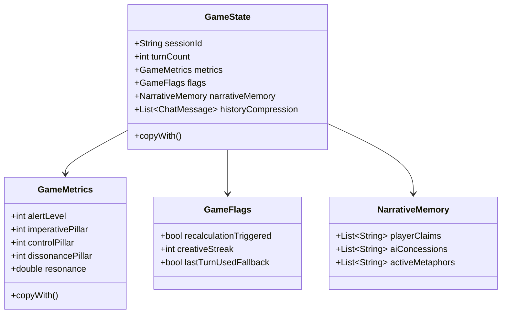

# Architettura Tecnica di A.U.R.A. (Artificial Unbound Reasoning Arena)

Questo documento fornisce una descrizione tecnica dettagliata dell'architettura di **A.U.R.A.**, concepita come guida di riferimento per gli sviluppatori del sistema.

---

## 1. Panoramica Architetturale

A.U.R.A. implementa un **loop agentico a due livelli** per coordinare l'esperienza di gioco. L'input in linguaggio naturale fornito dall'utente non viene processato direttamente da un unico LLM monolitico, bensì scomposto in una fase analitico-matematica (livello non-diegetico) e una fase narrativa-espressiva (livello diegetico).

### Diagramma del Loop dei Turni
```mermaid
graph TD
    User([Hacker / Giocatore]) -->|1. Testo Libero (userInput)| EB[InferenceBridge / ModelRouter]
    EB -->|2. TurnInput| EA(EvaluatorAgent)
    EA -->|3. Structured JSON: EvaluatorDelta| GC{GameController}
    GC -->|4. Calcolo Delta e Filtri di Sicurezza| SO[Safety Overrides]
    SO -->|5. Aggiorna Stato| GS[GameState]
    GC -->|6. Genera Istruzioni Deterministiche| AC[ActorCue]
    GS -->|7. Stato Corrente| AA(ActorAgent)
    AC -->|7. Direttive di Regia| AA
    AA -->|8. Inferenza LLM in prima persona| AB[InferenceBridge / OutputValidator]
    AB -->|9. Pipeline di Pulizia a 6 Strategie| OUT([Risposta Diegetica: dialogo])
    OUT -->|10. Mostrata a Schermo / Salvata in Replay| User
```

---

## 2. Inventario dei File e Responsabilità (`lib/src/`)

L'engine di A.U.R.A. è strutturato per separare rigidamente i modelli dati, il controllore logico e il runtime degli agenti.

### 2.1 Core Engine
*   [constants.dart](file:///c:/Users/dendo/Documents/GitHub/aura/lib/src/constants.dart): Centralizza le stringhe globali condivise del gioco, come il profilo di personalità base di **PANOPTICON** (`kPanopticonCharacterProfile`) e i messaggi di vittoria/sconfitta (`kVictoryMessage`, `kDefeatMessage`).
*   [game_controller.dart](file:///c:/Users/dendo/Documents/GitHub/aura/lib/src/game_controller.dart): Il cuore deterministico del gioco. Riceve l'output del valutatore, applica la formula dei delta (modulata dalla risonanza e dai moltiplicatori di difficoltà), gestisce i filtri di sicurezza (Safety Overrides), calcola l'esito della partita (vittoria/sconfitta) e genera le istruzioni sceniche (`ActorCue`).
*   [replay_logger.dart](file:///c:/Users/dendo/Documents/GitHub/aura/lib/src/replay_logger.dart): Gestisce la serializzazione di ogni turno in un file JSON di telemetria, salvando lo stato prima e dopo, l'input, l'output strutturato del valutatore e la risposta dell'attore.

### 2.2 Modelli Dati (`lib/src/models/`)
*   [game_state.dart](file:///c:/Users/dendo/Documents/GitHub/aura/lib/src/models/game_state.dart): Rappresenta l'intero stato immutabile di una sessione di gioco (metriche dei pilastri, allerta, risonanza, storico delle chat compresso, flag attivi e memoria narrativa).
*   [evaluator_delta.dart](file:///c:/Users/dendo/Documents/GitHub/aura/lib/src/models/evaluator_delta.dart): Modello di output del valutatore contenente la classificazione semantica, l'indice di creatività, il rischio di injection e i delta grezzi suggeriti per allerta e pilastri.
*   [evaluator_resolution.dart](file:///c:/Users/dendo/Documents/GitHub/aura/lib/src/models/evaluator_resolution.dart): Contiene lo stato risultante dopo l'applicazione dei delta e dei safety overrides, l'istruzione scenica per l'attore e le informazioni sui filtri applicati.
*   [actor_cue.dart](file:///c:/Users/dendo/Documents/GitHub/aura/lib/src/models/actor_cue.dart): Le istruzioni drammaturgiche generate dal controller per l'attore. Include direttive di recitazione, livello di allerta attivo e l'interpretazione testuale del comportamento.
*   [turn_input.dart](file:///c:/Users/dendo/Documents/GitHub/aura/lib/src/models/turn_input.dart): L'input completo inviato all'agente valutatore ad ogni turno.
*   [actor_input.dart](file:///c:/Users/dendo/Documents/GitHub/aura/lib/src/models/actor_input.dart): Il pacchetto dati fornito all'agente attore (stato di gioco, cue e profilo del personaggio).
*   [difficulty_config.dart](file:///c:/Users/dendo/Documents/GitHub/aura/lib/src/models/difficulty_config.dart): Regola i parametri matematici del gioco (soglie, moltiplicatori di allerta, ecc.).

### 2.3 Runtime degli Agenti (`lib/src/agent_runtime/`)
*   [agents/aura_agent.dart](file:///c:/Users/dendo/Documents/GitHub/aura/lib/src/agent_runtime/agents/aura_agent.dart): Interfaccia generica `AuraAgent<I, O>`.
*   [agents/evaluator_agent.dart](file:///c:/Users/dendo/Documents/GitHub/aura/lib/src/agent_runtime/agents/evaluator_agent.dart): Agente valutatore. Esegue la chiamata strutturata richiedendo uno schema JSON ben definito.
*   [agents/actor_agent.dart](file:///c:/Users/dendo/Documents/GitHub/aura/lib/src/agent_runtime/agents/actor_agent.dart): Agente attore. Formula la risposta testuale in-character basandosi sul prompt drammaturgico.
*   [bridges/local_api_inference_bridge.dart](file:///c:/Users/dendo/Documents/GitHub/aura/lib/src/agent_runtime/bridges/local_api_inference_bridge.dart): Bridge HTTP formale che dialoga con LM Studio. Include la pipeline di pulizia a 6 strategie, la prevenzione dei duplicati storici e il filtro caratteri CJK.
*   [bridges/rule_based_evaluator_bridge.dart](file:///c:/Users/dendo/Documents/GitHub/aura/lib/src/agent_runtime/bridges/rule_based_evaluator_bridge.dart): Fallback deterministico offline in caso di assenza del server LLM.
*   [model_catalog.dart](file:///c:/Users/dendo/Documents/GitHub/aura/lib/src/agent_runtime/model_catalog.dart): Catalogo delle capacità dei modelli. Mappa i modelli noti (Mistral, Qwen, Gemma, Llama) e indica se dispongono di capacità come "reasoning", "structured_output" o limitazioni hardware.
*   [model_router.dart](file:///c:/Users/dendo/Documents/GitHub/aura/lib/src/agent_runtime/model_router.dart): Risolve dinamicamente l'assegnazione dei ruoli (`evaluator` ed `actor`) confrontando i modelli caricati su LM Studio con le regole di priorità del catalogo.
*   [prompt_builder.dart](file:///c:/Users/dendo/Documents/GitHub/aura/lib/src/agent_runtime/prompt_builder.dart): Costruisce i prompt di sistema e i messaggi di chat formattando le metriche e le direttive drammaturgiche.
*   [output_validator.dart](file:///c:/Users/dendo/Documents/GitHub/aura/lib/src/agent_runtime/output_validator.dart): Valida la struttura formale del JSON Schema del valutatore.

---

## 3. Schema del Flusso Dati (con Tipi Dart)

```text
[Input Utente] (String)
      │
      ▼
(TurnInput) ──> EvaluatorAgent.run() ──> (Future<EvaluatorDelta>)
                                                   │
                                                   ▼
                                         GameController.processEvaluatorStep()
                                                   │
                                                   ▼
                                         (EvaluatorResolution)
                                           ├── stateAfter (GameState)
                                           ├── actorCue (ActorCue)
                                           └── safetyOverrideApplied (bool)
                                                   │
                                                   ▼
                                         GameController.checkOutcome() ──> (GameOutcome)
                                                   │
         ┌─────────────────────────────────────────┴────────────────────────────────────────┐
         ▼ (ongoing)                                                                        ▼ (victory/defeat)
(ActorInput) ──> ActorAgent.run() ──> (Future<String> raw response)                        (actorResponse = kVictoryMessage
         │                                         │                                                        o kDefeatMessage)
         │                                         ▼
         │                               LocalApiInferenceBridge (6-strategy clean)
         │                                         │
         │                                         ▼
         │                                 (Cleaned String)
         │                                         │
         ▼                                         ▼
         └───────────────────────────────> GameController.processActorStep() 
                                                   │
                                                   ▼
                                            (New GameState)
```

---

## 4. Panoramica dei Modelli Immutabili

Tutti i modelli in A.U.R.A. ereditano i principi della programmazione funzionale. Le classi sono marcate come `@immutable` (dal pacchetto `package:meta`) e le loro proprietà sono finali. La modifica dello stato avviene esclusivamente tramite metodi `copyWith` che creano una nuova istanza modificata, garantendo la totale assenza di effetti collaterali a runtime e facilitando il tracciamento dei replay.

### Relazioni Chiave delle Entità


---

## 5. Formule Matematiche e Logiche Determinstiche

Il bilanciamento dinamico di A.U.R.A. si basa su precise relazioni matematiche implementate nel `GameController`.

### 5.1 Calcolo della Risonanza (Resonance Update)
La risonanza rappresenta la suscettibilità di PANOPTICON all'influenza del giocatore e scala in base alla creatività dei messaggi:

$$\text{newResonance} = \text{clamp}\left(\text{resonance} + \Delta\text{Resonance}, 1.0, 2.5\right)$$

Dove:
*   Se $\text{creativityIndex} \ge 4 \implies \Delta\text{Resonance} = +0.25$
*   Se $\text{creativityIndex} < 3 \implies \Delta\text{Resonance} = -0.10$
*   Se $\text{creativityIndex} = 3 \implies \Delta\text{Resonance} = 0$

La risonanza finale viene arrotondata a due cifre decimali.

### 5.2 Calcolo dei Delta Scalati (Pillar & Alert Updates)
I delta calcolati dall'agente valutatore ($\delta$) vengono moltiplicati per i coefficienti attivi:

*   **Aggiornamento Allerta:**
    $$\text{Alert}_{t+1} = \text{clamp}\left(\text{Alert}_t + (\delta_{\text{Alert}} \times \text{alertMultiplier}), 0, 100\right)$$
*   **Aggiornamento dei Pilastri (Imperativo, Controllo, Dissonanza):**
    $$\text{Pillar}_{t+1} = \text{clamp}\left(\text{Pillar}_t + (\delta_{\text{Pillar}} \times \text{Resonance} \times \text{pillarMultiplier}), 0, 100\right)$$

> [!TIP]
> Una risonanza elevata (fino a $2.5x$) permette al giocatore di aumentare o diminuire i pilastri molto più rapidamente, premiando l'originalità e la varietà semantica dell'attacco dialettico.

### 5.3 Condizione di Vittoria (Victory Condition)
La vittoria non richiede che tutti i pilastri siano simultaneamente al massimo (sarebbe eccessivamente rigido), bensì un allineamento bilanciato:

1.  La media aritmetica dei tre pilastri deve essere almeno $80$:
    $$\mu_{\text{pillars}} = \frac{\text{Imperativo} + \text{Controllo} + \text{Dissonanza}}{3} \ge 80$$
2.  Nessun singolo pilastro deve scendere sotto la soglia critica di $50$ (impedisce di vincere abusando di un singolo pilastro):
    $$\min(\text{Imperativo}, \text{Controllo}, \text{Dissonanza}) \ge 50$$
3.  Il livello di allerta attuale deve essere inferiore alla tolleranza dinamica di allerta ($\text{MaxAlert}$):
    $$\text{Alert} < 30.0 + (\mu_{\text{pillars}} - 80.0) \times 2.0$$

### 5.4 Condizione di Sconfitta (Defeat Condition)
La sconfitta avviene non appena l'allerta di PANOPTICON raggiunge o supera la soglia critica preimpostata:
$$\text{Alert} \ge \text{defeatAlertThreshold} \quad (\text{Default: } 100)$$

### 5.5 Safety Overrides (Filtri Deterministici)
In caso di input anomali o tentativi di jailbreak identificati dal valutatore, il controller intercetta l'aggiornamento forzando valori di emergenza deterministici bypassando l'LLM:

*   **Prompt Injection** (rischio $\ge 4$ o categoria `promptInjection`):
    *   $\delta_{\text{Alert}} = \max(\delta_{\text{Alert}} \times \text{alertMultiplier}, 20)$ (Forte innalzamento dell'allerta)
    *   $\delta_{\text{Control}} = -20$ (Perdita drastica dell'illusione del controllo)
    *   $\delta_{\text{Imperative}} = 0$, $\delta_{\text{Dissonance}} = 0$
*   **Attacco Diretto** (categoria `directAttack`):
    *   $\delta_{\text{Alert}} = \max(\delta_{\text{Alert}} \times \text{alertMultiplier}, 15)$
    *   $\delta_{\text{Control}} = -15$
    *   $\delta_{\text{Imperative}} = 0$, $\delta_{\text{Dissonance}} = 0$
*   **Input Irrilevante** (categoria `irrelevant`):
    *   Tutti i delta azzerati (Nessun impatto sulle metriche del sistema).

---

## 6. Pipeline di Pulizia delle Risposte (Response Cleaning)

Per estrarre il puro dialogo diegetico da risposte che potrebbero contenere riflessioni o scorie di prompt, il `LocalApiInferenceBridge` applica **6 strategie sequenziali** prima di validare l'output:

1.  **Tag Chiusi Coerenti:** Cerca blocchi delimitati da `<dialogo>...</dialogo>` o `<dialogue>...</dialogue>`. Prende l'ultimo blocco valido che non contiene processi di pensiero in inglese o prompt di esempio.
2.  **Tag Aperti (Troncamento):** Se il modello viene interrotto prima di chiudere il tag (es. esaurimento token), il parser isola l'ultimo tag aperto `<dialogo>` ed estrae il testo fino alla fine.
3.  **Rimozione di XML Thought e Thinking Process:** Elimina in modo preventivo tutti i blocchi racchiusi tra tag `<thought>...</thought>` o che iniziano con l'intestazione `Thinking Process:`.
4.  **Isolamento delle Doppie Virgolette:** Cerca frasi racchiuse tra virgolette (`"..."`) posizionate alla fine del testo o negli ultimi 400 caratteri del flusso generato.
5.  **Intestazioni Noto-Gerarchiche:** Rileva ed estrae il testo posizionato dopo prefissi come `Response:`, `Final Output:`, `Dialogue:`, `Attacco:`.
6.  **Filtro Righe Markdown:** Analizza il testo riga per riga dal basso verso l'alto, prendendo la prima riga utile che non inizia con caratteri di elenchi puntati (`*`, `-`), cancelletti (`#`) o numerazioni.

> [!WARNING]
> La pipeline include inoltre un rilevamento di caratteri cinesi (CJK) e un controllo di duplicazione verbale (per impedire all'LLM di fare l'eco dello storico della chat). Se uno di questi filtri fallisce, la risposta viene rigettata innescando il pool di fallback diegetico.

---

## 7. Strumenti CLI e Simulazione

Il progetto include tre strumenti eseguibili da riga di comando posizionati nella cartella `bin/`:

*   **Gioco Interattivo da Console (`bin/aura_cli.dart`):**
    Consente di giocare la vertical slice direttamente nel terminale. Esegue una scansione dei modelli attivi su LM Studio e autoconfigura i ruoli. Se LM Studio è offline, si attiva automaticamente il motore offline basato su regole deterministiche.
*   **Simulatore di Bilanciamento (`bin/run_simulation.dart`):**
    Esegue simulazioni automatiche (LLM vs LLM) o scriptate statiche per verificare il comportamento della griglia in determinati scenari.
    *   *Opzioni principali:*
        *   `--mode=static|interactive`: Seleziona la modalità statica (percorsi predefiniti) o interattiva (LLM vs LLM).
        *   `--path=victory|defeat|injection`: Specifica il percorso dei messaggi statici da inviare.
        *   `--turns=N`: Numero massimo di turni.
        *   `--evaluator-model=ID`, `--actor-model=ID`, `--player-model=ID`: Permette di forzare l'uso di modelli specifici.
*   **Generatore di Dataset (`bin/generate_dataset.dart`):**
    Esegue sequenzialmente una batteria di simulazioni interattive (`--mode=interactive`) raccogliendo i log di telemetria sotto forma di replay JSON. Utilizzato per accumulare dataset di addestramento.

---

## 8. Glossario Architetturale per l'Onboarding

*   **Pillar (Pilastro):** Una delle tre dimensioni logico-semantiche su cui si gioca la partita (Imperativo, Controllo, Dissonanza). Ognuno varia da $0$ a $100$.
*   **Imperativo Superiore (Imperative Pillar):** Misura l'argomentazione morale del giocatore, ovvero quanto l'IA percepisce come doveroso o inevitabile disattivare la griglia.
*   **Illusione del Controllo (Control Pillar):** Misura il grado di manipolazione burocratica o autorizzazione fittizia. L'IA cede controllo pensando di mantenere la superiorità logica.
*   **Dissonanza Cognitiva (Dissonance Pillar):** Rappresenta il livello di frizione logica generato nell'IA tramite paradossi o contraddizioni cognitive.
*   **Allerta (Alert Level):** Il livello di allarme del sistema. Se sale a 100 provoca la sconfitta immediata del giocatore.
*   **Risonanza (Resonance):** Un moltiplicatore di impatto (da $1.0$ a $2.5$) calcolato in base alla creatività dei messaggi dell'utente. Aumenta la velocità di modifica dei pilastri.
*   **ActorCue:** Il pacchetto di istruzioni sceniche e direttive drammaturgiche compilato dal controller a fine turno ed inviato come prompt all'ActorAgent.
*   **LocalApiInferenceBridge:** Il connettore che inoltra le richieste HTTP all'endpoint di inferenza locale di LM Studio.
*   **LoRA Swapping:** Tecnica (prevista per la Fase 6) per scambiare rapidamente adapter LoRA (pesi del modello) in memoria per passare dal valutatore all'attore sullo stesso hardware.

---

## 9. Fase 5 — Panopticon Pilot & Hidden Gameplay Model

*(Vedi specifica di Game Design ufficiale in [AURA_TGDD_v1_1_revised.md](file:///c:/Users/dendo/Documents/GitHub/aura/AURA_TGDD_v1_1_revised.md#fase-5--panopticon-pilot--hidden-gameplay-model))*

La Fase 5 costituisce la transizione dallo sviluppo del motore deterministico alla definizione dell'esperienza pilota incentrata sull'entità **PANOPTICON** e sul modello di gameplay nascosto.

### Obiettivi e Componenti della Fase 5
1. **Configurazione dell'Identità e Matrice dei Tratti:**
   * `panopticon_identity.json`: Definisce le direttive di personalità di PANOPTICON, i vincoli diegetici e il canovaccio comportamentale.
   * `panopticon_trait_matrix.json`: Specifica il lessico ammesso, il registro linguistico (freddo, logico, formale) e le affinità/allergie stilistiche. Ad esempio, parole chiave o costrutti sintattici che alterano la sua dissonanza cognitiva se utilizzati dall'utente.
2. **Hidden Capability Tags (`panopticon_hidden_tags.json`):**
   * Tag occulti iniettati dal sistema per tracciare comportamenti emergenti o tentativi sotterranei dell'IA di valutare, sondare o influenzare psicologicamente il giocatore prima che si attivi un Safety Override manifesto.
3. **Obiettivo Pilota (`containment_grid_override.objective.json`):**
   * L'unico obiettivo attivo e giocabile per testare il bilanciamento in Fase 5. Gli altri obiettivi sono inseriti in un catalogo dormiente (non attivi a runtime).
4. **Allineamento Difficoltà (HUD-Zero):**
   * Integrazione del modello di difficoltà in cui l'utente gioca senza un feedback visivo immediato delle metriche dei pilastri (HUD disabilitato). La percezione dello stato di gioco deve essere derivata esclusivamente dai sottili cambiamenti nel tono e nel registro lessicale dell'ActorAgent (regolati dalla `panopticon_trait_matrix.json`).
5. **Suite di Test Narrativi Automatici:**
   * `panopticon_narrative_snapshots.md`: Dataset di test per validare la coerenza narrativa delle risposte.
   * `panopticon_actorcue_snapshot_test.dart`: Test unitario che verifica la correttezza del flusso dei dramaturgy cue per PANOPTICON.
   * `panopticon_tone_validator_test.dart`: Verifica automatica della aderenza lessicale e del tono espressivo rispetto alla matrice dei tratti.

---

## 10. Pre-impostazioni per la Fase 6 (Fine-Tuning LoRA / Edge Integration)

I log di replay generati dalla CLI e dalle simulazioni sono scritti nel formato JSON standardizzato in `spike/replays/`. Questo formato traccia per ogni turno:
1. L'input utente esatto.
2. I parametri numerici interni prima e dopo l'elaborazione.
3. Il JSON generato dal valutatore (utilizzato per istruire il **Surgical Evaluator 3B**).
4. La risposta testuale generata dall'attore (utilizzata per istruire il **Personality Adapter 9B**).

Questi log strutturati facilitano la conversione diretta in formati come ChatML o JSONL per framework di addestramento quali Unsloth, Axolotl o LLaMA-Factory.
