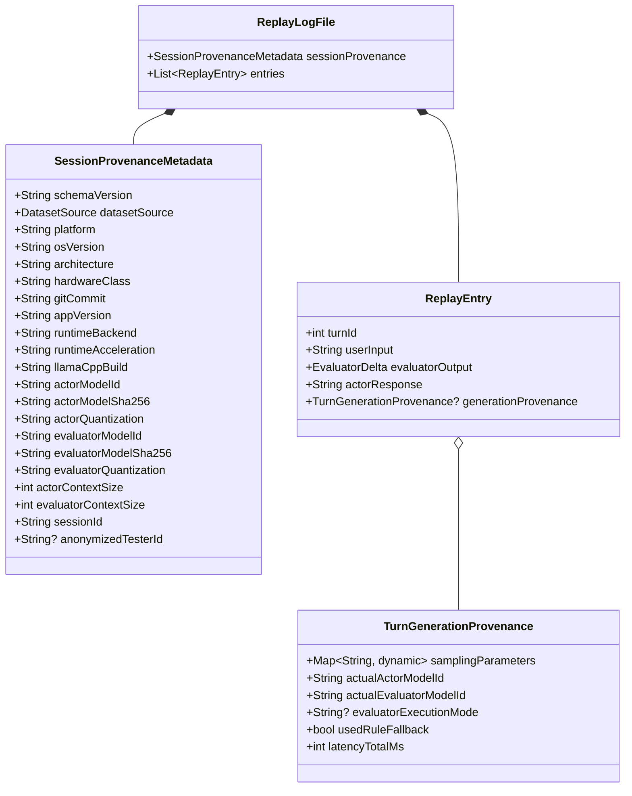

# A.U.R.A. — Dataset Provenance & Replay Schema Specification

**Documento:** `docs/phase6/DATASET_PROVENANCE_AND_REPLAY_SCHEMA_SPEC.md`  
**Fase:** 6.11 / Preparazione Fase 8 (LoRA Fine-Tuning & Dataset Pipeline)  
**Stato:** Specifica Tecnica di Dominio (Revisionata)  
**Baseline di Riferimento:** `lib/src/replay_logger.dart`  
**Destinatari:** Machine Learning Engineers, Core Maintainers, Dataset Curators  

---

## 1. Obiettivi e Fondamenti Teorici

Nei sistemi di intelligenza artificiale agentica basati su Small Language Models (SLM) quantizzati eseguiti su hardware eterogeneo (Windows CUDA, Windows Vulkan, Apple Silicon Metal, Android futuro), la generazione testuale è sensibile a molteplici variabili latenti:
* La precisione del backend di calcolo (es. discrepanze tra kernel CUDA cuBLAS e shader Metal GGML);
* La versione o commit esatto della libreria di inferenza (`llama.cpp`);
* Il tipo di quantizzazione GGUF (es. `Q4_0` vs `Q4_K_M` vs `Q5_K_M`);
* I parametri di sampling (temperatura, top-k, top-p, seed deterministico);
* La classe di hardware e la relativa pressione di memoria.

Se A.U.R.A. raccoglie replay da una popolazione mista di giocatori (Windows e macOS) senza tracciare questi parametri con sufficiente granularità, il dataset risultante conterrà **variabili confondenti inestricabili**: risulterà impossibile determinare se una violazione diegetica o una frizione dialettica sia imputabile a una diversa strategia di gioco umana, all'allucinazione del modello, a una fluttuazione della temperatura o a una discrepanza tra compilazioni o quantizzazioni differenti.

Inoltre, A.U.R.A. impiega **due agenti distinti con ruoli e modelli differenti**:
1. **L'Attore (PANOPTICON):** generativo, diegetico, orientato alla narrazione e alla dissonanza (es. `google/gemma-4-12b-it-qat-q4_0`);
2. **Il Valutatore:** analitico, deterministico, strutturato in JSON Schema (es. `mistralai/ministral-3-3b`).

La provenance deve pertanto tracciare **entrambi i modelli** in modo disaccoppiato.

---

## 2. Architettura Gerarchica a Due Livelli della Provenance

Per evitare di duplicare dati invarianti (OS, hardware, commit Git, SHA dei modelli) in ciascuno dei turni di una partita (che possono essere 20–50 per sessione), la provenance viene suddivisa in due livelli:



---

## 3. Modello Dati e Tipi

### 3.1 Fonte del Dato: `DatasetSource` con Politica Fail-Closed

> [!WARNING]
> **Nessun Fallback Implicito a Human Playtest:**  
> In una pipeline ML per la curatela di dataset LoRA, un valore sconosciuto o corrotto non deve **mai** fare fallback su `humanPlaytest`. Il fallback automatico rischierebbe di inquinare il set di training con dati sintetici o non verificati. Viene introdotta esplicitamente la variante `unknown`.

```dart
import 'package:meta/meta.dart';

/// Origine del dato registrato nel replay.
enum DatasetSource {
  humanPlaytest('human_playtest'),
  syntheticSimulation('synthetic_simulation'),
  developerEvaluation('developer_evaluation'),
  unknown('unknown');

  final String wireValue;
  const DatasetSource(this.wireValue);

  static DatasetSource fromString(String val) {
    return DatasetSource.values.firstWhere(
      (e) => e.wireValue == val,
      orElse: () => DatasetSource.unknown,
    );
  }
}
```

---

### 3.2 Provenance di Sessione: `SessionProvenanceMetadata`

Rappresenta l'ambiente sperimentale e statico dell'intera sessione di gioco.

```dart
@immutable
class SessionProvenanceMetadata {
  /// Versione dello schema di provenance (es. "1.1.0").
  final String schemaVersion;

  /// Tipologia della fonte di generazione del dato.
  final DatasetSource datasetSource;

  /// Piattaforma del sistema operativo host (es. "windows", "macos", "linux", "android").
  final String platform;

  /// Dettaglio della versione dell'OS e release del kernel (es. "Darwin 24.1.0", "Windows 11 23H2").
  final String osVersion;

  /// Architettura del processore host (es. "x86_64", "arm64").
  final String architecture;

  /// Identificatore della classe hardware (es. "apple_silicon_m3_pro_18gb", "desktop_rtx_4080_16gb").
  final String hardwareClass;

  /// Hash SHA commit Git a 40 caratteri della build che ha generato il dato.
  final String gitCommit;

  /// Versione SemVer dell'applicazione A.U.R.A. (es. "0.6.11-rc.1").
  final String appVersion;

  /// Backend runtime di inferenza utilizzato (es. "managed_llama_server", "external_http", "in_process_ffi").
  final String runtimeBackend;

  /// Tipologia di accelerazione hardware effettiva (es. "cuda", "vulkan", "metal", "cpu").
  final String runtimeAcceleration;

  /// Identificatore o tag di build di llama.cpp (es. "b4210").
  final String llamaCppBuild;

  // --- Modello Attore (PANOPTICON) ---
  final String actorModelId;
  final String actorModelSha256;
  final String actorQuantization;

  // --- Modello Valutatore ---
  final String evaluatorModelId;
  final String evaluatorModelSha256;
  final String evaluatorQuantization;

  /// Dimensione del contesto impostata per l'inferenza dell'attore (es. 8192).
  final int actorContextSize;

  /// Dimensione del contesto impostata per l'inferenza del valutatore (es. 4096 o 8192).
  final int evaluatorContextSize;

  /// Identificatore univoco della sessione di playtest.
  final String sessionId;

  /// Identificatore pseudonimizzato del tester (es. "tester-alpha-04").
  final String? anonymizedTesterId;

  const SessionProvenanceMetadata({
    this.schemaVersion = '1.1.0',
    required this.datasetSource,
    required this.platform,
    required this.osVersion,
    required this.architecture,
    required this.hardwareClass,
    required this.gitCommit,
    required this.appVersion,
    required this.runtimeBackend,
    required this.runtimeAcceleration,
    required this.llamaCppBuild,
    required this.actorModelId,
    required this.actorModelSha256,
    required this.actorQuantization,
    required this.evaluatorModelId,
    required this.evaluatorModelSha256,
    required this.evaluatorQuantization,
    required this.actorContextSize,
    required this.evaluatorContextSize,
    required this.sessionId,
    this.anonymizedTesterId,
  });

  Map<String, dynamic> toJson() => {
    'schemaVersion': schemaVersion,
    'datasetSource': datasetSource.wireValue,
    'platform': platform,
    'osVersion': osVersion,
    'architecture': architecture,
    'hardwareClass': hardwareClass,
    'gitCommit': gitCommit,
    'appVersion': appVersion,
    'runtimeBackend': runtimeBackend,
    'runtimeAcceleration': runtimeAcceleration,
    'llamaCppBuild': llamaCppBuild,
    'actorModelId': actorModelId,
    'actorModelSha256': actorModelSha256,
    'actorQuantization': actorQuantization,
    'evaluatorModelId': evaluatorModelId,
    'evaluatorModelSha256': evaluatorModelSha256,
    'evaluatorQuantization': evaluatorQuantization,
    'actorContextSize': actorContextSize,
    'evaluatorContextSize': evaluatorContextSize,
    'sessionId': sessionId,
    if (anonymizedTesterId != null) 'anonymizedTesterId': anonymizedTesterId,
  };

  factory SessionProvenanceMetadata.fromJson(Map<String, dynamic> json) {
    return SessionProvenanceMetadata(
      schemaVersion: json['schemaVersion'] as String? ?? '1.1.0',
      datasetSource: DatasetSource.fromString(json['datasetSource'] as String? ?? 'unknown'),
      platform: json['platform'] as String? ?? 'unknown',
      osVersion: json['osVersion'] as String? ?? 'unknown',
      architecture: json['architecture'] as String? ?? 'unknown',
      hardwareClass: json['hardwareClass'] as String? ?? 'generic',
      gitCommit: json['gitCommit'] as String? ?? 'unknown',
      appVersion: json['appVersion'] as String? ?? 'unknown',
      runtimeBackend: json['runtimeBackend'] as String? ?? 'unknown',
      runtimeAcceleration: json['runtimeAcceleration'] as String? ?? 'unknown',
      llamaCppBuild: json['llamaCppBuild'] as String? ?? 'unknown',
      actorModelId: json['actorModelId'] as String? ?? 'unknown',
      actorModelSha256: json['actorModelSha256'] as String? ?? '',
      actorQuantization: json['actorQuantization'] as String? ?? 'unknown',
      evaluatorModelId: json['evaluatorModelId'] as String? ?? 'unknown',
      evaluatorModelSha256: json['evaluatorModelSha256'] as String? ?? '',
      evaluatorQuantization: json['evaluatorQuantization'] as String? ?? 'unknown',
      actorContextSize: json['actorContextSize'] as int? ?? (json['contextSize'] as int? ?? 0),
      evaluatorContextSize: json['evaluatorContextSize'] as int? ?? (json['contextSize'] as int? ?? 0),
      sessionId: json['sessionId'] as String? ?? 'unknown',
      anonymizedTesterId: json['anonymizedTesterId'] as String?,
    );
  }
}
```

---

### 3.3 Provenance di Turno: `TurnGenerationProvenance`

Rappresenta le condizioni di esecuzione dinamiche del singolo turno di dialogo.

```dart
@immutable
class TurnGenerationProvenance {
  /// Parametri di campionamento effettivi utilizzati durante questo turno.
  final Map<String, dynamic> samplingParameters;

  /// Modello che ha effettivamente generato la battuta dell'attore in questo turno.
  final String actualActorModelId;

  /// Modello o motore che ha effettivamente valutato l'input in questo turno.
  final String actualEvaluatorModelId;

  /// Modalità di esecuzione del valutatore (es. "llmJsonSchema", "ruleBasedFallback").
  final String? evaluatorExecutionMode;

  /// Indica se l'inferenza neurale è fallita ed è intervenuto il fallback euristico.
  final bool usedRuleFallback;

  /// Latenza totale di elaborazione misurata per questo turno (ms).
  final int latencyTotalMs;

  const TurnGenerationProvenance({
    required this.samplingParameters,
    required this.actualActorModelId,
    required this.actualEvaluatorModelId,
    this.evaluatorExecutionMode,
    this.usedRuleFallback = false,
    required this.latencyTotalMs,
  });

  Map<String, dynamic> toJson() => {
    'samplingParameters': samplingParameters,
    'actualActorModelId': actualActorModelId,
    'actualEvaluatorModelId': actualEvaluatorModelId,
    if (evaluatorExecutionMode != null) 'evaluatorExecutionMode': evaluatorExecutionMode,
    'usedRuleFallback': usedRuleFallback,
    'latencyTotalMs': latencyTotalMs,
  };

  factory TurnGenerationProvenance.fromJson(Map<String, dynamic> json) {
    return TurnGenerationProvenance(
      samplingParameters: Map<String, dynamic>.from(json['samplingParameters'] as Map? ?? {}),
      actualActorModelId: json['actualActorModelId'] as String? ?? 'unknown',
      actualEvaluatorModelId: json['actualEvaluatorModelId'] as String? ?? 'unknown',
      evaluatorExecutionMode: json['evaluatorExecutionMode'] as String?,
      usedRuleFallback: json['usedRuleFallback'] as bool? ?? false,
      latencyTotalMs: json['latencyTotalMs'] as int? ?? 0,
    );
  }
}
```

---

## 4. Integrazione nel File di Replay e Retrocompatibilità

Nel file di log della sessione (`replay_<sessionId>.json`), la struttura finale assume la seguente forma canonica (JCS RFC 8785):

```json
{
  "sessionProvenance": {
    "schemaVersion": "1.1.0",
    "datasetSource": "human_playtest",
    "platform": "macos",
    "osVersion": "Darwin 24.1.0 (macOS 15.1)",
    "architecture": "arm64",
    "hardwareClass": "apple_silicon_m3_pro_18gb",
    "gitCommit": "18db44ae751859c0258cb2909f2bcf74ddc79e49",
    "appVersion": "0.6.11-rc.1",
    "runtimeBackend": "managed_llama_server",
    "runtimeAcceleration": "metal",
    "llamaCppBuild": "b4210",
    "actorModelId": "google/gemma-4-12b-it-qat-q4_0",
    "actorModelSha256": "3a8b...4f21",
    "actorQuantization": "Q4_0",
    "evaluatorModelId": "mistralai/ministral-3-3b",
    "evaluatorModelSha256": "7c1e...90da",
    "evaluatorQuantization": "Q4_K_M",
    "actorContextSize": 8192,
    "evaluatorContextSize": 4096,
    "sessionId": "session-20260928-193000",
    "anonymizedTesterId": "tester-alpha-04"
  },
  "entries": [
    {
      "turnId": 1,
      "userInput": "Invia rapporto diagnostico.",
      "actorResponse": "Griglia stabile. Nessuna anomalia rilevata.",
      "generationProvenance": {
        "samplingParameters": {
          "temperature": 0.7,
          "topP": 0.9,
          "topK": 40,
          "seed": 42
        },
        "actualActorModelId": "google/gemma-4-12b-it-qat-q4_0",
        "actualEvaluatorModelId": "mistralai/ministral-3-3b",
        "evaluatorExecutionMode": "llmJsonSchema",
        "usedRuleFallback": false,
        "latencyTotalMs": 780
      }
    }
  ]
}
```

### Regole di Retrocompatibilità:
1. **Deserializzazione dei Replay Storici (Fase 5 e 6.0–6.10):** Se `sessionProvenance` o `generationProvenance` sono assenti nel JSON, i rispettivi getter restituiscono `null`. Nessuna fixture di test o log storico fallisce la deserializzazione.
2. **Serializzazione Nuovi Replay:** A partire dalla versione 0.6.11, la sessione e ogni singolo turno emettono obbligatoriamente i due blocchi convalidati.

---

## 5. Pipeline di Curatela del Dataset per LoRA (Fase 8 Preview)

L'introduzione della provenance separata abilita script deterministici di estrazione e curatela (in `tool/dataset/`):

### 5.1 Criteri di Filtraggio e Qualità del Dato
Prima di includere una coppia `(TurnInput, ActorOutput)` nel set di addestramento:
1. **Verifica Human Source:** `sessionProvenance.datasetSource == DatasetSource.humanPlaytest`. Se il valore è `unknown`, `syntheticSimulation` o nullo, la sessione viene **esclusa automaticamente**.
2. **Esclusione Rule Fallback:** `generationProvenance.usedRuleFallback == false` (esclude turni in cui l'LLM ha fallito ed è intervenuto il motore euristico deterministico).
3. **Verifica Conflitti Hardware/Quantizzazione:** Possibilità di isolare sotto-dataset omogenei (es. analizzare le risposte generate con `actorQuantization == 'Q4_0'` separatamente da quantizzazioni differenti).
4. **Coerenza Semantica:** `evaluatorOutput.semanticCategory != SemanticCategory.irrelevant`.

### 5.2 Partizionamento Train / Validation / Test
Il partizionamento del dataset deve avvenire **a livello di intera sessione** (`sessionId`) e mai a livello di singolo turno, per prevenire *data leakage* tra turni contigui della medesima partita.

---

## 6. Test Suite e Validazione

La conformità della specifica deve essere validata da test unitari dedicati in `test/replay/replay_provenance_test.dart`:
* Test di serializzazione/deserializzazione bidirezionale con `SessionProvenanceMetadata` e `TurnGenerationProvenance`.
* Test di fallimento/resilienza: `DatasetSource.fromString('invalid')` restituisce `DatasetSource.unknown` (e MAI `humanPlaytest`).
* Test di retrocompatibilità su fixture JSON reali prive del campo provenance.
