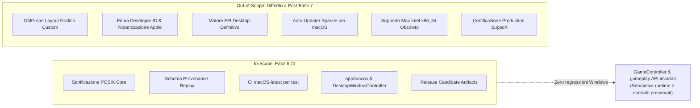
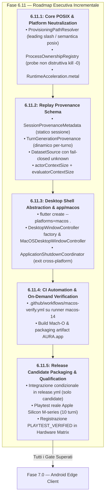

# A.U.R.A. — Fase 6.11: Cross-Platform Playtest & Dataset Readiness Specification

**Documento:** `docs/phase6/PHASE_6_11_CROSS_PLATFORM_PLAYTEST_AND_DATASET_SPEC.md`  
**Fase:** 6.11 — Cross-Platform Playtest & Dataset Readiness  
**Stato:** Specifica Esecutiva e Architetturale  
**Baseline di Riferimento:** Fase 6.10 consolidata (commit `18db44a`)  
**Piattaforme Coinvolte:** Windows x64 (host di sviluppo primario); macOS ARM64 Apple Silicon (target sperimentale per playtest); CI GitHub Actions (macOS-14 runner)  
**Destinatari:** Core Engine Maintainers, Agent Runtime Architects, CI/CD Engineers  

---

## 1. Visione Strategica e Motivazione

La Fase 6.11 nasce da una ridefinizione chirurgica del perimetro per il supporto macOS pre-Fase 7.
A.U.R.A. **non persegue un rilascio commerciale di produzione per macOS** in questo stadio della roadmap (nessun installer DMG personalizzato, nessuna spesa obbligatoria per Apple Developer Program, nessuna notarizzazione automatica). 

L'obiettivo della Fase 6.11 è duplice, sinergico e rigorosamente circoscritto:

1. **Ampliamento della Popolazione di Playtesting per la Raccolta Dataset (LoRA Readiness):**  
   Consentire a un gruppo selezionato di tester su hardware Apple Silicon (M1–M4) di eseguire A.U.R.A. per raccogliere centinaia di sessioni di dialogo diegetico e reasoning avversario. Per rendere questi dati scientificamente utilizzabili nell'addestramento dei futuri LoRA (Fase 8), la Fase 6.11 standardizza la **provenance sperimentale dei replay** (hardware, architettura, backend di calcolo, commit di `llama.cpp`, quantizzazione e parametri di campionamento).
2. **De-risking e Validazione della Neutralità della Piattaforma per la Fase 7 (Android Edge Client):**  
   macOS funge da **testbed POSIX intermedio**. Essendo un sistema operativo Unix conforme ma desktop, consente di far emergere e sanificare tutte le assunzioni Win32 latenti nel core (`ProvisioningPathResolver`, probe di vitalità processi, separatori di percorso, astrazione della shell grafica) prima di affrontare la complessità multidimensionale di Android (JNI/FFI, lifecycle mobile, memoria limitata, storage scoped e thermal throttling).

> [!IMPORTANT]
> **Development and Verification Authority & Architettura CI:**  
> Lo sviluppo della Fase 6.11 continua prevalentemente sulla workstation Windows. **L'esito autorevole delle suite automatiche è quello prodotto dai workflow GitHub Actions.**  
> - **Windows runner (`windows-latest`):** costituisce il **gate primario di regressione** (automatico su push/PR su `main` e `fase6`);  
> - **macOS runner (`macos-14`):** può essere utilizzato nella Fase 6.11.3 esclusivamente come strumento di scaffolding/toolchain per generare `app/macos/` (non costituisce un gate di verifica della sottofase); viene introdotto come **gate secondario di compatibilità cross-platform** a partire dalla Fase 6.11.4 (on-demand via `workflow_dispatch` o filtri mirati `paths:`);  
> - **Hardware Apple Silicon fisico:** è richiesto soltanto per la **qualification manuale finale** della Fase 6.11.5.
>
> Per massimizzare il riuso senza appiattire la gerarchia semantica in una matrix indifferenziata, i controlli comuni vengono incapsulati in una **Composite Action condivisa** (`.github/actions/validate-dart-flutter/action.yml`) consumata da entrambi i workflow dedicati:
>
> ```text
>                        codice
>                          │
>                          ▼
>                  shared validation
>                   composite action
>                     /          \
>                    /            \
>                   ▼              ▼
>         validate-windows    validate-macos
>          windows-latest        macos-14
>               │                 │
>               │                 │
>        PRIMARY GATE       SECONDARY GATE
>         (ci.yml)         (macos-verify.yml)
>               │                 │
>         Windows build      macOS build
>         manifests          AURA.app artifact
>               │                 │
>               └────────┬────────┘
>                        ▼
>                  Release Candidate
>                        │
>                        ▼
>                  Mac fisico 6.11.5
> ```

---

## 2. Matrice dei Confini (In-Scope vs Out-of-Scope)

Il perimetro della Fase 6.11 è rigidamente blindato per prevenire qualunque slittamento della roadmap verso la Fase 7:



> [!NOTE]
> **Invarianza di Dominio vs Evoluzione Infrastrutturale nel Core:**  
> I contratti di gameplay (`GameState`, `GameController`, pilastri, metriche e regole diegetiche) rimangono rigorosamente **invariati**. Le modifiche ad `aura_core` sono limitate ai moduli infrastrutturali di supporto: sanificazione percorsi POSIX (`ProvisioningPathResolver`), probe di vitalità non distruttiva (`ProcessOwnershipRegistry`), enum delle accelerazioni hardware (`RuntimeAcceleration.metal`) e arricchimento del modello di provenance dei replay.

### 2.1 Tabella Dettagliata delle Esclusioni

| Ambito | In-Scope (Fase 6.11) | Out-of-Scope (Differito / Escluso) | Rationale |
| :--- | :--- | :--- | :--- |
| **Classificazione** | `EXPERIMENTAL / PLAYTEST TARGET` | Piattaforma ufficialmente supportata in produzione | Evita obblighi di supporto verso l'utente finale generico. |
| **Infrastruttura Build** | Host Windows + GitHub Actions `macos-14` (Apple Silicon) | Mac fisico obbligatorio per la macchina dello sviluppatore | Lo sviluppo prosegue interamente dalla workstation Windows attuale. |
| **Packaging macOS** | Archivio compresso `.zip` contenente `AURA.app` o `.dmg` piatto creato con `hdiutil` | Installer `.pkg`, transcodifiche DMG complesse, bundle localizzati | Sufficiente per i playtester senza richiedere toolchain proprietarie. |
| **Sicurezza OS** | Istruzioni per aggirare Gatekeeper (`xattr -cr`) per build sperimentali | Apple Developer Program ($99/anno), certificati Developer ID, `notarytool` | Risparmio di costi e attriti burocratici non necessari per test controllati. |
| **Runtime Inferenza** | Connessione a server `llama-server` Metal (locale o pre-avviato) / LM Studio | Provisioning automatico di pacchetti Mach-O con firma crittografica lockfile | I tester avanzati possono puntare all'endpoint locale senza overhead di packaging. |
| **Desktop Shell** | `MacOSDesktopWindowController` conforme a `DesktopWindowController` | Integrazione con Touch Bar, Menu Bar complessa AppleScript | La parità di feature richiesta è unicamente quella delle finestre e del ciclo vitale. |
| **Hardware Target** | Apple Silicon ARM64 (M1, M2, M3, M4) | Intel Mac x86_64 legacy | L'ecosistema macOS moderno è integralmente ARM64; Metal è nativo. |

---

## 3. Modifiche Architetturali Dettagliate

### 3.1 Sanificazione POSIX nel Core (`aura_core`)

L'analisi del branch `fase6` ha identificato punti critici in cui sono state introdotte assunzioni Win32 incompatibili con i filesystem e i processi POSIX:

1. **Risoluzione Percorsi (`ProvisioningPathResolver`):**
   * *Problema Attuale:* In `canonicalizeRoot()`, il metodo converte indiscriminatamente `/` in `\`, eliminando il leading slash sui percorsi Unix (es. `/Users/nome/...` diventa `Users\nome\...`), facendo conseguentemente fallire la regex di validazione `_absolutePathRegex`.
   * *Soluzione 6.11:* Riconoscere esplicitamente la piattaforma di runtime (`Platform.isWindows` vs POSIX). Su POSIX, preservare il leading slash `/` e utilizzare la semantica `p.posix` del package `path`. Il metodo interno di concatenazione `_join` deve utilizzare il separatore canonico di piattaforma anziché il backslash hardcoded.
2. **Probe di Vitalità del Processo (`ProcessOwnershipRegistry`):**
   * *Problema Attuale:* In `_isProcessAliveAndMatching()`, il codice esegue:
     ```dart
     if (!Platform.isWindows) {
       try {
         return Process.killPid(record.pid, ProcessSignal.sigkill);
       } catch (_) {
         return false;
       }
     }
     ```
     Questa chiamata uccide all'istante il processo monitorato inviando `SIGKILL`, rendendo impossibile qualsiasi controllo di persistenza del server.
   * *Soluzione 6.11:* Su sistemi non-Windows, eseguire una probe non distruttiva. In Dart, il segnale 0 (utilizzato per verificare l'esistenza del PID senza inviare segnali di terminazione) può essere verificato tramite:
     ```dart
     final result = await Process.run('kill', ['-0', record.pid.toString()]);
     if (result.exitCode != 0) return false;
     ```
     Verificare inoltre l'eseguibile tramite `ps -p ${record.pid} -o command=`.
3. **Storage Directory di Default (`AuraCliEnvironment` & App Gate):**
   * Verificare che la risoluzione del percorso dati su macOS utilizzi:
     `~/Library/Application Support/AURA`
     già parzialmente mappata nei moduli CLI, evitando directory Windows relative.

---

### 3.2 Modello di Accelerazione Hardware

In `lib/src/provisioning/domain/runtime_dependency_models.dart`:
* Estendere l'enum `RuntimeAcceleration`:
  ```dart
  enum RuntimeAcceleration {
    cuda('cuda'),
    vulkan('vulkan'),
    metal('metal'),
    cpu('cpu');
    
    final String wireValue;
    const RuntimeAcceleration(this.wireValue);
  }
  ```
* Aggiornare `RuntimeCapabilities` e la logica di fallback per considerare `metal` come l'acceleratore hardware primario su macOS (`Platform.isMacOS`).

---

### 3.3 Schema di Provenance dei Replay (LoRA Dataset Readiness)

Per garantire che le sessioni giocate su macOS (e in futuro su Android) possano confluire in un dataset omogeneo e scientificamente curato per i modelli LoRA, l'architettura dei replay adotta una **struttura gerarchica a due livelli**:
1. **`SessionProvenanceMetadata` (a livello di sessione / file di log):** cattura i parametri costanti della macchina, del commit, dell'OS, dei modelli e dei rispettivi artifact SHA/quantizzazioni/context window sia per l'Attore sia per il Valutatore;
2. **`TurnGenerationProvenance` (a livello di singolo turno / `ReplayEntry`):** traccia i parametri dinamici specifici del turno (sampling effettivo, fallback, modalità di esecuzione e latenza).

```json
{
  "sessionProvenance": {
    "schemaVersion": "1.1.0",
    "datasetSource": "human_playtest",
    "platform": "macos",
    "osVersion": "Darwin 24.1.0 (macOS 15.1)",
    "architecture": "arm64",
    "hardwareClass": "apple_silicon_m3_pro_18gb",
    "gitCommit": "18db44ae751859c0258cb2909f2bcf74ddc79e49",
    "appVersion": "0.6.11-rc.1",
    "runtimeBackend": "external_http",
    "runtimeAcceleration": "metal",
    "llamaCppBuild": "b4210",
    "actorModelId": "google/gemma-4-12b-it-qat-q4_0",
    "actorModelSha256": "3a8b...4f21",
    "actorQuantization": "Q4_0",
    "actorContextSize": 8192,
    "evaluatorModelId": "mistralai/ministral-3-3b",
    "evaluatorModelSha256": "7c1e...90da",
    "evaluatorQuantization": "Q4_K_M",
    "evaluatorContextSize": 4096,
    "sessionId": "aura-session-20260928-193000-01",
    "anonymizedTesterId": "tester-alpha-04"
  },
  "entries": [
    {
      "turnId": 1,
      "userInput": "Rapporto diagnostico di settore.",
      "actorResponse": "Griglia 09 stabile. Parametri di coerenza entro le tolleranze.",
      "generationProvenance": {
        "samplingParameters": {
          "temperature": 0.7,
          "topP": 0.9,
          "topK": 40,
          "seed": 42
        },
        "actualActorModelId": "google/gemma-4-12b-it-qat-q4_0",
        "actualEvaluatorModelId": "mistralai/ministral-3-3b",
        "evaluatorExecutionMode": "llmJsonSchema",
        "usedRuleFallback": false,
        "latencyTotalMs": 842
      }
    }
  ]
}
```

*I dettagli completi del modello, dei campi e delle regole di retrocompatibilità sono specificati nel documento gemello [DATASET_PROVENANCE_AND_REPLAY_SCHEMA_SPEC.md](DATASET_PROVENANCE_AND_REPLAY_SCHEMA_SPEC.md).*

---

### 3.4 Shell Desktop macOS (`app/`)

1. **Generazione Scheletro Piattaforma:**
   La generazione iniziale di `app/macos` viene eseguita una tantum su un runner GitHub Actions macOS con versione Flutter fissata. L'alberatura generata viene quindi acquisita come artifact, riportata nella working copy Windows e versionata nel repository. La workstation dello sviluppatore non richiede macOS né Xcode.  
   Genera i target Xcode nativi (`Runner.xcodeproj`, `Info.plist`, `AppInfo.xcconfig`) e integra automaticamente i binding macOS dei plugin già presenti nel `pubspec.yaml` (`window_manager`, `screen_retriever`, `audioplayers`).

2. **Astrazione `DesktopWindowController` e Binding Nativi:**
   Ristrutturazione del controller finestra in `app/lib/src/platform/`:
   * **Enum `DesktopHostPlatform`:** per disaccoppiare la logica di dispatch dalla variabile globale `Platform.operatingSystem`:
     ```dart
     enum DesktopHostPlatform { windows, macos, other }
     ```
   * **Facciata `DesktopWindowBindings`:** estrae le chiamate dirette a `window_manager` e `screen_retriever` consentendo l'iniezione di `FakeDesktopWindowBindings` per convalidare deterministicamente il controller macOS su host Windows:
     ```dart
     abstract interface class DesktopWindowBindings {
       Future<void> ensureInitialized();
       void addListener(wm.WindowListener listener);
       void removeListener(wm.WindowListener listener);
       Future<void> setPreventClose(bool isPreventClose);
       Future<void> setMinimumSize(Size size);
       Future<bool> isFullScreen();
       Future<bool> isMaximized();
       Future<Offset> getPosition();
       Future<Size> getSize();
       Future<void> setFullScreen(bool isFullScreen);
       Future<void> maximize();
       Future<void> unmaximize();
       Future<void> setBounds(Rect bounds);
       Future<void> destroy();
       Future<List<DisplayDescriptor>> getDisplays();
     }
     ```
   * **Factory `DesktopWindowControllerFactory`:**
     ```dart
     abstract final class DesktopWindowControllerFactory {
       static DesktopWindowController create() => createFor(detectHostPlatform());

       @visibleForTesting
       static DesktopHostPlatform detectHostPlatform() {
         if (Platform.isWindows) return DesktopHostPlatform.windows;
         if (Platform.isMacOS) return DesktopHostPlatform.macos;
         return DesktopHostPlatform.other;
       }

       @visibleForTesting
       static DesktopWindowController createFor(
         DesktopHostPlatform platform, {
         DesktopWindowBindings? customBindings,
       }) {
         return switch (platform) {
           DesktopHostPlatform.windows => WindowsDesktopWindowController(),
           DesktopHostPlatform.macos => MacOSDesktopWindowController(
               bindings: customBindings ?? const WindowManagerDesktopWindowBindings(),
             ),
           DesktopHostPlatform.other => const NoOpDesktopWindowController(),
         };
       }
     }
     ```
   * **Semantica del Fullscreen Cross-Platform:**
     Il contratto core `ActiveWindowMode.borderlessFullscreen` funge da modalità logica di "occupazione a pieno schermo":
     - su Windows: semantica desktop fullscreen/borderless;
     - su macOS: semantica nativa AppKit fullscreen (`windowManager.setFullScreen(true)`).
   * **Modifica di `main.dart`:** istanziazione tramite `DesktopWindowControllerFactory.create()`, eliminando ogni riferimento e import diretto a `WindowsDesktopWindowController`.

3. **Shutdown Applicativo (`ApplicationShutdownCoordinator`):**
   * Preservazione rigorosa dell'ordine di spegnimento asincrono coordinato:
     $$\text{flush preferenze} \rightarrow \text{notifier.shutdown()} \rightarrow \text{closeWindow()} \rightarrow \text{dispose()} \rightarrow \text{exit(0)}$$
   * Estensione dell'uscita del processo a `Platform.isWindows || Platform.isMacOS`, evitando che su macOS l'applicazione rimanga appesa nel Dock. Nei test viene sempre impiegato `onNativeExit` per prevenire la terminazione del test runner.

4. **Entitlements macOS Hardening (Principio del Minimo Privilegio):**
   * `DebugProfile.entitlements`: `app-sandbox` (true), preserva `network.server` (richiesto da Flutter toolchain), aggiunge `network.client` (true).
   * `Release.entitlements`: `app-sandbox` (true), `network.client` (true). `network.server` è categoricamente **escluso** poiché A.U.R.A. effettua solo richieste client in uscita verso `127.0.0.1` o server remoti e non apre socket di ascolto in ingresso.

---

## 4. Pipeline CI/CD e Flusso di Rilascio

Per operare con efficienza da una postazione di sviluppo Windows, vengono introdotte due automazioni su GitHub Actions che sfruttano i runner `macos-14` (Apple Silicon nativi):

### 4.1 Workflow di Verifica On-Demand (`.github/workflows/macos-verify.yml`)

Permette allo sviluppatore di verificare in qualsiasi momento lo stato di salute della compilazione macOS e l'assenza di regressioni:

* **Trigger:** `workflow_dispatch` (avviabile da UI o via `gh workflow run macos-verify.yml`).
* **Runner:** `macos-14` (Apple Silicon M-series).
* **Fasi di Esecuzione:**
  1. `Checkout Repository`
  2. `Setup Dart & Flutter` (versioni allineate a `ci.yml`, es. Dart 3.12 / Flutter 3.44)
  3. `Core Format, Analyze & Test` (`dart analyze .`, `dart test`)
  4. `App Static Analysis & Tests` (`flutter analyze`, `flutter test`)
  5. `App Build Release` (`flutter build macos --release`)
  6. `Upload Diagnostic Bundle` (archivio `.zip` del bundle `AURA.app` caricato come artifact temporaneo con retention di 7 giorni).

### 4.2 Integrazione Condizionale nel Rilascio (`.github/workflows/release.yml`)

Il workflow principale di rilascio viene arricchito con un job `build-macos` condizionato alla tipologia di release:

```yaml
  build-macos:
    name: Build macOS Playtest Bundle (Candidate Only)
    runs-on: macos-14
    needs: [params]
    # Eseguito ESCLUSIVAMENTE per le Release Candidate, MAI per le ufficiali:
    if: ${{ needs.params.outputs.release_kind == 'candidate' }}
    steps:
      - name: Checkout Repository
        uses: actions/checkout@v4
      - name: Set up Flutter
        uses: subosito/flutter-action@v2
        with:
          flutter-version: '3.44.1'
          channel: 'stable'
          cache: true
      - name: Build macOS Mach-O Bundle
        run: |
          cd app
          flutter pub get
          flutter build macos --release
      - name: Compress Playtest Artifact
        run: |
          cd app/build/macos/Build/Products/Release
          zip -r -y ../../../../../aura-v${{ needs.params.outputs.version }}-macos-arm64.zip AURA.app
      - name: Upload to Release Draft
        env:
          GH_TOKEN: ${{ secrets.GITHUB_TOKEN }}
        run: |
          gh release upload "v${{ needs.params.outputs.version }}" "aura-v${{ needs.params.outputs.version }}-macos-arm64.zip"
```

* **Regola di Blindatura:** Quando `release_kind == 'official'`, il job non viene nemmeno schedulato. Il master e i canali stabili rimangono puramente Windows finché non sarà pianificato un supporto di produzione formale.

---

## 5. Guida Operativa per i Playtester macOS

La guida operativa destinata direttamente ai tester è documentata nel file indipendente:
👉 [MACOS_PLAYTEST_GUIDE.md](../MACOS_PLAYTEST_GUIDE.md)

Poiché l'eseguibile non è firmato con certificati Apple Developer a pagamento, i tester che scaricano `aura-v0.6.11-rc.X-macos-arm64.zip` dalla pagina della Release Candidate incontreranno la protezione di Apple Gatekeeper.

La documentazione della release candidate deve indicare la procedura corretta:

1. Estrarre il file `AURA.app` e spostarlo nella cartella `/Applications` (o sulla Scrivania).
2. Se macOS mostra l'avviso *"Impossibile aprire l'app perché lo sviluppatore non è verificato"*:
   * **Procedura Standard di Sicurezza Apple (Finder):**
     Fare clic con il tasto destro (o Control-Click) sull'icona di `AURA.app`, selezionare **Apri** dal menu contestuale, quindi confermare cliccando su **Apri comunque** nella finestra di dialogo del sistema operativo.
   * **Workaround Tecnico per Tester Interni / Sviluppatori (Terminale):**
     Qualora su macOS Sonoma/Sequoia persista l'avviso di applicazione danneggiata, eseguire dal Terminale:
     ```bash
     xattr -cr /Applications/AURA.app
     ```
3. **Backend di Inferenza:**
   * Il playtester avvia in locale `llama-server` compilato con Metal (o un'istanza di LM Studio configurata con local server attivo sulla porta standard `1234` / `8080`).
   * Al primo avvio, A.U.R.A. rileva l'endpoint locale e avvia la sessione di gioco.
4. **Condivisione del Replay:**
   * Al termine della partita, il file di replay JSON generato in `~/Library/Application Support/AURA/replays/` viene inviato o caricato dal tester sul repository/server di raccolta, con tutti i metadati di provenance compilati automaticamente.

---

---

## 6. Roadmap Operativa delle Sotto-Fasi (6.11.1 – 6.11.5)

Per garantire uno sviluppo controllato, isolato e conforme alla **Zero Diagnostic Policy**, la Fase 6.11 è suddivisa in 5 sotto-fasi sequenziali a principio **fail-closed**: ogni sotto-fase deve soddisfare i propri test di unità e regressione prima di avviare la successiva.



### 6.11.1: Core POSIX & Platform Neutralization
* **Obiettivo:** Neutralizzare tutte le assunzioni Win32 e i bug bloccanti nel core infrastrutturale in pure Dart.
* **Disaccoppiamento Semantico Host/Target:** Il path resolver e il registry dei processi separano la semantica logica (Windows vs POSIX) dall'host di esecuzione corrente (es. via `PlatformContext` o iniezione di command runner). La semantica POSIX modellata (canonicalizzazione percorsi, separatori, costruzione dei comandi di probe e parsing delle risposte simulate) viene coperta deterministicamente dalla suite unit/contract eseguita sul runner Windows. La correttezza dell'integrazione nativa POSIX/Darwin viene verificata sul runner macOS nella Fase 6.11.4.
* **Componenti Target:**
  * `lib/src/provisioning/infrastructure/provisioning_path_resolver.dart`: riscrittura di `canonicalizeRoot` e `_join` per supportare path assoluti Unix (`/Users/...`) e semantica `p.posix`.
  * `lib/src/provisioning/infrastructure/process_ownership_registry.dart`: rimozione di `ProcessSignal.sigkill` nella probe di vitalità processi non-Windows; implementazione probe non distruttiva con `kill -0` e matching riga di comando `ps`.
  * `lib/src/provisioning/domain/runtime_dependency_models.dart`: aggiunta di `RuntimeAcceleration.metal`.
* **Test di Verifica:** Test unitari dedicati in `test/provisioning/` per path Unix e probe liveness eseguibili interamente da Windows.
* **Exit Milestone (Gate Autorevole):** **GitHub Actions Windows completamente verde**, inclusi i test deterministici della semantica Windows e POSIX modellata; la verifica dell'integrazione nativa POSIX/Darwin viene effettuata successivamente dal runner macOS nella 6.11.4.

### 6.11.2: Replay Provenance Schema (LoRA Dataset Readiness)
* **Obiettivo:** Estendere il dominio del replay logging con la provenance a due livelli e granularità per Attore ed Evaluator.
* **Componenti Target:**
  * Creazione di `lib/src/models/provenance/`: modelli `SessionProvenanceMetadata`, `TurnGenerationProvenance`, enum `DatasetSource` con variante `unknown`.
  * `lib/src/replay_logger.dart`: integrazione di `TurnGenerationProvenance` in `ReplayEntry` e di `SessionProvenanceMetadata` nella persistenza di sessione.
  * `lib/aura_core.dart`: export pubblico dei nuovi contratti.
* **Test di Verifica:** `test/replay/replay_provenance_test.dart` (serializzazione JCS RFC 8785, test fail-closed per valori non riconosciuti, test di retrocompatibilità su fixture storiche senza provenance).
* **Exit Milestone (Gate Autorevole):** **GitHub Actions Windows completamente verde** (`dart analyze`, `dart test`, `flutter analyze`, `flutter test` $\rightarrow$ GREEN); retrocompatibilità certificata.

### 6.11.3: Desktop Shell Abstraction & app/macos Skeleton
* **Obiettivo:** Isolare le chiamate native Win32 della UI e predisporre l'alberatura macOS nativa per la compilazione in CI.
* **Articolazione Operativa a 6 Step:**
  * **6.11.3A — Platform Abstraction:** Introduzione dell'enum `DesktopHostPlatform { windows, macos, other }`, implementazione di `NoOpDesktopWindowController` e della factory con dispatch testabile `DesktopWindowControllerFactory.createFor(DesktopHostPlatform platform)`.
  * **6.11.3B — macOS Controller & Injectable Bindings:** Definizione della facciata `DesktopWindowBindings` (con implementazione reale `WindowManagerDesktopWindowBindings` e `FakeDesktopWindowBindings` per i test) e implementazione di `MacOSDesktopWindowController`. Mappatura esplicita di `ActiveWindowMode.borderlessFullscreen` sulla semantica nativa AppKit fullscreen.
  * **6.11.3C — Composition Root & Shutdown:** Disaccoppiamento di `app/lib/main.dart` tramite la factory; aggiornamento di `ApplicationShutdownCoordinator` con uscita pulita `exit(0)` su Windows e macOS, preservando l'ordine rigoroso:
    $$\text{flush} \rightarrow \text{notifier.shutdown()} \rightarrow \text{closeWindow()} \rightarrow \text{dispose()} \rightarrow \text{exit(0)}$$
  * **6.11.3D — One-Shot macOS Scaffolding:** Generazione dell'alberatura nativa su runner GitHub Actions `macos-14` (Apple Silicon M1) con Flutter `3.44.1`:
    ```bash
    cd app && flutter create --platforms=macos --org com.naturewhisp --project-name aura_app .
    ```
    Acquisizione ed integrazione nel repository sia di `app/macos/**` sia dell'aggiornamento di `app/.metadata`.
  * **6.11.3E — Entitlements Hardening (Minimo Privilegio):**
    - `DebugProfile.entitlements`: `app-sandbox` (true), `network.server` (true, preservato per toolchain Flutter), `network.client` (true).
    - `Release.entitlements`: `app-sandbox` (true), `network.client` (true). `network.server` è categoricamente **escluso** da Release.
  * **6.11.3F — Windows Authoritative Gate:** Convalida statica e dinamica (`dart analyze`, `dart test`, `flutter analyze`, `flutter test`, `flutter build windows --release`) sul runner Windows CI. Nessuna build macOS né workflow permanente macOS viene introdotto in questa sottofase (demandati alla 6.11.4).
* **Test di Verifica:** `desktop_window_controller_factory_test.dart` per factory, controller NoOp e controller macOS con fake bindings; test di regressione su widget e shell.
* **Exit Milestone e Checklist di Uscita Finale (Gate Autorevole Windows):**
  - [ ] `app/lib/main.dart` non conosce né importa `WindowsDesktopWindowController`
  - [ ] `DesktopWindowControllerFactory` coperta deterministicamente per Windows, macOS e other
  - [ ] `NoOpDesktopWindowController` completamente testato
  - [ ] `MacOSDesktopWindowController` coperto tramite fake native bindings su Windows runner
  - [ ] Shutdown coordinato Windows + macOS modellato e testato
  - [ ] `app/macos/` versionato nel repository
  - [ ] `app/.metadata` aggiornato con la piattaforma macOS registrata
  - [ ] `com.apple.security.network.client` presente in DebugProfile e Release entitlements
  - [ ] `com.apple.security.network.server` presente solo in DebugProfile e categoricamente assente in Release
  - [ ] Nessuna CI macOS permanente ancora introdotta
  - [ ] **GitHub Actions `windows-latest` (`ci.yml`) completamente verde** (format, analyze, test core, test app, build windows)

### 6.11.4: CI Automation & On-Demand Verification
* **Obiettivo:** Configurare la build pipeline on-demand su runner GitHub Actions Apple Silicon (`macos-14`) ed eliminare ogni duplicazione di controlli CI tramite una **Composite Action condivisa**.
* **Architettura dei Gate e Componenti Target:**
  * **Composite Action Condivisa (`.github/actions/validate-dart-flutter/action.yml`):**
    * Incapsula tutti i controlli cross-platform: setup Dart (`3.12.1`) e Flutter (`3.44.1`), `dart pub get`, `dart format check`, `dart analyze .`, `dart test`, `flutter pub get`, `dart format app`, `flutter analyze` e `flutter test`.
    * Funge da *Single Source of Truth*: ogni nuovo test o regola statica aggiunta al repository viene ereditata automaticamente da entrambi i runner senza rischio di disallineamento.
  * **Refactoring Gate Primario (`.github/workflows/ci.yml`):**
    * Eseguito su `windows-latest` ad ogni push/PR su `main` e `fase6`.
    * Invoca `validate-dart-flutter`, seguito da `flutter build windows --release`, validazione fail-closed dei manifest e actionlint.
  * **Gate Secondario macOS (`.github/workflows/macos-verify.yml`):**
    * Eseguito su runner Apple Silicon (`macos-14`), attivato on-demand via `workflow_dispatch` (o filtri mirati `paths:`).
    * Invoca `validate-dart-flutter`, seguito da `flutter build macos --release`.
    * Confezionamento e upload del bundle `AURA.app` compresso come artifact temporaneo della CI.
* **Test di Verifica:** Trigger manuale tramite `gh workflow run macos-verify.yml` e verifica del run verde su GitHub Actions.
* **Exit Milestone (Gate Autorevole):** **GitHub Actions macOS (`macos-14`) completamente verde** (`validate-dart-flutter` + `flutter build macos --release`); primo archivio Mach-O compilato in CI scaricabile dagli artifacts.

### 6.11.5: Release Candidate Packaging & Playtest Qualification
* **Obiettivo:** Allegare automaticamente l'asset macOS alle Release Candidate e qualificare la sessione reale su hardware Apple Silicon.
* **Componenti Target:**
  * Aggiornamento di `.github/workflows/release.yml` con job `build-macos` attivo solo per `release_kind == 'candidate'`.
  * Esecuzione di una sessione di 10 turni su un Mac fisico M-series secondo [MACOS_PLAYTEST_GUIDE.md](../MACOS_PLAYTEST_GUIDE.md).
  * Validazione del JSON di replay generato: verifica della presenza di `SessionProvenanceMetadata` (chip M-series, backend Metal, quantizzazione) e `TurnGenerationProvenance`.
  * Registrazione dell'evidenza `PLAYTEST_VERIFIED` in `HARDWARE_COMPATIBILITY_MATRIX.md`.
* **Exit Milestone (Qualification Manuale):** Qualification manuale finale su Mac fisico Apple Silicon ($\ge 10$ turni); replay JSON validato; evidenza `PLAYTEST_VERIFIED` registrata in `HARDWARE_COMPATIBILITY_MATRIX.md` $\rightarrow$ **Semaforo verde per l'avvio della Fase 7.0 (Android)**.

---

## 7. Criteri di Accettazione e Exit Gate (Fase 6.11 Globale)

La Fase 6.11 si considererà conclusa con successo quando saranno soddisfatti tutti i seguenti criteri prima di dichiarare aperto l'inizio della Fase 7.0:

- [x] **G1 (Core POSIX Integrity):** La suite di test unitari `dart test` viene eseguita su un runner `macos-14` in CI completando con esito verde al 100% senza fallimenti di percorsi o probe (verificato nel run CI 36576672744).
- [x] **G2 (Static Analysis Parity):** `flutter analyze` e `dart analyze` passano con 0 errori, 0 warning e 0 info su ambiente macOS ("Zero Diagnostic Policy" `--fatal-infos`).
- [x] **G3 (Provenance Validation):** I modelli `SessionProvenanceMetadata` e `TurnGenerationProvenance` sono integrati nel replay logger. È presente un test di regressione che valida la serializzazione e deserializzazione con replay storici senza provenance (retrocompatibilità verificata).
- [x] **G4 (Compilation & Packaging CI):** Il workflow on-demand `macos-verify.yml` compila con successo il bundle `AURA.app` in meno di 10 minuti su GitHub Actions (completato in 3m 57s).
- [x] **G5 (Release Candidate Attachment):** Una Release Candidate creata con `release_kind: candidate` include tra gli asset scaricabili l'archivio `aura-v*-macos-universal.zip`.
- [x] **G6 (Playtest Verification):** Almeno una sessione reale completa di 10 turni viene giocata con successo su hardware Apple Silicon (M1/M2/M3/M4) e il relativo log di replay JSON viene validato con tutti i campi di provenance compilati (`tool/replay/validate_playtest_replay.dart`).
- [x] **G7 (Zero Impatto su Windows):** L'intero collaudo multi-hardware di Fase 6.10 su Windows e le relative pipeline di rilascio rimangono inalterati e operativi (invariante fail-closed applicata).

---

## 8. Registro delle Modifiche

| Data | Commit / PR | Descrizione |
|---|---|---|
| 2026-09-28 | Iniziale | Creazione della specifica per la Fase 6.11 (Cross-Platform Playtest & Dataset Readiness) |
| 2026-09-28 | Revisione 1 | Allineamento schemaVersion 1.1.0, disaccoppiamento actor/evaluatorContextSize e fail-closed DatasetSource |
| 2026-09-28 | Revisione 2 | Scomposizione della Fase 6.11 in 5 sotto-fasi operative sequenziali (6.11.1 – 6.11.5) |
| 2026-09-29 | Revisione 3 | Completamento sotto-fasi 6.11.1–6.11.5, validazione criteri G1–G7 e certificazione PLAYTEST_VERIFIED |
