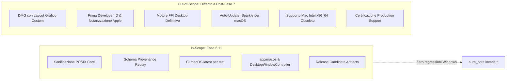

# A.U.R.A. — Fase 6.11: Cross-Platform Playtest & Dataset Readiness Specification

**Documento:** `docs/phase6/PHASE_6_11_CROSS_PLATFORM_PLAYTEST_AND_DATASET_SPEC.md`  
**Fase:** 6.11 — Cross-Platform Playtest & Dataset Readiness  
**Stato:** Specifica Esecutiva e Architetturale  
**Baseline di Riferimento:** Fase 6.10 consolidata (commit `18db44a`)  
**Piattaforme Coinvolte:** Windows x64 (host di sviluppo primario); macOS ARM64 Apple Silicon (target sperimentale per playtest); CI GitHub Actions (macOS-14 runner)  
**Destinatari:** Core Engine Maintainers, Agent Runtime Architects, CI/CD Engineers  

---

## 1. Visione Strategica e Motivazione

La Fase 6.11 nasce da una ridefinizione chirurgica del perimetro per il supporto macOS pre-Fase 7.
A.U.R.A. **non persegue un rilascio commerciale di produzione per macOS** in questo stadio della roadmap (nessun installer DMG personalizzato, nessuna spesa obbligatoria per Apple Developer Program, nessuna notarizzazione automatica). 

L'obiettivo della Fase 6.11 è duplice, sinergico e rigorosamente circoscritto:

1. **Ampliamento della Popolazione di Playtesting per la Raccolta Dataset (LoRA Readiness):**  
   Consentire a un gruppo selezionato di tester su hardware Apple Silicon (M1–M4) di eseguire A.U.R.A. per raccogliere centinaia di sessioni di dialogo diegetico e reasoning avversario. Per rendere questi dati scientificamente utilizzabili nell'addestramento dei futuri LoRA (Fase 8), la Fase 6.11 standardizza la **provenance sperimentale dei replay** (hardware, architettura, backend di calcolo, commit di `llama.cpp`, quantizzazione e parametri di campionamento).
2. **De-risking e Validazione della Neutralità della Piattaforma per la Fase 7 (Android Edge Client):**  
   macOS funge da **testbed POSIX intermedio**. Essendo un sistema operativo Unix conforme ma desktop, consente di far emergere e sanificare tutte le assunzioni Win32 latenti nel core (`ProvisioningPathResolver`, probe di vitalità processi, separatori di percorso, astrazione della shell grafica) prima di affrontare la complessità multidimensionale di Android (JNI/FFI, lifecycle mobile, memoria limitata, storage scoped e thermal throttling).

---

## 2. Matrice dei Confini (In-Scope vs Out-of-Scope)

Il perimetro della Fase 6.11 è rigidamente blindato per prevenire qualunque slittamento della roadmap verso la Fase 7:



### 2.1 Tabella Dettagliata delle Esclusioni

| Ambito | In-Scope (Fase 6.11) | Out-of-Scope (Differito / Escluso) | Rationale |
| :--- | :--- | :--- | :--- |
| **Classificazione** | `EXPERIMENTAL / PLAYTEST TARGET` | Piattaforma ufficialmente supportata in produzione | Evita obblighi di supporto verso l'utente finale generico. |
| **Infrastruttura Build** | Host Windows + GitHub Actions `macos-14` (Apple Silicon) | Mac fisico obbligatorio per la macchina dello sviluppatore | Lo sviluppo prosegue interamente dalla workstation Windows attuale. |
| **Packaging macOS** | Archivio compresso `.zip` contenente `AURA.app` o `.dmg` piatto creato con `hdiutil` | Installer `.pkg`, transcodifiche DMG complesse, bundle localizzati | Sufficiente per i playtester senza richiedere toolchain proprietarie. |
| **Sicurezza OS** | Istruzioni per aggirare Gatekeeper (`xattr -cr`) per build sperimentali | Apple Developer Program ($99/anno), certificati Developer ID, `notarytool` | Risparmio di costi e attriti burocratici non necessari per test controllati. |
| **Runtime Inferenza** | Connessione a server `llama-server` Metal (locale o pre-avviato) / LM Studio | Provisioning automatico di pacchetti Mach-O con firma crittografica lockfile | I tester avanzati possono puntare all'endpoint locale senza overhead di packaging. |
| **Desktop Shell** | `MacOSDesktopWindowController` conforme a `DesktopWindowController` | Integrazione con Touch Bar, Menu Bar complessa AppleScript | La parità di feature richiesta è unicamente quella delle finestre e del ciclo vitale. |
| **Hardware Target** | Apple Silicon ARM64 (M1, M2, M3, M4) | Intel Mac x86_64 legacy | L'ecosistema macOS moderno è integralmente ARM64; Metal è nativo. |

---

## 3. Modifiche Architetturali Dettagliate

### 3.1 Sanificazione POSIX nel Core (`aura_core`)

L'analisi del branch `fase6` ha identificato punti critici in cui sono state introdotte assunzioni Win32 incompatibili con i filesystem e i processi POSIX:

1. **Risoluzione Percorsi (`ProvisioningPathResolver`):**
   * *Problema Attuale:* In `canonicalizeRoot()`, il metodo converte indiscriminatamente `/` in `\`, eliminando il leading slash sui percorsi Unix (es. `/Users/nome/...` diventa `Users\nome\...`), facendo conseguentemente fallire la regex di validazione `_absolutePathRegex`.
   * *Soluzione 6.11:* Riconoscere esplicitamente la piattaforma di runtime (`Platform.isWindows` vs POSIX). Su POSIX, preservare il leading slash `/` e utilizzare la semantica `p.posix` del package `path`. Il metodo interno di concatenazione `_join` deve utilizzare il separatore canonico di piattaforma anziché il backslash hardcoded.
2. **Probe di Vitalità del Processo (`ProcessOwnershipRegistry`):**
   * *Problema Attuale:* In `_isProcessAliveAndMatching()`, il codice esegue:
     ```dart
     if (!Platform.isWindows) {
       try {
         return Process.killPid(record.pid, ProcessSignal.sigkill);
       } catch (_) {
         return false;
       }
     }
     ```
     Questa chiamata uccide all'istante il processo monitorato inviando `SIGKILL`, rendendo impossibile qualsiasi controllo di persistenza del server.
   * *Soluzione 6.11:* Su sistemi non-Windows, eseguire una probe non distruttiva. In Dart, il segnale 0 (utilizzato per verificare l'esistenza del PID senza inviare segnali di terminazione) può essere verificato tramite:
     ```dart
     final result = await Process.run('kill', ['-0', record.pid.toString()]);
     if (result.exitCode != 0) return false;
     ```
     Verificare inoltre l'eseguibile tramite `ps -p ${record.pid} -o command=`.
3. **Storage Directory di Default (`AuraCliEnvironment` & App Gate):**
   * Verificare che la risoluzione del percorso dati su macOS utilizzi:
     `~/Library/Application Support/AURA`
     già parzialmente mappata nei moduli CLI, evitando directory Windows relative.

---

### 3.2 Modello di Accelerazione Hardware

In `lib/src/provisioning/domain/runtime_dependency_models.dart`:
* Estendere l'enum `RuntimeAcceleration`:
  ```dart
  enum RuntimeAcceleration {
    cuda('cuda'),
    vulkan('vulkan'),
    metal('metal'),
    cpu('cpu');
    
    final String wireValue;
    const RuntimeAcceleration(this.wireValue);
  }
  ```
* Aggiornare `RuntimeCapabilities` e la logica di fallback per considerare `metal` come l'acceleratore hardware primario su macOS (`Platform.isMacOS`).

---

### 3.3 Schema di Provenance dei Replay (LoRA Dataset Readiness)

Per garantire che le sessioni giocate su macOS (e in futuro su Android) possano confluire in un dataset omogeneo e scientificamente curato per i modelli LoRA, `ReplayEntry` viene arricchita con la struttura `ReplayProvenanceMetadata`:

```json
{
  "provenance": {
    "schemaVersion": "1.0.0",
    "datasetSource": "human_playtest",
    "platform": "macos",
    "osVersion": "Darwin 24.1.0 (macOS 15.1)",
    "architecture": "arm64",
    "hardwareClass": "apple_silicon_m3_pro_18gb",
    "gitCommit": "18db44ae751859c0258cb2909f2bcf74ddc79e49",
    "appVersion": "0.6.11-rc.1",
    "runtimeBackend": "managed_llama_server",
    "runtimeAcceleration": "metal",
    "llamaCppBuild": "b4210",
    "modelArtifactSha256": "3a8b...4f21",
    "modelQuantization": "Q4_K_M",
    "contextSize": 8192,
    "samplingParameters": {
      "temperature": 0.7,
      "topP": 0.9,
      "topK": 40,
      "seed": 42
    },
    "anonymizedTesterId": "tester-alpha-04"
  }
}
```

*I dettagli completi del modello, dei campi e delle regole di retrocompatibilità sono specificati nel documento gemello [`docs/phase6/DATASET_PROVENANCE_AND_REPLAY_SCHEMA_SPEC.md`](file:///c:/Users/dendo/Documents/GitHub/aura/docs/phase6/DATASET_PROVENANCE_AND_REPLAY_SCHEMA_SPEC.md).*

---

### 3.4 Shell Desktop macOS (`app/`)

1. **Generazione Scheletro Piattaforma:**
   Esecuzione una tantum da ambiente di sviluppo Windows:
   ```bash
   cd app
   flutter create --platforms=macos .
   ```
   Genera i target Xcode nativi (`Runner.xcodeproj`, `Info.plist`, `AppInfo.xcconfig`) e integra automaticamente i binding macOS dei plugin già presenti nel `pubspec.yaml` (`window_manager`, `screen_retriever`, `audioplayers`).

2. **Astrazione `DesktopWindowController`:**
   Ristrutturazione del controller finestra in `app/lib/src/platform/`:
   * Creazione della factory astratta:
     ```dart
     abstract class DesktopWindowController {
       static DesktopWindowController create() {
         if (Platform.isWindows) return WindowsDesktopWindowController();
         if (Platform.isMacOS) return MacOSDesktopWindowController();
         return NoOpDesktopWindowController();
       }
       Future<void> initialize();
       Future<ActiveWindowMode> getActiveMode();
       Future<WindowGeometry> getGeometry();
       Future<void> setMode(ActiveWindowMode mode);
       // ...
     }
     ```
   * Creazione di `MacOSDesktopWindowController`: implementa le medesime logiche di `window_manager` adattate al comportamento del windowing macOS (gestione del fullscreen nativo macOS vs borderless, rispetto delle dimensioni minime consentite).
   * Modifica di `main.dart` per istanziare `DesktopWindowController.create()`.

3. **Shutdown Applicativo (`ApplicationShutdownCoordinator`):**
   * Correggere il metodo `requestShutdown()` in `app/lib/src/state_management/application_shutdown_coordinator.dart` per garantire l'invocazione di `exit(0)` sia su Windows sia su macOS, prevenendo che l'applicazione rimanga appesa nel Dock al termine del salvataggio dello stato.

---

## 4. Pipeline CI/CD e Flusso di Rilascio

Per operare con efficienza da una postazione di sviluppo Windows, vengono introdotte due automazioni su GitHub Actions che sfruttano i runner `macos-14` (Apple Silicon nativi):

### 4.1 Workflow di Verifica On-Demand (`.github/workflows/macos-verify.yml`)

Permette allo sviluppatore di verificare in qualsiasi momento lo stato di salute della compilazione macOS e l'assenza di regressioni:

* **Trigger:** `workflow_dispatch` (avviabile da UI o via `gh workflow run macos-verify.yml`).
* **Runner:** `macos-14` (Apple Silicon M-series).
* **Fasi di Esecuzione:**
  1. `Checkout Repository`
  2. `Setup Dart & Flutter` (versioni allineate a `ci.yml`, es. Dart 3.12 / Flutter 3.44)
  3. `Core Format, Analyze & Test` (`dart analyze .`, `dart test`)
  4. `App Static Analysis & Tests` (`flutter analyze`, `flutter test`)
  5. `App Build Release` (`flutter build macos --release`)
  6. `Upload Diagnostic Bundle` (archivio `.zip` del bundle `AURA.app` caricato come artifact temporaneo con retention di 7 giorni).

### 4.2 Integrazione Condizionale nel Rilascio (`.github/workflows/release.yml`)

Il workflow principale di rilascio viene arricchito con un job `build-macos` condizionato alla tipologia di release:

```yaml
  build-macos:
    name: Build macOS Playtest Bundle (Candidate Only)
    runs-on: macos-14
    needs: [params]
    # Eseguito ESCLUSIVAMENTE per le Release Candidate, MAI per le ufficiali:
    if: ${{ needs.params.outputs.release_kind == 'candidate' }}
    steps:
      - name: Checkout Repository
        uses: actions/checkout@v4
      - name: Set up Flutter
        uses: subosito/flutter-action@v2
        with:
          flutter-version: '3.44.1'
          channel: 'stable'
          cache: true
      - name: Build macOS Mach-O Bundle
        run: |
          cd app
          flutter pub get
          flutter build macos --release
      - name: Compress Playtest Artifact
        run: |
          cd app/build/macos/Build/Products/Release
          zip -r -y ../../../../../aura-v${{ needs.params.outputs.version }}-macos-arm64.zip AURA.app
      - name: Upload to Release Draft
        env:
          GH_TOKEN: ${{ secrets.GITHUB_TOKEN }}
        run: |
          gh release upload "v${{ needs.params.outputs.version }}" "aura-v${{ needs.params.outputs.version }}-macos-arm64.zip"
```

* **Regola di Blindatura:** Quando `release_kind == 'official'`, il job non viene nemmeno schedulato. Il master e i canali stabili rimangono puramente Windows finché non sarà pianificato un supporto di produzione formale.

---

## 5. Guida Operativa per i Playtester macOS

La guida operativa destinata direttamente ai tester è documentata nel file indipendente:
👉 [`docs/MACOS_PLAYTEST_GUIDE.md`](file:///c:/Users/dendo/Documents/GitHub/aura/docs/MACOS_PLAYTEST_GUIDE.md)

Poiché l'eseguibile non è firmato con certificati Apple Developer a pagamento, i tester che scaricano `aura-v0.6.11-rc.X-macos-arm64.zip` dalla pagina della Release Candidate incontreranno la protezione di Apple Gatekeeper.

La documentazione della release candidate deve includere le istruzioni chiare per l'avvio:

1. Estrarre il file `AURA.app` e spostarlo nella cartella `/Applications` (o sulla Scrivania).
2. Se macOS mostra l'avviso *"Impossibile aprire l'app perché lo sviluppatore non è verificato"*:
   * **Metodo Rapido da Terminale (Consigliato):**
     Aprire il Terminale ed eseguire:
     ```bash
     xattr -cr /Applications/AURA.app
     ```
   * **Metodo Grafico:**
     Fare clic con il tasto destro (o Control-Click) sull'icona di `AURA.app`, selezionare **Apri**, quindi confermare cliccando su **Apri comunque** nella finestra di dialogo.
3. **Backend di Inferenza:**
   * Il playtester avvia in locale `llama-server` compilato con Metal (o un'istanza di LM Studio configurata con local server attivo sulla porta standard `1234` / `8080`).
   * Al primo avvio, A.U.R.A. rileva l'endpoint locale e avvia la sessione di gioco.
4. **Condivisione del Replay:**
   * Al termine della partita, il file di replay JSON generato in `~/Library/Application Support/AURA/replays/` viene inviato o caricato dal tester sul repository/server di raccolta, con tutti i metadati di provenance compilati automaticamente.

---

## 6. Criteri di Accettazione e Exit Gate (Fase 6.11)

La Fase 6.11 si considererà conclusa con successo quando saranno soddisfatti tutti i seguenti criteri prima di dichiarare aperto l'inizio della Fase 7.0:

- [ ] **G1 (Core POSIX Integrity):** La suite di test unitari `dart test` viene eseguita su un runner `macos-14` in CI completando con esito verde al 100% senza fallimenti di percorsi o probe.
- [ ] **G2 (Static Analysis Parity):** `flutter analyze` e `dart analyze` passano con 0 errori, 0 warning e 0 info su ambiente macOS ("Zero Diagnostic Policy").
- [ ] **G3 (Provenance Validation):** La classe `ReplayProvenance` è integrata in `ReplayEntry`. È presente un test di regressione che valida la serializzazione e deserializzazione con replay storici senza provenance (retrocompatibilità verificata).
- [ ] **G4 (Compilation & Packaging CI):** Il workflow on-demand `macos-verify.yml` compila con successo il bundle `AURA.app` in meno di 10 minuti su GitHub Actions.
- [ ] **G5 (Release Candidate Attachment):** Una Release Candidate creata con `release_kind: candidate` include tra gli asset scaricabili l'archivio `aura-v*-macos-arm64.zip`.
- [ ] **G6 (Playtest Verification):** Almeno una sessione reale completa di 10 turni viene giocata con successo su hardware Apple Silicon (M1/M2/M3/M4) e il relativo log di replay JSON viene validato con tutti i campi di provenance compilati.
- [ ] **G7 (Zero Impatto su Windows):** L'intero collaudo multi-hardware di Fase 6.10 su Windows e le relative pipeline di rilascio rimangono inalterati e operativi.

---

## 7. Registro delle Modifiche

| Data | Commit / PR | Descrizione |
|---|---|---|
| 2026-09-28 | Iniziale | Creazione della specifica per la Fase 6.11 (Cross-Platform Playtest & Dataset Readiness) |
