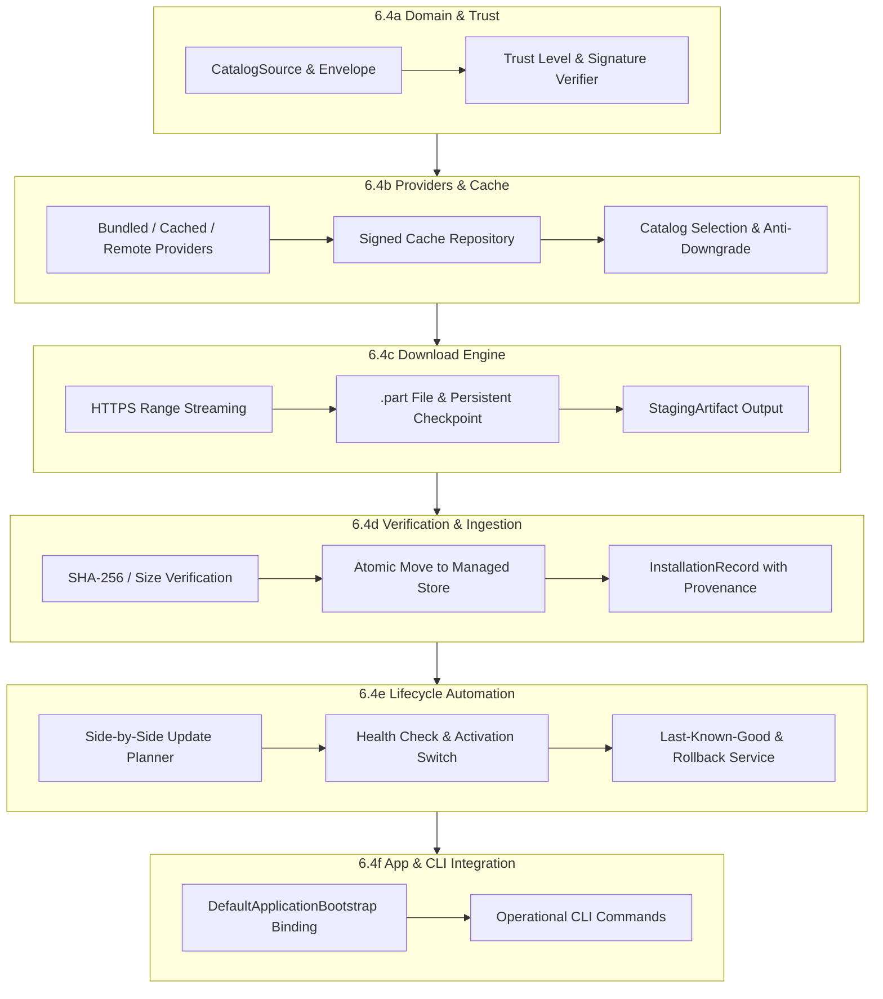

# Phase 6.4 Model & Catalog Remote Acquisition, Resilient Download & Automated Lifecycle Specification

**Project:** A.U.R.A. — Artificial Unbound Reasoning Arena  
**Target path:** `docs/phase6/PHASE_6_4_ACQUISITION_AND_LIFECYCLE_SPEC.md`  
**Status:** Approved Specification & Implementation Roadmap  
**Phase:** 6.4 — Model Acquisition, Download Engine & Lifecycle Automation  
**Parent documents:**
- [CROSS_PLATFORM_RUNTIME_ADR.md](CROSS_PLATFORM_RUNTIME_ADR.md)
- [INFERENCE_RUNTIME_CONTRACT.md](INFERENCE_RUNTIME_CONTRACT.md)
- [MODEL_MANIFEST_SPEC.md](MODEL_MANIFEST_SPEC.md)
- [MODEL_LIFECYCLE_SPEC.md](MODEL_LIFECYCLE_SPEC.md)
- [PHASE_6_2B_BASELINE_AND_6_3_READINESS.md](PHASE_6_2B_BASELINE_AND_6_3_READINESS.md)

**Repository baseline:** `72ca550021d6aceda98eb999f35b3407bce75383` (Formal closure of Phase 6.3e)  
**Working branch:** `fase6`  
**Last updated:** 2026-07-22  

---

## 1. Purpose & Strategic Scope

This specification defines the architecture, trust model, network protocols, resilient download engine, verification pipelines, and lifecycle automation for remote model and catalog acquisition in A.U.R.A.

Phase 6.3 established the physical storage foundation, local JSON persistence, atomic directory installation, role-aware activation state, and offline/local GGUF acquisition. Phase 6.4 extends this foundation to remote distribution channels, enabling dynamic catalog acquisition, cryptographically verified integrity, HTTP Range resume streaming, side-by-side updates, and atomic rollbacks.

---

## 2. Consolidate Context & Baseline Invariants

### 2.1 Baseline of Phase 6.3 (Completed)
- **Closure Baseline Commit:** `72ca550021d6aceda98eb999f35b3407bce75383`.
- **Implemented Subsystems:**
  - Core domain models & static bootstrap catalog (`CatalogManifest.initialDefault()`);
  - Physical store filesystem abstractions & cross-platform path resolvers;
  - Local GGUF artifact ingestion, validation, and atomic directory staging/installation;
  - Role-aware activation state (`actor`, `evaluator`) and installed model registry;
  - Operational CLI commands for local provisioning (`aura_cli.dart`).
- **Baseline Default Roles:**
  - **Default Actor Target:** `gemma-4-12b-it-qat-q4_0`
  - **Default Evaluator Target:** Configured Ministral variant (`ministral-3-3b` or GGUF equivalent).
- **Bootstrap Hashes Status:** Hashes in `CatalogManifest.initialDefault()` carry the explicit status `bootstrapDeclared`.

### 2.2 Core Trust & Lifecycle Axioms
1. **Dynamic Fingerprint Certification:** Dynamic fingerprint certification, remote catalog fetching, and HTTP downloads belong strictly to Phase 6.4.
2. **Untrusted Payload Isolation:** A client MUST NOT treat a checksum recovered from the same unauthenticated source as the payload itself as certified or trusted. Checksums must be verified against signed catalog envelopes or pre-embedded bootstrap declarations.
3. **Decoupled Lifecycle States:** The acquisition pipeline strictly enforces non-overlapping responsibilities:
   $$\text{Catalog Acquired} \neq \text{Download Completed} \neq \text{Artifact Verified} \neq \text{Artifact Installed} \neq \text{Artifact Registered} \neq \text{Artifact Activated}$$
4. **Relationship with Phase 6.9 (Release & Signing Pipeline):** Phase 6.9 owns the build server infrastructure, release key generation, catalog signing, and publishing pipeline. Phase 6.4 is the **client-side consumer and verifier** of signed catalog envelopes using configured public keys.

---

## 3. Sub-Phase Architecture (Tranches 6.4a – 6.4f)

To allow incremental implementation, rigorous code reviews, and isolated test suites, Phase 6.4 is split into six sequential, non-overlapping tranches.



---

### 3.1 Tranche 6.4a — Catalog Acquisition Domain & Trust Model

#### 3.1.1 Objective
Define domain contracts, data models, trust levels, signature verification interfaces, and selection policies for remote/local catalogs without performing real network I/O.

#### 3.1.2 Responsibilities
- Model canonical catalog metadata envelopes (`CatalogEnvelope`) and trust classifications (`CatalogTrustLevel`).
- Distinguish immutable artifact identifiers (SHA-256 + size) from transient sources.
- Prohibit floating revisions (`main`, `master`, `latest`) in catalog declarations.
- Enforce strict signature versioning and envelope validation contracts.

#### 3.1.3 Planned Components & Data Contracts
- `CatalogSource` (`enum`: `bundledBootstrap`, `remoteSigned`, `cachedSigned`, `localDevelopment`)
- `CatalogTrustLevel` (`enum`: `bootstrapDeclared`, `signatureVerified`, `locallyImported`, `developmentUnsigned`)
- `CatalogEnvelope` (Immutable DTO containing `CatalogManifest`, signature payload, signature algorithm, key ID, and timestamp)
- `CatalogVersion` & `CatalogRevision` (Semantic versioning and monotonic revision counter)
- `CatalogSignature` & `CatalogSignatureVerifier` (Abstract interface for cryptographic signature verification)
- `CatalogValidationService` (Structural and semantic manifest validation)
- `CatalogSelectionPolicy` (Evaluates effective catalog precedence)
- `CatalogCompatibilityEvaluator` (Evaluates compatibility with current application version)
- `CatalogAcquisitionResult` (Result container with trust provenance)

#### 3.1.4 Input / Output Contracts
- **Input:** Raw JSON string / `Map<String, dynamic>` + Trusted Public Keys + Application Version.
- **Output:** `CatalogAcquisitionResult` with classified `CatalogTrustLevel` and validated `CatalogManifest`.

#### 3.1.5 Normative Rules & Constraints
- The bundled static catalog (`CatalogManifest.initialDefault()`) MUST always be available as a fallback.
- Floating revision specifiers (`main`, `master`, `latest`) are strictly forbidden in catalog manifests.
- Artifact identity is immutable and defined exclusively by `(sizeBytes, sha256)`.
- The signature protects the entire `CatalogEnvelope` payload.
- No actual HTTP/HTTPS network calls are allowed in this tranche.

#### 3.1.6 Failure Model
- Structural invalidity $\rightarrow$ `CatalogValidationException`.
- Signature mismatch or missing public key $\rightarrow$ `CatalogSignatureException`.
- Prohibited floating revision $\rightarrow$ `InvalidCatalogRevisionException`.

#### 3.1.7 Required Tests
- Deterministic unit tests for `CatalogEnvelope` parsing, serialization, and validation.
- Unit tests asserting rejection of `main`/`latest` revisions.
- Mock signature verification tests (`MockCatalogSignatureVerifier`).
- Precedence and trust level classification unit tests.

#### 3.1.8 Gate Criteria & Deferred Work
- **Gate Criteria:** 100% domain contract coverage; `dart analyze` clean; zero network code.
- **Deferred Work:** HTTP transport and persistent disk cache (deferred to 6.4b).

---

### 3.2 Tranche 6.4b — Catalog Providers, Signed Cache & Refresh

#### 3.2.1 Objective
Implement the provider chain for acquiring, caching, and refreshing catalog manifests with offline support, signed cache validation, and anti-downgrade protection.

#### 3.2.2 Acquisition Precedence Flow
```text
Bundled Bootstrap -> Cached Signed Catalog -> Remote HTTPS Fetch -> Signature Verification -> Semantic Validation -> Atomic Cache Write -> Effective Catalog Selection
```

#### 3.2.3 Responsibilities
- Implement `BundledCatalogProvider`, `CachedCatalogProvider`, and `RemoteCatalogProvider`.
- Maintain a local signed cache in `%LOCALAPPDATA%\AURA\cache\catalog\`.
- Guarantee offline capability using the cached signed catalog.
- Prevent catalog downgrade (reject remote catalogs with lower revision numbers than currently verified cache).
- Use `ETag` and `Last-Modified` headers strictly as network bandwidth optimizations.

#### 3.2.4 Planned Components
- `BundledCatalogProvider` (Reads `CatalogManifest.initialDefault()`)
- `RemoteCatalogProvider` (Fetches `CatalogEnvelope` over HTTPS)
- `CachedCatalogProvider` (Reads/writes verified envelopes to local cache)
- `CatalogCacheRepository` (Atomic JSON file write with `.bak` recovery)
- `CatalogRefreshService` (Orchestrates periodic or manual catalog refresh)
- `SignedCatalogVerifier` (Concrete RSA/Ed25519 verifier using embedded public key)
- `CatalogAcquisitionCoordinator` (Executes provider fallback chain)
- `CatalogRefreshPolicy` (Controls refresh intervals and offline modes)

#### 3.2.5 Input / Output Contracts
- **Input:** `CatalogRefreshRequest` (forceRefresh, offlineOnly, timeout).
- **Output:** `CatalogAcquisitionResult` containing active effective catalog and acquisition diagnostic metadata.

#### 3.2.6 Normative Rules & Constraints
- An invalid remote catalog MUST NEVER overwrite a valid cached catalog or fallback baseline.
- Atomic file writes MUST use intermediate `.tmp` files before renaming to destination.
- Downgrade attempts (remote revision < cached revision) MUST be rejected.

#### 3.2.7 Failure Model
- Network timeout / offline status $\rightarrow$ Triggers fallback to `CachedCatalogProvider`.
- Cache missing or corrupted $\rightarrow$ Triggers fallback to `BundledCatalogProvider`.
- Remote signature verification failure $\rightarrow$ Discards remote payload, logs warning, returns cached catalog.

#### 3.2.8 Required Tests
- Offline fallback integration tests using `FakeHttpClient`.
- Anti-downgrade validation tests.
- Atomic cache write crash-recovery tests.
- ETag / 304 Not Modified optimization tests.

#### 3.2.9 Gate Criteria & Deferred Work
- **Gate Criteria:** Full provider chain tested offline; atomic cache verified; zero diagnostics.
- **Deferred Work:** Binary artifact download (deferred to 6.4c).

---

### 3.3 Tranche 6.4c — Download Engine, Resume & Staging

#### 3.3.1 Objective
Build a resilient, high-performance HTTP Range download engine for large GGUF model files that operates strictly within temporary staging (`.part` files) without altering installation registries.

#### 3.3.2 Fundamental Boundary Rule
$$\text{Download Completed} \neq \text{Artifact Verified} \neq \text{Artifact Installed}$$
A completed download yields a `StagingArtifact` file on disk, which is not yet trusted or installed.

#### 3.3.3 Responsibilities
- Stream large files over HTTPS to intermediate `.part` files in `%LOCALAPPDATA%\AURA\staging\`.
- Support pause, cancel, and HTTP Range resume across application restarts.
- Persist download session checkpoints (`DownloadCheckpoint`) to disk in JSON format.
- Execute exponential backoff retries for transient network errors.
- Monitor disk space prior to allocating staging files.
- Enforce strict concurrency limits (default: 1 active heavy download).

#### 3.3.4 Planned Components
- `ArtifactDownloadService` (Main download engine interface and implementation)
- `DownloadRequest` (Target URL, destination path, expected size, expected SHA-256)
- `DownloadSession` (Runtime state of an active download)
- `DownloadProgress` (Bytes downloaded, total bytes, speed, ETA, percentage)
- `DownloadCheckpoint` & `DownloadCheckpointRepository` (JSON checkpoint storage)
- `DownloadRetryPolicy` (Exponential backoff with jitter)
- `DownloadCancellationToken` (Cooperative cancellation signal)
- `DownloadResult` (Outcome container)
- `StagingArtifact` (File descriptor for completed `.part` staging file)
- `DownloadConcurrencyController` (Concurrency throttle queue)

#### 3.3.5 Input / Output Contracts
- **Input:** `DownloadRequest` with HTTPS URI and expected size/hash.
- **Output:** `DownloadResult` with reference to unverified `StagingArtifact`.

#### 3.3.6 Normative Rules & Constraints
- Downloads MUST use streaming I/O (`Stream<List<int>>`) and never read entire files into RAM.
- Staging files MUST use the `.part` extension during download.
- If the remote server returns a changed `ETag` during a resume attempt, the existing `.part` file MUST be discarded and the download restarted from byte 0.
- Pre-allocation check MUST fail fast if available disk space is less than `expectedSizeBytes + 500 MB`.

#### 3.3.7 Failure Model
- Network disconnect $\rightarrow$ Saves `DownloadCheckpoint`, transitions state to `paused` / `failedRetryable`.
- Insufficient disk space $\rightarrow$ Throws `InsufficientStorageException`.
- Changed remote ETag $\rightarrow$ Resets checkpoint and restarts.

#### 3.3.8 Required Tests
- HTTP Range resume unit tests using a local loopback HTTP server.
- Interruption, cancellation, and checkpoint persistence tests.
- Concurrency limit throttling tests.
- ETag mismatch reset tests.

#### 3.3.9 Gate Criteria & Deferred Work
- **Gate Criteria:** Resilient download & resume proven over loopback HTTP server; zero orphaned `.part` file leaks on cancel.
- **Deferred Work:** SHA-256 verification and atomic move into the managed model store (deferred to 6.4d).

---

### 3.4 Tranche 6.4d — Verification, Import & Provisioning Integration

#### 3.4.1 Objective
Bridge completed staging downloads and local user files with Phase 6.3 provisioning infrastructure (`ArtifactIngestionEngine` and `ProvisioningCoordinator`), validating SHA-256 hashes and recording complete metadata provenance.

#### 3.4.2 Provenance Data Schema
Every installed artifact MUST persist the following immutable provenance fields in `InstallationRecord`:

```json
{
  "catalog_id": "aura-official-catalog",
  "catalog_version": "1.2.0",
  "catalog_revision": 42,
  "artifact_id": "gemma-4-12b-it-qat-q4_0",
  "repository": "https://huggingface.co/lmstudio-community/gemma-4-12B-it-QAT-GGUF",
  "repository_revision": "72ca550021d6aceda98eb999f35b3407bce75383",
  "file_name": "gemma-4-12B-it-QAT-Q4_0.gguf",
  "size_bytes": 7458124800,
  "sha256": "e3b0c44298fc1c149afbf4c8996fb92427ae41e4649b934ca495991b7852b855",
  "trust_provenance": "signatureVerified",
  "acquired_at": "2026-07-22T21:30:00Z"
}
```

#### 3.4.3 Responsibilities
- Compute chunked SHA-256 hashes for staged files (`StagingArtifact`) or local imported GGUF files.
- Compare calculated SHA-256 and byte size against catalog expectations.
- Execute atomic directory move from staging to `%LOCALAPPDATA%\AURA\models\<artifactId>\`.
- Generate `InstallationRecord` and register the model with `InstalledModelRegistry`.
- Notify `ProvisioningCoordinator` of availability without forcing immediate activation.

#### 3.4.4 Planned Components
- `DownloadedArtifactVerifier` (Validates size and SHA-256 of staged files)
- `ArtifactFingerprintVerifier` (Streaming SHA-256 calculation)
- `LocalArtifactImportService` (Inspects and imports external local GGUF files)
- `ArtifactImportInspector` (Parses GGUF header metadata and computes hash)
- `CatalogArtifactSnapshot` (Immutable snapshot of catalog metadata at import time)
- Integration extensions for `ModelProvisioningService`, `ArtifactIngestionEngine`, and `ProvisioningCoordinator`.

#### 3.4.5 Normative Rules & Constraints
- An artifact MUST NOT be marked `verified` or `installed` before passing streaming SHA-256 verification.
- Size or hash mismatch MUST immediately trigger staging file cleanup or quarantine.
- External local imports not matching a signed catalog are assigned `developmentUnsigned` or `locallyImported` trust levels.
- The download and verification pipeline MUST NOT mutate `ActivationState` directly. Activation remains the exclusive responsibility of `ProvisioningCoordinator`.

#### 3.4.6 Failure Model
- Hash mismatch $\rightarrow$ `ArtifactChecksumMismatchException`, staging file moved to quarantine or deleted.
- Registration failure $\rightarrow$ Rollback directory move and purge unregistered files.

#### 3.4.7 Required Tests
- Staging verification & atomic install integration tests.
- SHA-256 mismatch rejection tests.
- Local GGUF file import & classification tests.
- `ProvisioningCoordinator` event emission tests.

#### 3.4.8 Gate Criteria & Deferred Work
- **Gate Criteria:** Complete remote & local import pipeline verified end-to-end; full provenance recorded.
- **Deferred Work:** Automated lifecycle management, health checks, updates, and rollbacks (deferred to 6.4e).

---

### 3.5 Tranche 6.4e — Model Lifecycle: Update, Repair & Rollback

#### 3.5.1 Objective
Implement automated lifecycle operations for installed models, including side-by-side updates, health checks, `last-known-good` fallback preservation, repair, and retention policy enforcement.

#### 3.5.2 Side-by-Side Update Sequence
```text
Download New Build -> Verify SHA-256 -> Side-by-Side Install -> Health Check -> Activate -> Mark Previous Active as Last-Known-Good -> Deferred Cleanup
```

#### 3.5.3 Responsibilities
- Prevent in-place overwrites of active model files.
- Execute side-by-side installations in versioned target directories.
- Run `InstallationHealthService` check before completing activation switch.
- Retain previous active version as `last-known-good` for instant rollback.
- Provide `ArtifactRepairService` to re-download or re-verify missing/corrupted files.
- Enforce `RetentionPolicy` (never purge `active` or `last-known-good` versions).

#### 3.5.4 Planned Components
- `ModelLifecycleManager` (High-level orchestration entry point)
- `ArtifactUpdatePlanner` (Compares catalog versions against local registry to build candidate list)
- `ArtifactUpdateCandidate` (DTO detailing available updates)
- `ArtifactRepairService` (Diagnoses and repairs corrupted installations)
- `ArtifactRollbackService` (Executes instant rollback to `last-known-good`)
- `RetentionPolicy` (Defines garbage collection rules for old builds)
- `InstallationHealthService` (Verifies model loadability and basic inference smoke test)
- `UpdatePolicy` (Default: automatic check, download and activation require explicit user consent)
- `UpdateResult` (Operation outcome container)

#### 3.5.5 Normative Rules & Constraints
- In-place overwriting of existing model files is STRICTLY FORBIDDEN.
- Updates are evaluated independently for `actor`, `evaluator`, and `runtime` binaries.
- `RetentionPolicy` MUST NEVER delete an active installation or a `last-known-good` fallback.
- If health check fails on a new version, the system MUST automatically abort activation and revert to `last-known-good`.

#### 3.5.6 Failure Model
- Health check failure post-install $\rightarrow$ Aborts activation, retains pre-existing `active` model, flags new build as `failedHealthCheck`.
- Corrupted file detected during gameplay $\rightarrow$ `ArtifactRepairService` queues background re-verification or re-download.

#### 3.5.7 Required Tests
- Side-by-side update integration tests asserting non-destruction of active models.
- Automatic rollback test on simulated health-check failure.
- Repair service test on missing GGUF files.
- Retention policy garbage collection tests.

#### 3.5.8 Gate Criteria & Deferred Work
- **Gate Criteria:** Update, repair, and rollback verified deterministically; zero in-place mutations.
- **Deferred Work:** Operational CLI exposure and composition root binding (deferred to 6.4f).

---

### 3.6 Tranche 6.4f — Application Integration & Operational CLI

#### 3.6.1 Objective
Wire the remote catalog acquisition, download engine, and lifecycle services into `DefaultApplicationBootstrap` and expose comprehensive management tools via `bin/aura_cli.dart`.

#### 3.6.2 Responsibilities
- Register all 6.4 services within `DefaultApplicationBootstrap` and `PlatformServices`.
- Expose environment variables and configuration parameters (`AURA_REMOTE_ACQUISITION_ENABLED`, `AURA_CATALOG_URL`, `AURA_PUBLIC_KEY`).
- Provide operational CLI commands for catalog status, download management, manual import, updates, repair, and rollback.
- Implement strict diagnostic sanitization (prevent leaking full local paths, API keys, or private tokens in logs).
- Ensure UI layer widgets consume state via `Notifier` controllers without direct repository dependencies.

#### 3.6.3 Operational CLI Commands
The CLI tool `bin/aura_cli.dart` MUST support the following commands:

```text
aura catalog status                             # Display catalog source, revision, trust level, and model counts
aura catalog refresh                            # Force remote catalog refresh and update signed cache
aura catalog show                               # List models and physical variants in effective catalog
aura download <artifactId>                      # Initiate artifact download with progress bar
aura download status                            # Show active/paused download sessions and checkpoints
aura download cancel                            # Cancel an active download session
aura import <path>                              # Inspect and import local GGUF file into managed store
aura install <artifactId>                       # Execute full download, verify, and install sequence
aura update check                               # Check for model or runtime updates
aura update apply <artifactId>                  # Apply side-by-side update for target artifact
aura repair <installationId>                    # Repair damaged installation
aura rollback --role actor|evaluator|runtime    # Instant rollback of specified role to last-known-good
```

#### 3.6.4 Planned Components
- `CatalogCliController` (CLI command handlers for catalog and download operations)
- Composition root wiring in `DefaultApplicationBootstrap`
- Feature flag toggle `enableRemoteAcquisition`
- Log & Diagnostic Sanitizer (Filters sensitive network/path details)

#### 3.6.5 Normative Rules & Constraints
- CLI output MUST support clean plain-text and structured `--json` output modes.
- Diagnostics MUST NOT stringify raw exceptions exposing sensitive workstation paths.
- UI widgets MUST NOT import repository or filesystem classes directly.

#### 3.6.6 Failure Model
- Network errors during CLI commands yield formatted, user-friendly diagnostic messages with actionable remediation steps.

#### 3.6.7 Required Tests
- End-to-end CLI integration tests for all 12 operational commands.
- Bootstrap composition root initialization tests with `enableRemoteAcquisition` toggled.
- Log sanitization verification tests.

#### 3.6.8 Gate Criteria
- Verification script `tool/run_ci_tests.ps1` completes successfully across `aura` and `app`.
- `dart analyze` and `flutter analyze` report zero errors, warnings, or info diagnostics.
- All CLI commands tested and operational.

---

## 4. Cross-Subsystem Traceability Matrix

| Requirement / Component | Tranche | Primary Document | Validation Mechanism |
| :--- | :---: | :--- | :--- |
| `CatalogEnvelope` & Trust Models | **6.4a** | [PHASE_6_4_ACQUISITION_AND_LIFECYCLE_SPEC.md](PHASE_6_4_ACQUISITION_AND_LIFECYCLE_SPEC.md#31-tranche-64a--catalog-acquisition-domain--trust-model) | Unit tests in `test/catalog/` |
| Provider Precedence & Signed Cache | **6.4b** | [PHASE_6_4_ACQUISITION_AND_LIFECYCLE_SPEC.md](PHASE_6_4_ACQUISITION_AND_LIFECYCLE_SPEC.md#32-tranche-64b--catalog-providers-signed-cache--refresh) | Offline HTTP Fake tests |
| HTTPS Range Resume & Staging `.part` | **6.4c** | [PHASE_6_4_ACQUISITION_AND_LIFECYCLE_SPEC.md](PHASE_6_4_ACQUISITION_AND_LIFECYCLE_SPEC.md#33-tranche-64c--download-engine-resume--staging) | Loopback server tests |
| SHA-256 Verification & Provenance Record | **6.4d** | [PHASE_6_4_ACQUISITION_AND_LIFECYCLE_SPEC.md](PHASE_6_4_ACQUISITION_AND_LIFECYCLE_SPEC.md#34-tranche-64d--verification-import--provisioning-integration) | Ingestion pipeline tests |
| Side-by-Side Update & Rollback | **6.4e** | [PHASE_6_4_ACQUISITION_AND_LIFECYCLE_SPEC.md](PHASE_6_4_ACQUISITION_AND_LIFECYCLE_SPEC.md#35-tranche-64e--model-lifecycle-update-repair--rollback) | Lifecycle Integration tests |
| Operational CLI & Composition Root | **6.4f** | [PHASE_6_4_ACQUISITION_AND_LIFECYCLE_SPEC.md](PHASE_6_4_ACQUISITION_AND_LIFECYCLE_SPEC.md#36-tranche-64f--application-integration--operational-cli) | Master CI script `tool/run_ci_tests.ps1` |

---

## 5. Verification & Acceptance Checklist

To consider Phase 6.4 fully complete, the system MUST satisfy:

1. **No Monolithic Design:** Phase 6.4 is formally split into sequential tranches 6.4a through 6.4f.
2. **Decoupled States:** Network download, checksum verification, physical directory staging, record registration, and role activation are distinct and non-overlapping operations.
3. **Trust Model Precedes I/O:** `CatalogTrustLevel` and domain contracts are defined in 6.4a prior to network provider implementation in 6.4b.
4. **Bootstrap Catalog Resilience:** `CatalogManifest.initialDefault()` remains accessible at all times; invalid remote payloads never destroy valid local baselines.
5. **Full Provenance Persistence:** `InstallationRecord` includes `catalogId`, `catalogVersion`, `catalogRevision`, `artifactId`, `repository`, `sha256`, `trust_provenance`, and `acquiredAt`.
6. **Side-by-Side Invariant:** Model updates never overwrite active files in-place; rollbacks restore `last-known-good` state instantly.
7. **Release Pipeline Separation:** Phase 6.9 remains responsible for signing and publishing catalog artifacts, while Phase 6.4 consumes and verifies signed envelopes on the client.
8. **Operational CLI:** All 12 CLI commands (`catalog status`, `refresh`, `download`, `import`, `update`, `rollback`, etc.) are fully tested and functional.
