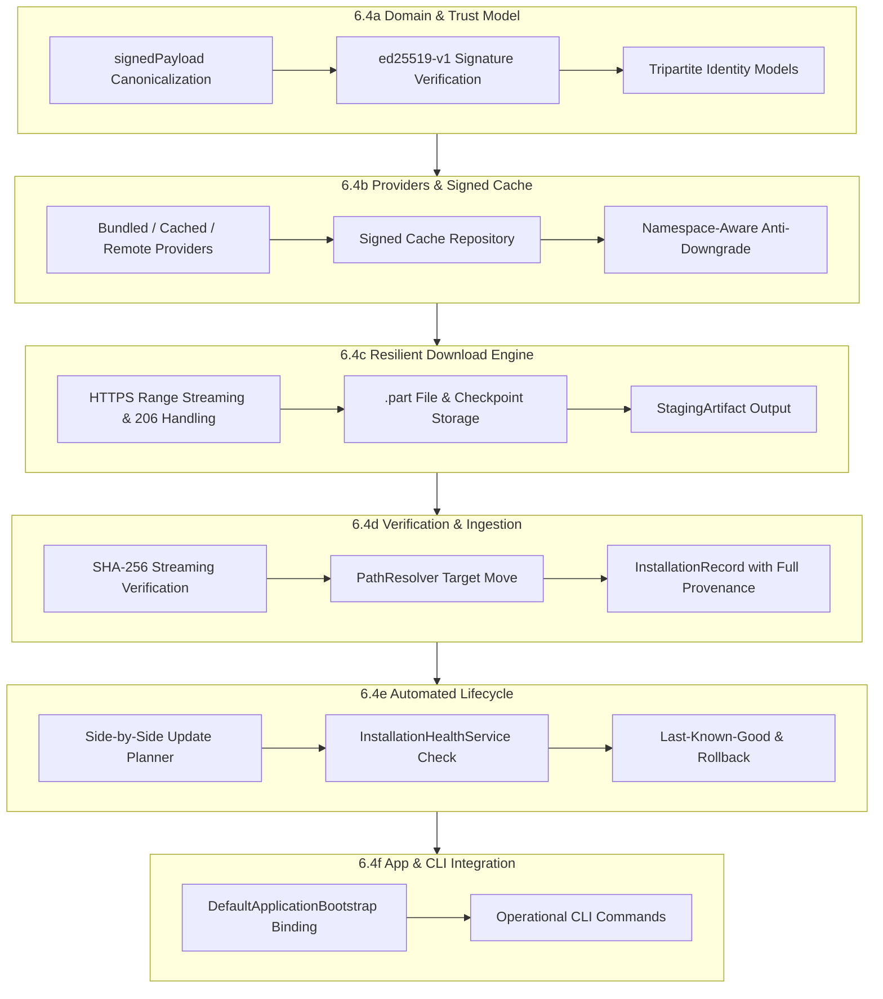

# Phase 6.4 Model & Catalog Remote Acquisition, Resilient Download & Automated Lifecycle Specification

**Project:** A.U.R.A. — Artificial Unbound Reasoning Arena  
**Target path:** `docs/phase6/PHASE_6_4_ACQUISITION_AND_LIFECYCLE_SPEC.md`  
**Status:** Approved Specification & Implementation Roadmap (Revised Document Baseline)  
**Phase:** 6.4 — Model Acquisition, Download Engine & Lifecycle Automation  
**Parent documents:**
- [CROSS_PLATFORM_RUNTIME_ADR.md](CROSS_PLATFORM_RUNTIME_ADR.md)
- [INFERENCE_RUNTIME_CONTRACT.md](INFERENCE_RUNTIME_CONTRACT.md)
- [MODEL_MANIFEST_SPEC.md](MODEL_MANIFEST_SPEC.md)
- [MODEL_LIFECYCLE_SPEC.md](MODEL_LIFECYCLE_SPEC.md)
- [PHASE_6_2B_BASELINE_AND_6_3_READINESS.md](PHASE_6_2B_BASELINE_AND_6_3_READINESS.md)

**Repository baseline:** `72ca550021d6aceda98eb999f35b3407bce75383` (Formal closure of Phase 6.3e)  
**Working branch:** `fase6`  
**Last updated:** 2026-07-22  

---

## 1. Purpose & Strategic Scope

This specification defines the architecture, trust model, canonical signature representation, network protocols, resilient download engine, verification pipelines, and lifecycle automation for remote model and catalog acquisition in A.U.R.A.

Phase 6.3 established the physical storage foundation, local JSON persistence (`JsonInstallationRecordRepository`, `JsonActivationStateRepository`), atomic directory installation via `LocalProvisioningFileSystem`, role-aware activation state, and offline/local GGUF acquisition. Phase 6.4 extends this foundation to remote distribution channels, enabling dynamic signed catalog acquisition, cryptographically verified integrity, HTTP Range resume streaming, side-by-side updates, and atomic rollbacks.

---

## 2. Consolidate Context & Baseline Invariants

### 2.1 Baseline of Phase 6.3 (Completed)
- **Closure Baseline Commit:** `72ca550021d6aceda98eb999f35b3407bce75383`.
- **Implemented Subsystems & Concrete Symbols:**
  - Core domain models & static bootstrap catalog (`CatalogManifest.initialDefault()`);
  - Physical store filesystem abstraction `LocalProvisioningFileSystem` & `ProvisioningPathResolver`;
  - Ingestion & installation components: `ArtifactIngestionEngine`, `AtomicArtifactInstaller`;
  - Repositories: `JsonInstallationRecordRepository` (implementing `InstallationRecordRepository`) and `JsonActivationStateRepository` (implementing `ActivationStateRepository`);
  - Role-aware activation state (`actor`, `evaluator`) and `ProvisioningCoordinator`;
  - Operational CLI commands for local provisioning (`bin/aura_provisioning.dart`).
- **Baseline Default Roles:**
  - **Default Actor Target:** `gemma-4-12b-it-qat-q4_0`
  - **Default Evaluator Target:** Configured Ministral variant (`ministral-3-3b` or GGUF equivalent).
- **Bootstrap Hashes Status:** Hashes in `CatalogManifest.initialDefault()` carry the explicit trust provenance status `bootstrapDeclared`.

### 2.2 Core Trust, Identity & Lifecycle Axioms

#### 2.2.1 Tripartification of Identity
To prevent ambiguity between file contents, catalog declarations, and local provisioning records, A.U.R.A. enforces three distinct levels of identity:

```text
Content Identity:
  (sizeBytes, sha256)

Artifact Identity:
  artifactId + version + buildId + Content Identity

Catalog Declaration Identity:
  catalogId + catalogRevision + Artifact Identity
```

- **Content Identity** uniquely identifies the raw binary blob (e.g., GGUF file bytes).
- **Artifact Identity** uniquely identifies the specific model build variant within the provisioning layer (allowing versioning, side-by-side builds, and content deduplication).
- **Catalog Declaration Identity** uniquely identifies an artifact's declaration within a specific signed catalog revision.

#### 2.2.2 Untrusted Payload Isolation & Responsibilities
- A client MUST NOT treat a checksum recovered from the same unauthenticated source as the payload itself as certified or trusted. Checksums must be verified against signed catalog envelopes or pre-embedded bootstrap declarations.
- **Phase 6.9 vs Phase 6.4 Responsibility Boundary:**
  - **Phase 6.9 (Release & Signing Pipeline):** Responsible for fingerprint generation, catalog approval, private key signature generation, and publishing.
  - **Phase 6.4 (Client Acquisition & Verification):** Responsible for signed catalog acquisition, authenticity verification against pinned public keys, and local payload integrity verification.

#### 2.2.3 Decoupled Lifecycle States
The acquisition pipeline strictly enforces non-overlapping responsibilities:
$$\text{Catalog Acquired} \neq \text{Download Completed} \neq \text{Artifact Verified} \neq \text{Artifact Installed} \neq \text{Artifact Registered} \neq \text{Artifact Activated}$$

---

## 3. Sub-Phase Architecture (Tranches 6.4a – 6.4f)

Phase 6.4 is split into six sequential, non-overlapping tranches.



---

### 3.1 Tranche 6.4a — Catalog Acquisition Domain & Trust Model

#### 3.1.1 Objective
Define domain contracts, data models, trust levels, signature verification interfaces, and selection policies for remote/local catalogs without performing real network I/O.

#### 3.1.2 Canonical Envelope & Signature Representation
To prevent recursive signature definition, the `CatalogEnvelope` separates the signature from the signed payload:

```text
CatalogEnvelope
├── signedPayload
│   ├── schemaVersion ("1.0")
│   ├── catalogId ("aura-official-catalog")
│   ├── catalogVersion ("1.2.0")
│   ├── catalogRevision (42)
│   ├── issuedAt ("2026-07-22T21:30:00Z")
│   ├── expiresAt ("2026-08-22T21:30:00Z")
│   └── manifest (CatalogManifest DTO)
├── signatureAlgorithm ("ed25519-v1")
├── keyId ("aura-release-key-2026-01")
└── signature ("<BASE64_ED25519_SIGNATURE>")
```

#### 3.1.3 Canonicalization & Signature Rules
1. **Signature Target:** Cryptographic verification is performed strictly on the canonical JSON byte representation of `signedPayload`. The `signature`, `signatureAlgorithm`, and `keyId` fields are outside `signedPayload` and are excluded from signature computation.
2. **Canonical Encoding:** UTF-8 encoded RFC 8785 (JSON Canonicalization Scheme - JCS) or deterministic lexicographical key ordering without whitespace.
3. **Normative Cryptographic Algorithm:** `ed25519-v1` (Ed25519 over Curve25519 with SHA-512 per RFC 8032).
4. **Prohibition of Floating Revisions:** Revision specifiers like `main`, `master`, or `latest` are strictly forbidden in `signedPayload`.

#### 3.1.4 Planned Components & Data Contracts
- `CatalogSource` (`enum`: `bundledBootstrap`, `remoteSigned`, `cachedSigned`, `localDevelopment`)
- `CatalogTrustLevel` (`enum`: `bootstrapDeclared`, `signatureVerified`, `locallyImported`, `developmentUnsigned`)
- `CatalogSignedPayload` (Immutable DTO containing catalog metadata and manifest)
- `CatalogEnvelope` (Wrapper holding `signedPayload`, `signatureAlgorithm`, `keyId`, and `signature`)
- `CatalogSignatureVerifier` (Abstract interface for verifying `CatalogEnvelope` signatures using trusted public keys)
- `CatalogValidationService` (Structural and semantic manifest validation)
- `CatalogSelectionPolicy` (Evaluates effective catalog precedence)
- `CatalogCompatibilityEvaluator` (Evaluates application version compatibility)

#### 3.1.5 Input / Output Contracts
- **Input:** Raw JSON string / `Map<String, dynamic>` + Trusted Public Keys + Application Version.
- **Output:** `CatalogAcquisitionResult` with classified `CatalogTrustLevel` and validated `CatalogManifest`.

#### 3.1.6 Failure Model
- Structural or canonicalization invalidity $\rightarrow$ `CatalogValidationException`.
- Signature mismatch or untrusted `keyId` $\rightarrow$ `CatalogSignatureException`.
- Prohibited floating revision $\rightarrow$ `InvalidCatalogRevisionException`.

#### 3.1.7 Required Tests
- Deterministic unit tests for JCS canonicalization and `signedPayload` serialization.
- Unit tests asserting rejection of `main`/`latest` revisions.
- `MockCatalogSignatureVerifier` and Ed25519 test vectors (`ed25519-v1`).
- Tripartite identity equality and hash code tests.

#### 3.1.8 Gate Criteria & Deferred Work
- **Gate Criteria:** 100% domain contract coverage; `dart analyze` clean; zero network code.
- **Deferred Work:** HTTP transport and persistent disk cache (deferred to 6.4b).

---

### 3.2 Tranche 6.4b — Catalog Providers, Signed Cache & Refresh

#### 3.2.1 Objective
Implement the provider chain for acquiring, caching, and refreshing catalog manifests with offline support, signed cache validation, and namespace-aware anti-downgrade protection.

#### 3.2.2 Acquisition Precedence Flow
```text
Bundled Bootstrap -> Cached Signed Catalog -> Remote HTTPS Fetch -> Signature Verification -> Semantic Validation -> Atomic Cache Write -> Effective Catalog Selection
```

#### 3.2.3 Namespace-Aware Anti-Downgrade & Robustness Rules
A remote catalog payload MUST pass the following checks before replacing an existing cached catalog:
1. **Namespace Matching:** `remote.catalogId == cached.catalogId`.
2. **Schema Compatibility:** `remote.schemaVersion` is supported by current client.
3. **Key Lineage:** `remote.keyId` exists in the local trusted key store.
4. **Monotonic Revision Check:** `remote.catalogRevision >= cached.catalogRevision`.
5. **Conflict Resolution:** If `remote.catalogRevision == cached.catalogRevision` but the payload hash differs, reject remote payload as `CatalogIntegrityMismatchException`.
6. **Expiration Check:** Rejection if `expiresAt < currentTime` (allowing 300s clock skew margin).

#### 3.2.4 Planned Components
- `BundledCatalogProvider` (Reads `CatalogManifest.initialDefault()`)
- `RemoteCatalogProvider` (Fetches `CatalogEnvelope` over HTTPS)
- `CachedCatalogProvider` (Reads/writes verified envelopes to local cache)
- `CatalogCacheRepository` (Atomic JSON file write with `.bak` recovery via `LocalProvisioningFileSystem`)
- `CatalogRefreshService` (Orchestrates catalog updates)
- `Ed25519CatalogSignatureVerifier` (Concrete Ed25519 verifier)
- `CatalogAcquisitionCoordinator` (Executes provider fallback chain)
- `CatalogRefreshPolicy` (Controls refresh intervals and offline modes)

#### 3.2.5 Input / Output Contracts
- **Input:** `CatalogRefreshRequest` (forceRefresh, offlineOnly, timeout).
- **Output:** `CatalogAcquisitionResult` containing active effective catalog and diagnostic metadata.

#### 3.2.6 Failure Model
- Network timeout / offline status $\rightarrow$ Triggers fallback to `CachedCatalogProvider`.
- Remote signature failure / downgrade attempt $\rightarrow$ Discards remote payload, returns cached catalog.

#### 3.2.7 Required Tests
- Offline fallback integration tests using `FakeHttpClient`.
- Anti-downgrade namespace validation tests.
- Atomic cache write crash-recovery tests.

#### 3.2.8 Gate Criteria & Deferred Work
- **Gate Criteria:** Full provider chain tested offline; atomic cache verified; zero diagnostics.
- **Deferred Work:** Binary artifact download (deferred to 6.4c).

---

### 3.3 Tranche 6.4c — Download Engine, Resume & Staging

#### 3.3.1 Objective
Build a resilient, high-performance HTTP Range download engine for large GGUF model files that operates strictly within temporary staging (`.part` files) without altering installation registries.

#### 3.3.2 Robust Resume Policy
Resume is permitted ONLY when the remote server explicitly confirms continuity of the exact same resource representation:
- Server MUST respond with HTTP status `206 Partial Content`.
- `Content-Range` header MUST match requested byte offset.
- Strong `ETag` (or `Last-Modified`) MUST match `DownloadCheckpoint`.

If the server responds with HTTP `200 OK`, `416 Range Not Satisfiable`, mismatched `ETag`, or missing Range headers:
$$\rightarrow \text{Invalidate checkpoint} \rightarrow \text{Truncate } .part \text{ file} \rightarrow \text{Restart download from byte 0}$$

#### 3.3.3 Planned Components
- `ArtifactDownloadService` (Main download engine interface and implementation)
- `DownloadRequest` (Target URL, destination path, expected size, expected SHA-256)
- `DownloadSession` (Runtime state of an active download)
- `DownloadProgress` (Bytes downloaded, total bytes, speed, ETA, percentage)
- `DownloadCheckpoint` & `DownloadCheckpointRepository` (JSON checkpoint storage)
- `DownloadRetryPolicy` (Exponential backoff with jitter)
- `DownloadCancellationToken` (Cooperative cancellation signal)
- `DownloadResult` (Outcome container)
- `StagingArtifact` (File descriptor for completed `.part` staging file)
- `DownloadConcurrencyController` (Concurrency throttle queue, default max 1 active)

#### 3.3.4 Input / Output Contracts
- **Input:** `DownloadRequest` with HTTPS URI and expected size/hash.
- **Output:** `DownloadResult` with reference to unverified `StagingArtifact`.

#### 3.3.5 Failure Model
- Network disconnect $\rightarrow$ Saves `DownloadCheckpoint`, transitions state to `failedRetryable`.
- Insufficient disk space $\rightarrow$ Throws `InsufficientStorageException`.

#### 3.3.6 Required Tests
- HTTP Range resume unit tests with 206 vs 200 server responses.
- Interruption, cancellation, and checkpoint persistence tests.
- Invalid ETag reset tests.

#### 3.3.7 Gate Criteria & Deferred Work
- **Gate Criteria:** Resilient download & resume proven over loopback HTTP server; zero orphaned `.part` file leaks on cancel.
- **Deferred Work:** Streaming SHA-256 verification and move to managed store (deferred to 6.4d).

---

### 3.4 Tranche 6.4d — Verification, Import & Provisioning Integration

#### 3.4.1 Objective
Bridge completed staging downloads and local user files with Phase 6.3 provisioning infrastructure (`ArtifactIngestionEngine`, `ProvisioningPathResolver`, `JsonInstallationRecordRepository`, and `ProvisioningCoordinator`), validating SHA-256 hashes and recording complete metadata provenance.

#### 3.4.2 Target Installation Path & Provenance Schema
The target installation directory is allocated strictly by `ProvisioningPathResolver`:
```text
%LOCALAPPDATA%\AURA\models\<artifactId>\<version>_<buildId>\
```

The persisted `InstallationRecord` uses standard camelCase Dart JSON serialization:

```json
{
  "catalogId": "aura-official-catalog",
  "catalogVersion": "1.2.0",
  "catalogRevision": 42,
  "artifactId": "gemma-4-12b-it-qat-q4_0",
  "version": "1.0.0",
  "buildId": "b1042",
  "repository": "https://huggingface.co/lmstudio-community/gemma-4-12B-it-QAT-GGUF",
  "repositoryRevision": "<IMMUTABLE_MODEL_REPOSITORY_COMMIT>",
  "fileName": "gemma-4-12B-it-QAT-Q4_0.gguf",
  "sizeBytes": 7458124800,
  "sha256": "<64_HEX_SHA256_FROM_SIGNED_CATALOG>",
  "trustProvenance": "signatureVerified",
  "acquiredAt": "2026-07-22T21:30:00Z"
}
```

#### 3.4.3 Orchestration Flow
`ModelProvisioningService` coordinates the sequence without event-driven notifications:
```text
StagingArtifact / Local File -> Streaming SHA-256 Verification -> Atomic Move via LocalProvisioningFileSystem -> ProvisioningCoordinator.registerInstallation(...) -> ProvisioningResult
```

Activation remains an explicit, separate application call:
```text
ProvisioningCoordinator.activateModel(installationId, ModelActivationRole.actor)
```

#### 3.4.4 Planned Components
- `DownloadedArtifactVerifier` (Validates size and SHA-256 of staged files)
- `ArtifactFingerprintVerifier` (Streaming SHA-256 calculation)
- `LocalArtifactImportService` (Inspects and imports external local GGUF files)
- `ArtifactImportInspector` (Parses GGUF header metadata and computes hash)
- `CatalogArtifactSnapshot` (Immutable snapshot of catalog metadata at import time)
- `ModelProvisioningService` (Application layer orchestrator)

#### 3.4.5 Failure Model
- Hash mismatch $\rightarrow$ `ArtifactChecksumMismatchException`, staging file quarantined or deleted.

#### 3.4.6 Required Tests
- Staging verification & atomic install integration tests.
- SHA-256 mismatch rejection tests.
- Local GGUF file import & classification tests.

#### 3.4.7 Gate Criteria & Deferred Work
- **Gate Criteria:** Complete remote & local import pipeline verified end-to-end; full provenance recorded.
- **Deferred Work:** Side-by-side update planning and rollback (deferred to 6.4e).

---

### 3.5 Tranche 6.4e — Model Lifecycle: Update, Repair & Rollback

#### 3.5.1 Objective
Implement automated lifecycle operations for installed models, including side-by-side updates, health checks, `last-known-good` fallback preservation, repair, and retention policy enforcement.

#### 3.5.2 Side-by-Side Update Sequence
```text
Download New Build -> Verify SHA-256 -> Side-by-Side Install in <version>_<buildId> -> InstallationHealthService Check -> Activate Role -> Mark Previous Active as Last-Known-Good -> Deferred Cleanup
```

#### 3.5.3 Responsibilities
- Prevent in-place overwrites of active model directories.
- Run `InstallationHealthService` check before completing activation switch.
- Retain previous active version as `last-known-good` for instant rollback per role (`actor`, `evaluator`).
- Provide `ArtifactRepairService` to re-download missing or corrupted files.
- Enforce `RetentionPolicy` (never purge `active` or `last-known-good` versions).

#### 3.5.4 Planned Components
- `ModelLifecycleManager` (High-level orchestration entry point)
- `ArtifactUpdatePlanner` (Compares catalog versions against local registry to build candidate list)
- `ArtifactUpdateCandidate` (DTO detailing available updates)
- `ArtifactRepairService` (Diagnoses and repairs corrupted installations)
- `ArtifactRollbackService` (Executes instant rollback to `last-known-good`)
- `RetentionPolicy` (Defines garbage collection rules for old builds)
- `InstallationHealthService` (Verifies model loadability and basic inference smoke test)
- `UpdatePolicy` (Default: automatic check, download and activation require explicit user consent)
- `UpdateResult` (Operation outcome container)

#### 3.5.5 Failure Model
- Health check failure post-install $\rightarrow$ Aborts activation, retains pre-existing `active` model, flags new build as `failedHealthCheck`.

#### 3.5.6 Required Tests
- Side-by-side update integration tests asserting non-destruction of active models.
- Automatic rollback test on simulated health-check failure.
- Retention policy garbage collection tests.

#### 3.5.7 Gate Criteria & Deferred Work
- **Gate Criteria:** Update, repair, and rollback verified deterministically; zero in-place mutations.
- **Deferred Work:** Operational CLI forms and composition root binding (deferred to 6.4f).

---

### 3.6 Tranche 6.4f — Application Integration & Operational CLI

#### 3.6.1 Objective
Wire the remote catalog acquisition, download engine, and lifecycle services into `DefaultApplicationBootstrap` and expose management tools via `bin/aura_cli.dart` and `bin/aura_provisioning.dart`.

#### 3.6.2 Configuration & Trust Store Parameters
Environment override configuration parameters:
- `AURA_REMOTE_ACQUISITION_ENABLED` (`bool`, default: `true` in production, `false` in tests)
- `AURA_CATALOG_URL` (`String`, default: official release endpoint)
- `AURA_TRUST_STORE_PATH` (`String?`, override path for public keys)
- `AURA_CATALOG_KEY_ID` (`String?`, explicit target public key ID)

#### 3.6.3 Operational CLI Forms (12 Command Forms)
`bin/aura_cli.dart` and `bin/aura_provisioning.dart` MUST support the following command forms:

```text
aura catalog status                             # Display catalog source, revision, trust level, and model counts
aura catalog refresh                            # Force remote catalog refresh and update signed cache
aura catalog show                               # List models and physical variants in effective catalog
aura download <artifactId>                      # Initiate artifact download with progress bar
aura download status                            # Show active/paused download sessions and checkpoints
aura download cancel                            # Cancel an active download session
aura import <path>                              # Inspect and import local GGUF file into managed store
aura install <artifactId>                       # Execute full download, verify, and install sequence
aura update check                               # Check for model or runtime updates
aura update apply <artifactId>                  # Apply side-by-side update for target artifact
aura repair <installationId>                    # Repair damaged installation
aura rollback --role actor|evaluator|runtime    # Instant rollback of specified role to last-known-good
```

#### 3.6.4 Planned Components
- `CatalogCliController` (CLI command handlers)
- Composition root wiring in `DefaultApplicationBootstrap`
- Log & Diagnostic Sanitizer (Filters sensitive network/path details)

#### 3.6.5 Gate Criteria
- Verification script `tool/run_ci_tests.ps1` completes successfully across `aura` and `app`.
- `dart analyze` and `flutter analyze` report zero errors, warnings, or info diagnostics.
- All 12 CLI command forms tested and operational.

---

## 4. Cross-Subsystem Traceability Matrix

| Requirement / Component | Tranche | Primary Document | Validation Mechanism |
| :--- | :---: | :--- | :--- |
| `signedPayload` Canonicalization & `ed25519-v1` | **6.4a** | [PHASE_6_4_ACQUISITION_AND_LIFECYCLE_SPEC.md](PHASE_6_4_ACQUISITION_AND_LIFECYCLE_SPEC.md#31-tranche-64a--catalog-acquisition-domain--trust-model) | JCS & Signature unit tests |
| Namespace Anti-Downgrade & Signed Cache | **6.4b** | [PHASE_6_4_ACQUISITION_AND_LIFECYCLE_SPEC.md](PHASE_6_4_ACQUISITION_AND_LIFECYCLE_SPEC.md#32-tranche-64b--catalog-providers-signed-cache--refresh) | Offline HTTP Fake tests |
| HTTPS 206 Resume & Checkpoint Reset | **6.4c** | [PHASE_6_4_ACQUISITION_AND_LIFECYCLE_SPEC.md](PHASE_6_4_ACQUISITION_AND_LIFECYCLE_SPEC.md#33-tranche-64c--download-engine-resume--staging) | Loopback server Range tests |
| SHA-256 Streaming & `JsonInstallationRecordRepository` | **6.4d** | [PHASE_6_4_ACQUISITION_AND_LIFECYCLE_SPEC.md](PHASE_6_4_ACQUISITION_AND_LIFECYCLE_SPEC.md#34-tranche-64d--verification-import--provisioning-integration) | Ingestion pipeline tests |
| Side-by-Side `<version>_<buildId>` Update & Rollback | **6.4e** | [PHASE_6_4_ACQUISITION_AND_LIFECYCLE_SPEC.md](PHASE_6_4_ACQUISITION_AND_LIFECYCLE_SPEC.md#35-tranche-64e--model-lifecycle-update-repair--rollback) | Lifecycle Integration tests |
| Operational CLI Forms & Bootstrap | **6.4f** | [PHASE_6_4_ACQUISITION_AND_LIFECYCLE_SPEC.md](PHASE_6_4_ACQUISITION_AND_LIFECYCLE_SPEC.md#36-tranche-64f--application-integration--operational-cli) | Master CI script `tool/run_ci_tests.ps1` |

---

## 5. Verification & Acceptance Checklist

To consider Phase 6.4 fully complete, the system MUST satisfy:

1. **Canonical Signature Payload:** Signature protects RFC 8785 canonical `signedPayload`, not the outer `CatalogEnvelope`.
2. **Tripartite Identity Model:** Explicit distinction between Content Identity `(sizeBytes, sha256)`, Artifact Identity `(artifactId, version, buildId, contentIdentity)`, and Catalog Declaration Identity `(catalogId, catalogRevision, artifactIdentity)`.
3. **Exact 6.3 Baseline Symbol Alignment:** Uses `LocalProvisioningFileSystem`, `JsonInstallationRecordRepository`, `JsonActivationStateRepository`, `ProvisioningPathResolver`, and `bin/aura_provisioning.dart`.
4. **Abstract Provenance Schema:** Uses camelCase JSON placeholders without empty-hash or developer-commit fallbacks.
5. **Decoupled Verification vs Publication:** Phase 6.9 handles signature generation and publishing; Phase 6.4 handles client acquisition, envelope verification, and payload integrity checks.
6. **Normative Cryptographic Algorithm:** `ed25519-v1` specified as the primary signature algorithm.
7. **Namespace Anti-Downgrade:** Anti-downgrade enforces `catalogId` matching, monotonic revision checks, and integrity validation.
8. **Robust Range Resume:** Resumes only on HTTP 206 with matching strong `ETag` and byte offsets; resets `.part` file on 200 OK or invalid headers.
9. **Versioned Target Paths:** Target paths follow `%LOCALAPPDATA%\AURA\models\<artifactId>\<version>_<buildId>\` via `ProvisioningPathResolver`.
10. **Explicit Application Service Boundary:** `ModelProvisioningService` coordinates ingestion, verifier, and `ProvisioningCoordinator.registerInstallation(...)` without implicit event mechanisms.
